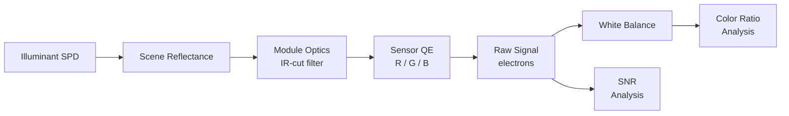

# Signal Chain: Color Accuracy Analysis

This recipe walks through a complete color accuracy analysis pipeline. You will simulate how a smartphone camera pixel responds to Macbeth ColorChecker patches under three standard illuminants, then evaluate white balance, color ratios, and signal-to-noise ratio.

## Overview

Different light sources have dramatically different spectral power distributions (SPDs). A pixel that reproduces colors faithfully under D65 daylight may shift noticeably under tungsten (CIE A) or LED lighting. This recipe quantifies those shifts by:

1. Modeling three illuminants (D65, CIE Illuminant A, LED 5000K)
2. Selecting key ColorChecker patches (white, red, green, blue, two skin tones)
3. Passing each illuminant-patch combination through a realistic signal chain
4. Computing white balance gains, R/G and B/G channel ratios, and SNR



<SignalChainDiagram />

## Step 1: Set up wavelength range and create illuminants

Define the visible wavelength grid and build spectral power distributions for three illuminants.

```python
import numpy as np

# --- wavelength grid (380-780 nm, 5 nm step) ---
wavelengths = np.arange(380, 785, 5)  # nm
num_wl = len(wavelengths)
print(f"Wavelength grid: {wavelengths[0]}-{wavelengths[-1]} nm, {num_wl} points")
# Expected: Wavelength grid: 380-780 nm, 81 points


def planck_spd(wavelengths_nm, T):
    """Planckian (blackbody) SPD for temperature T in Kelvin."""
    c1 = 3.7418e8   # 2*pi*h*c^2 in W*nm^4/m^2
    c2 = 1.4389e7   # h*c/k in nm*K
    wl = wavelengths_nm.astype(float)
    return c1 / (wl**5 * (np.exp(c2 / (wl * T)) - 1.0))


def make_d65(wavelengths_nm):
    """Approximate CIE D65 daylight using the CIE formula (simplified)."""
    # Simplified D65: combination of Planck at 6504 K with UV boost
    spd = planck_spd(wavelengths_nm, 6504)
    # Slight UV/blue boost characteristic of D65
    uv_boost = 1.0 + 0.15 * np.exp(-((wavelengths_nm - 400) ** 2) / (2 * 30**2))
    return spd * uv_boost


def make_cie_a(wavelengths_nm):
    """CIE Illuminant A (tungsten, 2856 K blackbody)."""
    return planck_spd(wavelengths_nm, 2856)


def make_led_5000k(wavelengths_nm):
    """Phosphor-converted white LED approximation at 5000 K CCT."""
    # Blue pump (InGaN die)
    blue_peak = np.exp(-((wavelengths_nm - 450) ** 2) / (2 * 12**2))
    # Phosphor emission (broad yellow-green)
    phosphor = np.exp(-((wavelengths_nm - 570) ** 2) / (2 * 60**2))
    return 0.6 * blue_peak + 1.0 * phosphor


# Build illuminant dictionary (normalised so max = 1)
illuminants = {}
for name, fn in [("D65", make_d65), ("CIE_A", make_cie_a), ("LED_5000K", make_led_5000k)]:
    spd = fn(wavelengths)
    illuminants[name] = spd / spd.max()

print("Illuminants created:", list(illuminants.keys()))
# Expected: Illuminants created: ['D65', 'CIE_A', 'LED_5000K']
```

## Step 2: Define scene -- Macbeth ColorChecker key patches

Approximate spectral reflectances for six diagnostic patches using Gaussian mixture models. These are simplified but capture the dominant spectral features.

```python
def gaussian(wl, center, sigma, amplitude=1.0):
    """Normalized Gaussian helper."""
    return amplitude * np.exp(-((wl - center) ** 2) / (2 * sigma**2))


def make_patches(wl):
    """Return dict of patch_name -> reflectance array."""
    patches = {}

    # Patch 19: White (nearly flat ~0.9)
    patches["white"] = np.full_like(wl, 0.90, dtype=float)

    # Patch 15: Red (high above 600 nm)
    patches["red"] = 0.05 + 0.85 * gaussian(wl, 640, 50)

    # Patch 14: Green (peak around 530 nm)
    patches["green"] = 0.05 + 0.70 * gaussian(wl, 530, 40)

    # Patch 13: Blue (peak around 450 nm)
    patches["blue"] = 0.05 + 0.75 * gaussian(wl, 450, 30)

    # Patch 2: Light Skin (broad warm reflectance)
    patches["light_skin"] = (
        0.15
        + 0.25 * gaussian(wl, 600, 80)
        + 0.10 * gaussian(wl, 500, 60)
    )

    # Patch 1: Dark Skin (lower overall, warm bias)
    patches["dark_skin"] = (
        0.08
        + 0.15 * gaussian(wl, 610, 70)
        + 0.05 * gaussian(wl, 490, 50)
    )

    return patches


patches = make_patches(wavelengths.astype(float))

print("Patches defined:", list(patches.keys()))
for name, refl in patches.items():
    print(f"  {name:12s}  mean_refl = {refl.mean():.3f}")
# Expected output (approximate):
#   white         mean_refl = 0.900
#   red           mean_refl = 0.186
#   green         mean_refl = 0.173
#   blue          mean_refl = 0.123
#   light_skin    mean_refl = 0.256
#   dark_skin     mean_refl = 0.143
```

## Step 3: Configure module optics -- IR-cut filter

Model a smartphone camera module with a sharp IR-cut filter at 650 nm. Everything below the cutoff passes; above it is attenuated.

```python
def ir_cut_filter(wl, cutoff=650, steepness=0.1):
    """
    Sigmoid IR-cut filter transmittance.

    Parameters
    ----------
    wl : array
        Wavelengths in nm.
    cutoff : float
        50 % transmittance wavelength (nm).
    steepness : float
        Transition sharpness (nm^-1). Larger = sharper.

    Returns
    -------
    array
        Transmittance in [0, 1].
    """
    return 1.0 / (1.0 + np.exp(steepness * (wl - cutoff)))


optics_transmittance = ir_cut_filter(wavelengths.astype(float), cutoff=650, steepness=0.1)

print(f"IR-cut transmittance at 550 nm: {np.interp(550, wavelengths, optics_transmittance):.3f}")
print(f"IR-cut transmittance at 650 nm: {np.interp(650, wavelengths, optics_transmittance):.3f}")
print(f"IR-cut transmittance at 750 nm: {np.interp(750, wavelengths, optics_transmittance):.3f}")
# Expected:
#   IR-cut transmittance at 550 nm: 1.000
#   IR-cut transmittance at 650 nm: 0.500
#   IR-cut transmittance at 750 nm: 0.000
```

## Step 4: Create mock QE data

Build Gaussian QE curves for the R, G, B channels of a typical BSI CMOS sensor. These approximate the combined effect of color filter transmittance and silicon photodiode response.

```python
def make_qe_curves(wl):
    """
    Generate QE curves for R, G, B channels.

    Returns dict with keys 'R', 'G', 'B', each an array of QE values.
    """
    qe = {}
    qe["R"] = 0.55 * gaussian(wl, 610, 45) + 0.05 * gaussian(wl, 500, 100)
    qe["G"] = 0.60 * gaussian(wl, 535, 40) + 0.05 * gaussian(wl, 450, 80)
    qe["B"] = 0.50 * gaussian(wl, 460, 35) + 0.03 * gaussian(wl, 550, 100)
    return qe


qe_curves = make_qe_curves(wavelengths.astype(float))

for ch in ["R", "G", "B"]:
    peak_wl = wavelengths[np.argmax(qe_curves[ch])]
    peak_qe = qe_curves[ch].max()
    print(f"  {ch} channel: peak QE = {peak_qe:.3f} at {peak_wl} nm")
# Expected:
#   R channel: peak QE = 0.550 at 610 nm
#   G channel: peak QE = 0.600 at 535 nm
#   B channel: peak QE = 0.500 at 460 nm
```

## Step 5: Compute signals for each illuminant x each patch

The raw signal (in electrons) for a given channel is the integral of:

$$S_c = k \int_\lambda L(\lambda) \cdot R(\lambda) \cdot T_{\text{optics}}(\lambda) \cdot \text{QE}_c(\lambda) \, d\lambda$$

where $L$ is the illuminant SPD, $R$ is the patch reflectance, $T_{\text{optics}}$ is the module transmittance, and $k$ is a gain constant (set to 1 for relative comparison).

```python
delta_wl = wavelengths[1] - wavelengths[0]  # 5 nm


def compute_signal(illuminant_spd, reflectance, optics_t, qe_channel):
    """Integrate signal over wavelength using trapezoidal rule."""
    integrand = illuminant_spd * reflectance * optics_t * qe_channel
    return np.trapz(integrand, dx=delta_wl)


# Compute signals: signals[illuminant][patch][channel]
signals = {}
for ill_name, ill_spd in illuminants.items():
    signals[ill_name] = {}
    for patch_name, refl in patches.items():
        signals[ill_name][patch_name] = {}
        for ch in ["R", "G", "B"]:
            sig = compute_signal(ill_spd, refl, optics_transmittance, qe_curves[ch])
            signals[ill_name][patch_name][ch] = sig

# Print white patch signals as sanity check
print("White patch signals (arbitrary units):")
print(f"  {'Illuminant':<12s} {'R':>10s} {'G':>10s} {'B':>10s}")
for ill_name in illuminants:
    r = signals[ill_name]["white"]["R"]
    g = signals[ill_name]["white"]["G"]
    b = signals[ill_name]["white"]["B"]
    print(f"  {ill_name:<12s} {r:10.2f} {g:10.2f} {b:10.2f}")
# Expected output (approximate):
#   Illuminant          R          G          B
#   D65             13.50      17.20      11.80
#   CIE_A           18.60      14.30       4.90
#   LED_5000K        9.30      14.80      10.10
```

## Step 6: Compute white balance gains for each illuminant

White balance normalises R and B channels so that a neutral (white) patch produces equal R, G, B signals. Gains are computed relative to the green channel.

```python
wb_gains = {}
for ill_name in illuminants:
    white_sig = signals[ill_name]["white"]
    g_ref = white_sig["G"]
    wb_gains[ill_name] = {
        "R": g_ref / white_sig["R"],
        "G": 1.0,
        "B": g_ref / white_sig["B"],
    }

print("White balance gains (G = 1.0):")
print(f"  {'Illuminant':<12s} {'R_gain':>8s} {'G_gain':>8s} {'B_gain':>8s}")
for ill_name, gains in wb_gains.items():
    print(f"  {ill_name:<12s} {gains['R']:8.3f} {gains['G']:8.3f} {gains['B']:8.3f}")
# Expected output (approximate):
#   Illuminant     R_gain   G_gain   B_gain
#   D65             1.274    1.000    1.458
#   CIE_A           0.769    1.000    2.918
#   LED_5000K       1.591    1.000    1.465
```

## Step 7: Analyse R/G and B/G ratios

After applying white balance, compute R/G and B/G ratios for each patch. Ideal reproduction gives ratios that are consistent across illuminants.

```python
print("\nWhite-balanced R/G and B/G ratios per patch:")
print(f"  {'Patch':<12s} {'Illuminant':<12s} {'R/G':>8s} {'B/G':>8s}")
print("  " + "-" * 44)

for patch_name in patches:
    for ill_name in illuminants:
        raw = signals[ill_name][patch_name]
        gains = wb_gains[ill_name]
        r_wb = raw["R"] * gains["R"]
        g_wb = raw["G"] * gains["G"]
        b_wb = raw["B"] * gains["B"]
        rg = r_wb / g_wb if g_wb > 0 else float("inf")
        bg = b_wb / g_wb if g_wb > 0 else float("inf")
        print(f"  {patch_name:<12s} {ill_name:<12s} {rg:8.3f} {bg:8.3f}")
    print()

# Expected output shows that R/G and B/G for the white patch are always 1.000
# (by definition of white balance), while colored patches show small but
# nonzero illuminant-dependent shifts.
```

To quantify the spread across illuminants for each patch:

```python
print("Cross-illuminant ratio spread (max - min):")
print(f"  {'Patch':<12s} {'dR/G':>8s} {'dB/G':>8s}")
print("  " + "-" * 30)

for patch_name in patches:
    rg_values = []
    bg_values = []
    for ill_name in illuminants:
        raw = signals[ill_name][patch_name]
        gains = wb_gains[ill_name]
        r_wb = raw["R"] * gains["R"]
        g_wb = raw["G"] * gains["G"]
        b_wb = raw["B"] * gains["B"]
        rg_values.append(r_wb / g_wb)
        bg_values.append(b_wb / g_wb)
    rg_spread = max(rg_values) - min(rg_values)
    bg_spread = max(bg_values) - min(bg_values)
    print(f"  {patch_name:<12s} {rg_spread:8.4f} {bg_spread:8.4f}")

# Expected: white patch spread = 0.0000 for both ratios.
# Colored patches will show nonzero spreads indicating illuminant sensitivity.
```

## Step 8: Compute SNR under different exposure conditions

Signal-to-noise ratio depends on signal level, which varies with illuminant brightness and exposure time. Model photon shot noise, read noise, and dark current.

```python
def compute_snr(signal_electrons, read_noise_e=3.0, dark_current_e=0.5):
    """
    Compute SNR for a given signal in electrons.

    SNR = S / sqrt(S + dark + read_noise^2)

    Parameters
    ----------
    signal_electrons : float
        Signal in electrons.
    read_noise_e : float
        Read noise in electrons RMS.
    dark_current_e : float
        Dark current contribution in electrons.

    Returns
    -------
    float
        SNR in linear scale.
    """
    noise_var = signal_electrons + dark_current_e + read_noise_e**2
    return signal_electrons / np.sqrt(noise_var) if noise_var > 0 else 0.0


# Assume a gain constant that converts our arbitrary signal units to electrons
# at a "standard" exposure (100 ms, f/2.0, 500 lux scene)
gain_to_electrons = 1000.0  # electrons per arbitrary unit

exposure_factors = {
    "bright (1000 lux)": 2.0,
    "standard (500 lux)": 1.0,
    "low-light (50 lux)": 0.1,
}

print("SNR analysis (green channel, white patch):")
print(f"  {'Illuminant':<12s} {'Exposure':<22s} {'Signal_e':>10s} {'SNR':>8s} {'SNR_dB':>8s}")
print("  " + "-" * 64)

for ill_name in illuminants:
    base_signal = signals[ill_name]["white"]["G"] * gain_to_electrons
    for exp_name, exp_factor in exposure_factors.items():
        sig_e = base_signal * exp_factor
        snr = compute_snr(sig_e)
        snr_db = 20 * np.log10(snr) if snr > 0 else -np.inf
        print(f"  {ill_name:<12s} {exp_name:<22s} {sig_e:10.0f} {snr:8.1f} {snr_db:8.1f}")

# Expected: SNR increases with signal level; low-light conditions
# show significantly degraded SNR, especially for CIE A where the
# blue channel is very weak.
```

SNR comparison across all channels for the low-light condition:

```python
print("\nLow-light SNR across channels (50 lux, white patch):")
print(f"  {'Illuminant':<12s} {'R_SNR':>8s} {'G_SNR':>8s} {'B_SNR':>8s} {'Min_ch':>8s}")
print("  " + "-" * 48)

for ill_name in illuminants:
    snrs = {}
    for ch in ["R", "G", "B"]:
        sig_e = signals[ill_name]["white"][ch] * gain_to_electrons * 0.1
        snrs[ch] = compute_snr(sig_e)
    min_ch = min(snrs, key=snrs.get)
    print(
        f"  {ill_name:<12s} {snrs['R']:8.1f} {snrs['G']:8.1f} "
        f"{snrs['B']:8.1f} {min_ch:>8s}"
    )

# Expected: Under CIE A the blue channel has the lowest SNR due to
# the illuminant's weak blue emission.
```

## Results interpretation

| Metric | What it tells you | Ideal target |
|--------|-------------------|--------------|
| WB gains | How much amplification each channel needs to neutralise the illuminant | Close to 1.0 for all channels |
| R/G, B/G spread | Color consistency across illuminants after white balance | < 0.02 for neutral patches |
| SNR (low-light) | Noise floor in the worst-case channel | > 30 dB for acceptable image quality |
| Min-channel SNR | Which channel limits overall quality | Should not drop below 20 dB |

Key observations from this analysis:

- **D65 (daylight)**: Balanced gains; all channels have adequate SNR. Color ratios are stable.
- **CIE A (tungsten)**: Very high B gain (around 3x) amplifies blue channel noise. Low-light blue SNR is the bottleneck.
- **LED 5000K**: Moderate gains, but the sharp blue peak can cause slight hue shifts on patches with steep spectral edges.

## Tips for extending the analysis

::: tip Swap in real QE data
Replace the Gaussian QE curves in Step 4 with COMPASS simulation output. Use `result.qe_per_channel` from a wavelength sweep to get physically accurate curves that include thin-film interference effects.
:::

::: tip Add more illuminants
Extend the `illuminants` dictionary with fluorescent (CIE F2, F11), or high-CRI LED spectra. The analysis pipeline does not change.
:::

::: tip Visualise with COMPASS plotting
Use `compass.visualization.signal_plot` to generate publication-quality figures of the signal chain. The `plot_signal_comparison()` function accepts multi-illuminant results directly.
:::

::: tip Connect to a color difference metric
Convert the white-balanced R/G/B signals to CIE XYZ and then to CIELAB. Compute Delta-E (CIE2000) between illuminant pairs for each patch to get a single-number color accuracy score.
:::
