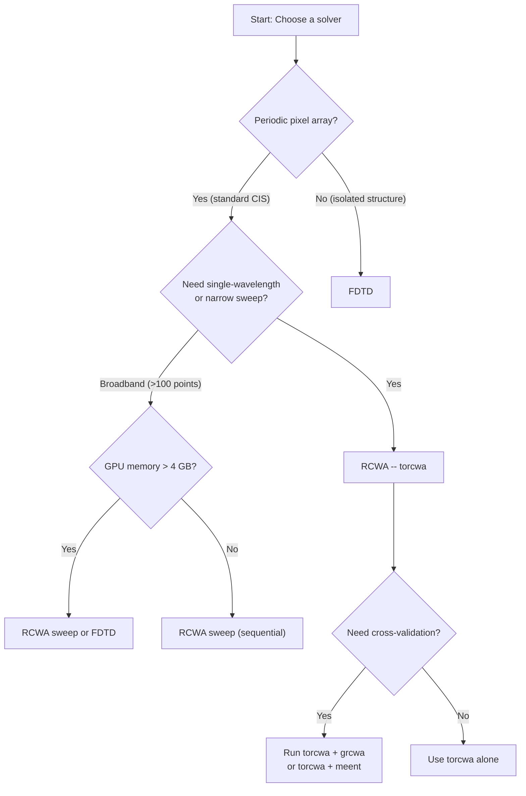

# Choosing a Solver

COMPASS supports multiple electromagnetic solver backends under a unified interface. This guide covers the available solvers, when to use each one, how to configure them, and how to validate convergence.

## Available solvers

### RCWA solvers

RCWA (Rigorous Coupled-Wave Analysis) is a frequency-domain method that solves Maxwell's equations for periodic structures by expanding fields and permittivity into Fourier harmonics. It is naturally suited to pixel arrays because pixels repeat periodically.

| Name     | Library | Backend    | GPU     | Status      |
|----------|---------|------------|---------|-------------|
| `torcwa` | torcwa  | PyTorch    | CUDA    | Primary, recommended |
| `grcwa`  | grcwa   | NumPy/JAX  | CUDA    | Cross-validation |
| `meent`  | meent   | NumPy/JAX/PyTorch | CUDA/CPU | Multi-backend, good for validation |

### FDTD solvers

FDTD (Finite-Difference Time-Domain) solves Maxwell's equations by stepping through time on a spatial grid. It is broadband in a single run and handles arbitrary (non-periodic) geometries.

| Name            | Library | Backend   | GPU           | Status     |
|-----------------|---------|-----------|---------------|------------|
| `fdtd_flaport`  | fdtd    | PyTorch   | CUDA          | Prototyping |

## RCWA vs FDTD: when to use each



### Trade-off summary

| Criterion                    | RCWA                         | FDTD                          |
|-----------------------------|------------------------------|-------------------------------|
| **Speed (single wl)**       | Fast (0.1--2 s)             | Slow (30--120 s)              |
| **Speed (31-pt sweep)**     | ~10 s (sequential)          | ~45 s (one broadband run)     |
| **Memory**                  | Moderate (200--800 MB)      | High (1--4 GB)                |
| **Periodic structures**     | Native (Bloch BCs)          | Requires periodic BCs         |
| **Curved surfaces**         | Staircase approximation     | Staircase approximation       |
| **Dispersive metals**       | Natural (per-wavelength)    | Requires Drude/Lorentz fit    |
| **Near-field accuracy**     | Good in far-field           | Good everywhere               |
| **Convergence parameter**   | Fourier order $N$           | Grid spacing $\Delta x$      |
| **Numerical stability**     | S-matrix required           | CFL condition                 |

### When RCWA excels

- Standard Bayer pixel QE sweeps (the primary COMPASS use case)
- Angular response studies (just change $\theta$, $\phi$)
- Fourier order convergence studies
- Parameter sweeps where each point is independent

### When FDTD is preferable

- Non-periodic or finite-sized structures
- Broadband response in a single simulation
- Situations where near-field detail inside the structure matters
- Cross-validation against RCWA

## Solver configuration reference

### torcwa (recommended)

```yaml
solver:
  name: "torcwa"
  type: "rcwa"
  params:
    fourier_order: [9, 9]       # Fourier harmonics [Nx, Ny]
    dtype: "complex64"           # complex64 or complex128
  stability:
    precision_strategy: "mixed"  # mixed | float32 | float64
    allow_tf32: false            # MUST be false for RCWA
    eigendecomp_device: "cpu"    # cpu | gpu (cpu is more stable)
    fourier_factorization: "li_inverse"  # li_inverse | naive
    energy_check:
      enabled: true
      tolerance: 0.02
      auto_retry_float64: true
    eigenvalue_broadening: 1.0e-10
    condition_number_warning: 1.0e+12
  convergence:
    auto_converge: false
    order_range: [5, 25]
    qe_tolerance: 0.01
```

**Key parameter: `fourier_order`**

The Fourier order $N$ determines the number of harmonics retained in each direction. The total number of harmonics is $(2N_x + 1) \times (2N_y + 1)$. For `[9, 9]`, this gives $19 \times 19 = 361$ modes. Eigenvalue problems of size $2 \times 361 = 722$ are solved per layer.

| Order  | Modes | Matrix size | Typical runtime | Accuracy  |
|--------|-------|-------------|-----------------|-----------|
| [5, 5] | 121   | 242x242     | 0.1 s           | Low       |
| [9, 9] | 361   | 722x722     | 0.3 s           | Good      |
| [13,13]| 729   | 1458x1458   | 1.5 s           | High      |
| [17,17]| 1225  | 2450x2450   | 5.0 s           | Very high |

**Key parameter: `precision_strategy`**

The `"mixed"` strategy (default) runs the main simulation in `complex64` but promotes eigendecomposition to `complex128` and executes it on CPU. This provides a good balance of speed and stability.

$$\text{mixed} = \begin{cases} \text{float32 for layer setup, FFT, S-matrix products} \\ \text{float64 for eigendecomp (on CPU)} \end{cases}$$

### grcwa

```yaml
solver:
  name: "grcwa"
  type: "rcwa"
  params:
    fourier_order: [9, 9]
    dtype: "complex128"     # grcwa defaults to float64
  convergence:
    auto_converge: false
    order_range: [5, 25]
    qe_tolerance: 0.01
```

grcwa uses NumPy-based computation with optional JAX acceleration. It defaults to `complex128` and tends to be numerically more stable than `torcwa` at the cost of speed. It is useful for cross-validation.

### meent

```yaml
solver:
  name: "meent"
  type: "rcwa"
  params:
    fourier_order: [9, 9]
    dtype: "complex64"
    backend: "torch"       # numpy | jax | torch
  convergence:
    auto_converge: false
    order_range: [5, 25]
    qe_tolerance: 0.01
```

meent supports three backends: `numpy` (backend=0), `jax` (backend=1), and `torch` (backend=2). The JAX backend can leverage XLA compilation for performance. Note that meent uses **nanometers** internally; the COMPASS adapter handles the conversion from micrometers.

### fdtd_flaport

```yaml
solver:
  name: "fdtd_flaport"
  type: "fdtd"
  params:
    grid_spacing: 0.02     # Grid cell size in um (20 nm)
    runtime: 200           # Simulation time in femtoseconds
    pml_layers: 15         # PML absorber thickness in cells
    dtype: "float64"
```

**Key parameter: `grid_spacing`**

The grid must resolve both the smallest geometric feature and the shortest wavelength inside the highest-index material. For silicon ($n \approx 4$) at 400 nm:

$$\Delta x \leq \frac{\lambda_\text{min}}{n_\text{max} \cdot \text{PPW}} = \frac{0.400}{4.0 \times 10} = 0.010 \text{ um}$$

where PPW (points per wavelength) should be at least 10 for accuracy. A 20 nm grid is adequate for most visible-range simulations, but 10 nm provides better accuracy at the cost of 8x more memory (3D).

## GPU vs CPU considerations

### CUDA (NVIDIA GPUs)

RCWA benefits substantially from GPU acceleration for the matrix operations (FFT, eigendecomp, S-matrix products). Typical speedup is 5--20x for Fourier orders above [7, 7].

```yaml
compute:
  backend: "cuda"
  gpu_id: 0
```

**Important**: Disable TF32 on Ampere+ GPUs (RTX 30xx/40xx, A100). TF32 reduces floating-point mantissa from 23 bits to 10 bits in matmul operations, which catastrophically degrades S-matrix accuracy.

```yaml
solver:
  stability:
    allow_tf32: false  # Always keep this false for RCWA
```

### Apple Silicon (MPS)

PyTorch MPS backend works for basic tensor operations but has limitations for RCWA:

- Complex number support is incomplete in some PyTorch versions
- Eigendecomposition may silently fall back to CPU
- Performance is typically slower than CUDA for RCWA workloads

```yaml
compute:
  backend: "mps"
```

Test with CPU first if you encounter MPS errors.

### CPU

All solvers work on CPU without any GPU dependencies. CPU mode is slower but fully functional and numerically the most reliable.

```yaml
compute:
  backend: "cpu"
  num_workers: 4
```

## Convergence testing

### RCWA: Fourier order sweep

Always verify that results have converged before trusting them. Sweep the Fourier order and check that QE stabilizes.

```python
import numpy as np
from compass.solvers.base import SolverFactory

orders = range(5, 22, 2)
peak_green_qe = []

for N in orders:
    config["solver"]["params"]["fourier_order"] = [N, N]
    solver = SolverFactory.create("torcwa", config["solver"])
    solver.setup_geometry(pixel_stack)
    solver.setup_source({"wavelength": 0.55, "theta": 0.0,
                         "phi": 0.0, "polarization": "unpolarized"})
    result = solver.run()

    green_qe = np.mean([
        qe for name, qe in result.qe_per_pixel.items()
        if name.startswith("G")
    ])
    peak_green_qe.append(float(green_qe))
    print(f"Order {N:2d}: Green QE = {green_qe:.4f}")

# Check convergence: relative change < 1%
for i in range(1, len(peak_green_qe)):
    delta = abs(peak_green_qe[i] - peak_green_qe[i-1])
    print(f"  Order {list(orders)[i]}: delta = {delta:.5f}")
```

### FDTD: Grid spacing convergence

```python
for spacing in [0.04, 0.02, 0.01]:
    config["solver"]["params"]["grid_spacing"] = spacing
    # ... run and compare QE
```

### Cross-solver validation

Run the same pixel with two solvers and compare QE spectra:

```python
from compass.visualization.qe_plot import plot_qe_comparison

ax_main, ax_diff = plot_qe_comparison(
    results=[torcwa_result, grcwa_result],
    labels=["torcwa", "grcwa"],
    show_difference=True,
    figsize=(10, 7),
)
```

Agreement within 1--2% absolute QE is expected for well-converged simulations at the same Fourier order.

## Performance benchmarks

Typical numbers for a 2x2 Bayer unit cell, 1.0 um pitch, single wavelength, normal incidence, NVIDIA RTX 4090:

| Solver              | Order / Grid | Runtime  | GPU Mem | Notes              |
|---------------------|-------------|----------|---------|--------------------|
| torcwa (f32)        | [9, 9]     | 0.3 s    | 200 MB  | Default, fast      |
| torcwa (f64)        | [9, 9]     | 0.6 s    | 400 MB  | Higher accuracy    |
| torcwa (f32)        | [15, 15]   | 2.1 s    | 600 MB  | High accuracy      |
| grcwa (f64)         | [9, 9]     | 0.5 s    | 250 MB  | Cross-validation   |
| meent/torch (f32)   | [9, 9]     | 0.4 s    | 200 MB  | Comparable         |
| fdtd_flaport (20nm) | --         | 45 s     | 2 GB    | Broadband capable  |
| fdtd_flaport (10nm) | --         | 180 s    | 8 GB    | High accuracy      |

For a 31-point wavelength sweep (400--700 nm, 10 nm step):

- **RCWA (torcwa, order 9)**: 31 x 0.3 s = ~10 s total
- **FDTD (flaport, 20 nm)**: 1 broadband run = ~45 s

RCWA wins for narrow sweeps; FDTD becomes competitive for very dense wavelength sampling (>100 points).

## Quick-start recommendations

| Use case                          | Recommended solver | Config notes                |
|----------------------------------|--------------------|-----------------------------|
| Standard QE simulation           | `torcwa`           | order [9,9], mixed precision |
| Publication-quality results      | `torcwa`           | order [15,15], float64      |
| Cross-validation                 | `torcwa` + `grcwa` | Same order, compare QE      |
| Metal grid / high-contrast layers | `torcwa` or `meent` | Li inverse factorization   |
| Broadband single-shot            | `fdtd_flaport`     | 10 nm grid, 200 fs runtime  |
| CPU-only environment             | `meent` (numpy)    | No GPU required             |

## Next steps

- [First Simulation](./first-simulation.md) -- run your first solver
- [Pixel Stack Configuration](./pixel-stack-config.md) -- define the structure to simulate
- [Troubleshooting](./troubleshooting.md) -- solver convergence and stability issues
- [Visualization](./visualization.md) -- plot and compare solver results
