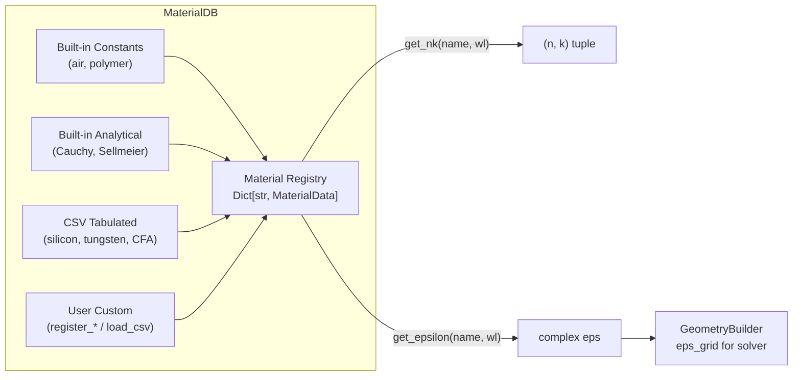
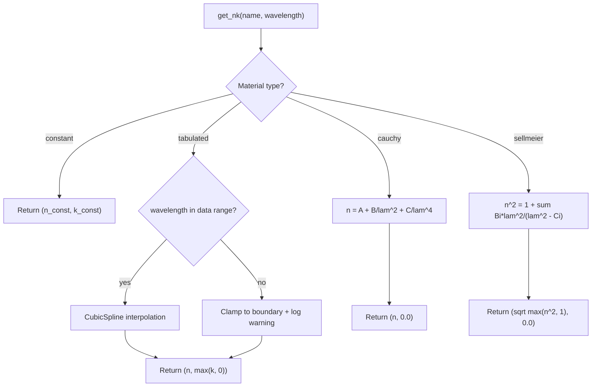

# Material Database

COMPASS models the optical properties of every layer in the pixel stack through complex refractive indices $\tilde{n}(\lambda) = n(\lambda) + i k(\lambda)$, where $n$ is the real refractive index and $k$ is the extinction coefficient. The `MaterialDB` class manages all material definitions and provides wavelength-dependent interpolation.

## Architecture overview



When you create a `MaterialDB` instance, it automatically:

1. Registers **built-in constant and analytical materials** (air, polymers, dielectrics)
2. Loads **tabulated CSV data** from the `materials/` directory (silicon, tungsten, color filters)
3. Falls back to **approximate built-in data** if CSV files are not found

```python
from compass.materials.database import MaterialDB

mat_db = MaterialDB()
print(mat_db.list_materials())
# ['air', 'cf_blue', 'cf_green', 'cf_red', 'hfo2', 'polymer_n1p56',
#  'si3n4', 'silicon', 'sio2', 'tio2', 'tungsten']
```

## Built-in materials

| Material           | DB Name          | Type      | Source / Model                       | $n$ at 550 nm |
|--------------------|------------------|-----------|--------------------------------------|---------------|
| Air                | `air`            | constant  | $n = 1.0$, $k = 0.0$                | 1.000         |
| Microlens polymer  | `polymer_n1p56`  | cauchy    | $A = 1.56$, $B = 0.004$             | 1.573         |
| Silicon dioxide    | `sio2`           | sellmeier | 3-term Sellmeier (Malitson 1965)     | 1.460         |
| Silicon nitride    | `si3n4`          | sellmeier | 2-term Sellmeier                     | 2.020         |
| Hafnium dioxide    | `hfo2`           | cauchy    | $A = 1.90$, $B = 0.02$              | 1.966         |
| Titanium dioxide   | `tio2`           | cauchy    | $A = 2.27$, $B = 0.05$ (anatase)    | 2.435         |
| Crystalline Si     | `silicon`        | tabulated | Green 2008 (350--1100 nm)            | 4.082         |
| Tungsten           | `tungsten`       | tabulated | Palik data (380--780 nm)             | 3.650         |
| Red color filter   | `cf_red`         | tabulated | Lorentzian absorption model          | 1.550         |
| Green color filter | `cf_green`       | tabulated | Lorentzian absorption model          | 1.550         |
| Blue color filter  | `cf_blue`        | tabulated | Lorentzian absorption model          | 1.550         |

## Material data types

COMPASS supports four dispersion model types for specifying how $n$ and $k$ vary with wavelength.

### Constant

Fixed refractive index independent of wavelength. Suitable for non-dispersive media such as air or idealized dielectrics.

$$n(\lambda) = n_0, \quad k(\lambda) = k_0$$

```python
mat_db.register_constant("my_dielectric", n=1.45, k=0.0)

n, k = mat_db.get_nk("my_dielectric", 0.55)
# n=1.45, k=0.0 at any wavelength
```

### Tabulated

Wavelength-dependent $n(\lambda)$ and $k(\lambda)$ from discrete data points. COMPASS interpolates between points using **cubic spline interpolation** when 4 or more data points are available, or **linear interpolation** for fewer points.

```python
# Internally, tabulated materials build scipy interpolators:
from scipy.interpolate import CubicSpline
n_interp = CubicSpline(wavelengths, n_data, extrapolate=True)
k_interp = CubicSpline(wavelengths, k_data, extrapolate=True)
```

Important behaviors:

- Wavelengths outside the data range are **clamped** to the nearest boundary value
- A warning is logged when clamping occurs
- The extinction coefficient is clamped non-negative: $k = \max(k_\text{interp}, 0)$

### Cauchy

Analytical dispersion model for transparent dielectrics. Accurate in the visible range for materials without strong absorption bands.

$$n(\lambda) = A + \frac{B}{\lambda^2} + \frac{C}{\lambda^4}$$

where $\lambda$ is in micrometers. The Cauchy model always returns $k = 0$.

```python
mat_db.register_cauchy("my_polymer", A=1.56, B=0.004, C=0.0)

n, k = mat_db.get_nk("my_polymer", 0.55)
# n = 1.56 + 0.004 / 0.3025 = 1.573, k = 0.0
```

Built-in Cauchy coefficients:

| Material        | $A$   | $B$    | $C$   |
|----------------|-------|--------|-------|
| `polymer_n1p56` | 1.56  | 0.004  | 0.0   |
| `hfo2`          | 1.90  | 0.02   | 0.0   |
| `tio2`          | 2.27  | 0.05   | 0.0   |

### Sellmeier

Multi-term Sellmeier equation for high-accuracy dispersion modeling of glasses and dielectrics:

$$n^2(\lambda) = 1 + \sum_{i} \frac{B_i \lambda^2}{\lambda^2 - C_i}$$

where $B_i$ are oscillator strengths and $C_i$ are resonance wavelengths squared (in um$^2$). The model returns $k = 0$ and clamps $n^2 \geq 1$.

```python
mat_db.register_sellmeier(
    "fused_silica",
    B=[0.6961663, 0.4079426, 0.8974794],
    C=[0.0684043**2, 0.1162414**2, 9.896161**2],
)
```

Built-in Sellmeier coefficients:

| Material | $B_1$   | $B_2$   | $B_3$   | $C_1$ (um$^2$) | $C_2$ (um$^2$) | $C_3$ (um$^2$) |
|----------|---------|---------|---------|-----------------|-----------------|-----------------|
| `sio2`   | 0.6962  | 0.4079  | 0.8975  | 0.00468         | 0.01352         | 97.934          |
| `si3n4`  | 2.8939  | 0.0     | --      | 0.01951         | 1.0             | --              |

## Permittivity conversion

Solvers consume complex permittivity $\varepsilon$ rather than refractive index. The conversion is:

$$\varepsilon(\lambda) = \tilde{n}^2 = (n + ik)^2 = (n^2 - k^2) + i\,2nk$$

```python
# Single wavelength
eps = mat_db.get_epsilon("silicon", 0.55)
# eps = (4.082 + 0.028j)^2 ~ 16.66 + 0.229j

# Spectrum over multiple wavelengths
import numpy as np
wavelengths = np.arange(0.40, 0.701, 0.01)
eps_spectrum = mat_db.get_epsilon_spectrum("silicon", wavelengths)
```

## Adding custom materials via CSV

To add a material not in the built-in database, create a CSV file with three columns: wavelength (um), $n$, $k$. Lines starting with `#` are treated as comments.

### CSV format

```
# Custom infrared filter material
# wavelength(um), n, k
0.380, 1.60, 0.12
0.400, 1.59, 0.10
0.440, 1.57, 0.05
0.480, 1.55, 0.01
0.520, 1.55, 0.002
0.560, 1.55, 0.002
0.600, 1.56, 0.01
0.650, 1.56, 0.03
0.700, 1.56, 0.05
0.750, 1.57, 0.08
```

### Loading and using a custom CSV

```python
mat_db = MaterialDB()

# Load from file (sorts by wavelength, builds interpolators)
mat_db.load_csv("ir_cut_filter", "materials/ir_cut_filter.csv")

# Verify it loaded
print(mat_db.has_material("ir_cut_filter"))  # True
n, k = mat_db.get_nk("ir_cut_filter", 0.55)
print(f"IR cut filter at 550nm: n={n:.3f}, k={k:.4f}")
```

You can also override the interpolation method:

```python
mat_db.load_csv("my_mat", "data.csv", interpolation="linear")
```

### Automatic CSV discovery

COMPASS searches the `materials/` directory (configurable via the `COMPASS_MATERIALS` environment variable) for known filenames:

| Material name | Searched filenames                          |
|---------------|---------------------------------------------|
| `silicon`     | `silicon_green2008.csv`, `silicon_palik.csv` |
| `tungsten`    | `tungsten.csv`                               |
| `cf_red`      | `color_filter_red.csv`                       |
| `cf_green`    | `color_filter_green.csv`                     |
| `cf_blue`     | `color_filter_blue.csv`                      |

If no CSV is found, approximate built-in fallback data is used.

### Using custom materials in YAML configs

After registering a custom material, reference it by name in your pixel configuration:

```yaml
color_filter:
  materials:
    R: "my_custom_red"
    G: "cf_green"
    B: "cf_blue"
```

Ensure the material is registered before calling `GeometryBuilder`:

```python
mat_db = MaterialDB()
mat_db.load_csv("my_custom_red", "materials/my_red_filter.csv")

builder = GeometryBuilder(config.pixel, mat_db)
pixel_stack = builder.build()
```

## Interpolation flow



## MaterialDB API summary

```python
class MaterialDB:
    def __init__(self, db_path: str | None = None): ...
    def register_constant(self, name: str, n: float, k: float = 0.0) -> None: ...
    def register_cauchy(self, name: str, A: float, B: float = 0.0, C: float = 0.0) -> None: ...
    def register_sellmeier(self, name: str, B: list[float], C: list[float]) -> None: ...
    def load_csv(self, name: str, filepath: str, interpolation: str = "cubic_spline") -> None: ...
    def get_nk(self, name: str, wavelength: float) -> tuple[float, float]: ...
    def get_epsilon(self, name: str, wavelength: float) -> complex: ...
    def get_epsilon_spectrum(self, name: str, wavelengths: np.ndarray) -> np.ndarray: ...
    def list_materials(self) -> list[str]: ...
    def has_material(self, name: str) -> bool: ...
```

## Example: plotting material dispersion

```python
import numpy as np
import matplotlib.pyplot as plt
from compass.materials.database import MaterialDB

mat_db = MaterialDB()
wavelengths = np.linspace(0.38, 0.78, 100)
wavelengths_nm = wavelengths * 1000

fig, (ax1, ax2) = plt.subplots(1, 2, figsize=(12, 5))

for name in ["silicon", "sio2", "si3n4", "hfo2"]:
    n_arr = np.array([mat_db.get_nk(name, wl)[0] for wl in wavelengths])
    k_arr = np.array([mat_db.get_nk(name, wl)[1] for wl in wavelengths])
    ax1.plot(wavelengths_nm, n_arr, label=name)
    ax2.plot(wavelengths_nm, k_arr, label=name)

ax1.set_xlabel("Wavelength (nm)")
ax1.set_ylabel("n")
ax1.set_title("Refractive Index")
ax1.legend()
ax1.grid(True, alpha=0.3)

ax2.set_xlabel("Wavelength (nm)")
ax2.set_ylabel("k")
ax2.set_title("Extinction Coefficient")
ax2.legend()
ax2.grid(True, alpha=0.3)
plt.tight_layout()
```

## Next steps

- [Pixel Stack Configuration](./pixel-stack-config.md) -- reference materials in pixel layer definitions
- [Choosing a Solver](./choosing-solver.md) -- how material complexity affects solver choice
- [Troubleshooting](./troubleshooting.md) -- handling material wavelength range warnings
