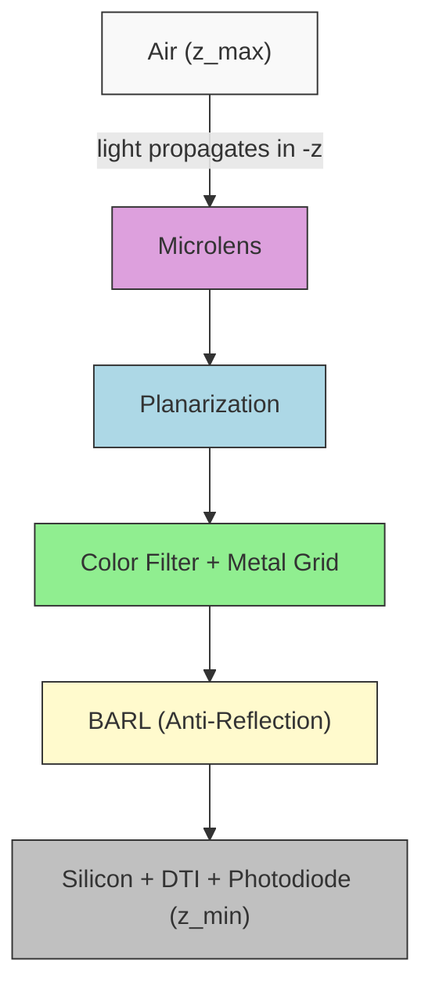

# Pixel Stack Configuration

The pixel structure is the central input to any COMPASS simulation. It is defined in a YAML file under the `pixel:` key and describes a Back-Side Illuminated (BSI) CMOS image sensor pixel as a vertical stack of optical layers. This page documents every parameter with its type, default value, and physical meaning.

<PixelStackBuilder />

## Coordinate system

COMPASS uses a right-handed coordinate system where light propagates downward through the stack.



Key conventions:

- All lengths are in **micrometers (um)**
- **x, y**: lateral (in-plane) directions
- **z**: vertical stack direction. Silicon sits at the bottom ($z_\text{min}$), air at the top ($z_\text{max}$)
- Light propagates in **-z** (from air toward silicon), consistent with BSI illumination
- The origin of the x-y plane is at the lower-left corner of the unit cell
- The `position` and `size` for photodiodes are relative to each pixel center

## Top-level pixel parameters

```yaml
pixel:
  pitch: 1.0          # Pixel pitch in um (both x and y)
  unit_cell: [2, 2]   # Number of pixels [rows, cols] in the unit cell
  bayer_map:           # Color channel assignment per pixel
    - ["R", "G"]
    - ["G", "B"]
```

| Parameter    | Type            | Default                       | Description                                        |
|-------------|-----------------|-------------------------------|----------------------------------------------------|
| `pitch`     | float           | `1.0`                         | Pixel pitch in um. Applied to both x and y.        |
| `unit_cell` | [int, int]      | `[2, 2]`                      | Pixels in the periodic unit cell [rows, cols].     |
| `bayer_map` | list[list[str]] | `[["R","G"],["G","B"]]`       | Color channel assignment. Maps to CFA materials.   |

The total simulation domain size is `pitch * unit_cell[1]` in x and `pitch * unit_cell[0]` in y. For a standard 2x2 Bayer pattern with 1.0 um pitch, the domain is 2.0 um x 2.0 um with periodic boundary conditions.

## Layer stack

Layers are defined top-to-bottom under `pixel.layers`. The ordering of keys in the YAML dictionary determines the physical stacking order from top (air) to bottom (silicon).

```yaml
pixel:
  layers:
    air:             # Superstrate (top)
    microlens:       # Curved focusing lens
    planarization:   # Flat dielectric spacer
    color_filter:    # Bayer CFA with optional metal grid
    barl:            # Bottom anti-reflection layers
    silicon:         # Photodiode substrate (bottom)
```

### air

Simple dielectric layer above the microlens. This layer provides the medium from which light enters the pixel.

```yaml
air:
  thickness: 1.0     # um
  material: "air"    # Material name from MaterialDB
```

| Parameter   | Type  | Default | Description                          |
|------------|-------|---------|--------------------------------------|
| `thickness` | float | `1.0`  | Air gap above microlens in um.       |
| `material`  | str   | `"air"` | Material name ($n = 1.0$, $k = 0.0$). |

### microlens

Curved focusing lens described by a superellipse profile. The microlens shape in 2D is defined as:

$$z(x, y) = h \cdot \left(1 - r(x,y)^2\right)^{1/(2\alpha)}$$

where the normalized radial coordinate $r$ uses the superellipse norm:

$$r(x, y) = \left(\left|\frac{x - x_c}{R_x}\right|^n + \left|\frac{y - y_c}{R_y}\right|^n\right)^{1/n}$$

The parameter $n$ controls squareness ($n = 2$ is a circle/ellipse, $n > 2$ approaches a rectangle) and $\alpha$ controls curvature ($\alpha = 1$ is spherical, $\alpha > 1$ produces a flatter top).

```yaml
microlens:
  enabled: true
  height: 0.6          # Lens sag height in um
  radius_x: 0.48       # Semi-axis in x (um)
  radius_y: 0.48       # Semi-axis in y (um)
  material: "polymer_n1p56"
  profile:
    type: "superellipse"
    n: 2.5              # Squareness parameter
    alpha: 1.0          # Curvature: 1=spherical, >1=flatter
  shift:
    mode: "auto_cra"    # none | manual | auto_cra
    cra_deg: 0.0        # Chief ray angle for auto shift
    shift_x: 0.0        # Manual x-offset (um)
    shift_y: 0.0        # Manual y-offset (um)
  gap: 0.0              # Gap between adjacent lenses (um)
```

| Parameter        | Type  | Default            | Description                                       |
|-----------------|-------|--------------------|---------------------------------------------------|
| `enabled`       | bool  | `true`             | Enable/disable microlens.                         |
| `height`        | float | `0.6`              | Maximum lens height (sag) in um.                  |
| `radius_x`      | float | `0.48`             | Semi-axis in x direction in um.                   |
| `radius_y`      | float | `0.48`             | Semi-axis in y direction in um.                   |
| `material`      | str   | `"polymer_n1p56"`  | Lens material (Cauchy model, $n \approx 1.56$).   |
| `profile.type`  | str   | `"superellipse"`   | Profile model.                                    |
| `profile.n`     | float | `2.5`              | Superellipse squareness. Higher = more square.    |
| `profile.alpha`  | float | `1.0`              | Curvature control. 1.0 = spherical, >1 = flatter. |
| `shift.mode`    | str   | `"auto_cra"`       | `"none"`, `"manual"`, or `"auto_cra"`.            |
| `shift.cra_deg`  | float | `0.0`              | Chief ray angle in degrees for auto shift.        |
| `gap`           | float | `0.0`              | Inter-lens gap in um.                             |

When `shift.mode` is `"auto_cra"`, the microlens center is offset from the pixel center to accommodate off-axis chief ray angles at the image sensor edge. The shift is computed as $\Delta x = d \cdot \tan(\theta_\text{CRA})$ where $d$ is the focal distance to the photodiode.

### planarization

Flat dielectric spacer between microlens and color filter.

```yaml
planarization:
  thickness: 0.3
  material: "sio2"
```

Typically SiO2 or a polymer. This layer acts as the propagation medium between the microlens and the color filter. Adjust thickness to control where the microlens focuses light relative to the photodiode. The effective focal length of the microlens-planarization system determines optical crosstalk.

### color_filter

Bayer CFA (Color Filter Array) with optional metal grid isolation.

```yaml
color_filter:
  thickness: 0.6
  pattern: "bayer_rggb"
  materials:
    R: "cf_red"
    G: "cf_green"
    B: "cf_blue"
  grid:
    enabled: true
    width: 0.05          # Grid line width in um
    height: 0.6          # Grid height (usually = CFA thickness)
    material: "tungsten"  # Metal grid material
```

| Parameter        | Type | Default          | Description                            |
|-----------------|------|------------------|----------------------------------------|
| `thickness`     | float | `0.6`           | Color filter thickness in um.          |
| `pattern`       | str  | `"bayer_rggb"`   | CFA pattern name.                      |
| `materials`     | dict | R/G/B mapping    | Maps color keys to material names.     |
| `grid.enabled`  | bool | `true`           | Enable metal isolation grid.           |
| `grid.width`    | float | `0.05`          | Grid line width in um.                 |
| `grid.height`   | float | `0.6`           | Grid line height in um.               |
| `grid.material` | str  | `"tungsten"`     | Grid material.                         |

**Supported Bayer patterns:**

| Pattern         | Layout                                                |
|----------------|-------------------------------------------------------|
| `bayer_rggb`   | Row 0: R G, Row 1: G B                               |
| `bayer_grbg`   | Row 0: G R, Row 1: B G                               |
| `bayer_gbrg`   | Row 0: G B, Row 1: R G                               |
| `bayer_bggr`   | Row 0: B G, Row 1: G R                               |

The `bayer_map` at the top level determines which material each pixel receives. The keys in `materials` must match the characters used in `bayer_map`. Custom patterns beyond standard Bayer (e.g., RGBW quad-pixel) can be defined by enlarging the `unit_cell` and `bayer_map`:

```yaml
# 4x4 Quad-Bayer pattern
pixel:
  pitch: 0.7
  unit_cell: [4, 4]
  bayer_map:
    - ["R", "R", "G", "G"]
    - ["R", "R", "G", "G"]
    - ["G", "G", "B", "B"]
    - ["G", "G", "B", "B"]
```

### barl (Bottom Anti-Reflection Layers)

Multi-layer dielectric stack for anti-reflection between the CFA and silicon. The purpose of the BARL is to minimize Fresnel reflection at the high-contrast interface between the color filter ($n \approx 1.55$) and silicon ($n \approx 4.0$).

```yaml
barl:
  layers:
    - thickness: 0.010
      material: "sio2"
    - thickness: 0.025
      material: "hfo2"
    - thickness: 0.015
      material: "sio2"
    - thickness: 0.030
      material: "si3n4"
```

Each entry is a `{thickness, material}` pair. Layers are ordered top-to-bottom. Typical BARL stacks use alternating high/low refractive index materials (SiO2/HfO2 or SiO2/Si3N4) to create a graded index transition. The optimal thickness for each sub-layer follows the quarter-wave condition:

$$t = \frac{\lambda_0}{4 n}$$

where $\lambda_0$ is the target wavelength and $n$ is the layer refractive index.

### silicon

Absorbing substrate containing photodiode regions and DTI (Deep Trench Isolation).

```yaml
silicon:
  thickness: 3.0
  material: "silicon"
  photodiode:
    position: [0.0, 0.0, 0.5]   # Offset from pixel center [x, y, z] in um
    size: [0.7, 0.7, 2.0]        # Photodiode extent [dx, dy, dz] in um
  dti:
    enabled: true
    width: 0.1                    # Trench width in um
    depth: 3.0                    # Trench depth in um (from top of silicon)
    material: "sio2"              # Fill material
```

| Parameter              | Type                    | Default          | Description                                  |
|-----------------------|-------------------------|------------------|----------------------------------------------|
| `thickness`           | float                   | `3.0`            | Total silicon thickness in um.               |
| `material`            | str                     | `"silicon"`      | Substrate material.                          |
| `photodiode.position` | [float, float, float]   | `[0, 0, 0.5]`   | PD offset from pixel center (x, y, z) in um. |
| `photodiode.size`     | [float, float, float]   | `[0.7, 0.7, 2.0]` | PD extent (dx, dy, dz) in um.              |
| `dti.enabled`         | bool                    | `true`           | Enable deep trench isolation.                |
| `dti.width`           | float                   | `0.1`            | DTI trench width in um.                     |
| `dti.depth`           | float                   | `3.0`            | DTI depth in um (from top of Si).           |
| `dti.material`        | str                     | `"sio2"`         | DTI fill material.                          |

DTI trenches are placed at pixel boundaries in the silicon layer. They serve as optical barriers that reduce crosstalk by reflecting light back into the intended pixel. Full-depth DTI (`depth == thickness`) provides the best isolation.

## Example configurations

### Small pixel (0.8 um)

```yaml
pixel:
  pitch: 0.8
  unit_cell: [2, 2]
  layers:
    air: {thickness: 1.0, material: "air"}
    microlens:
      height: 0.5
      radius_x: 0.38
      radius_y: 0.38
    planarization: {thickness: 0.25, material: "sio2"}
    color_filter:
      thickness: 0.5
      grid: {width: 0.05, height: 0.5}
    barl:
      layers:
        - {thickness: 0.010, material: "sio2"}
        - {thickness: 0.020, material: "hfo2"}
    silicon:
      thickness: 2.5
      photodiode:
        size: [0.55, 0.55, 1.6]
      dti: {depth: 2.5}
  bayer_map:
    - ["R", "G"]
    - ["G", "B"]
```

### Large pixel (1.4 um) with thicker CFA

```yaml
pixel:
  pitch: 1.4
  unit_cell: [2, 2]
  layers:
    air: {thickness: 1.0, material: "air"}
    microlens:
      height: 0.8
      radius_x: 0.65
      radius_y: 0.65
      profile: {n: 3.0, alpha: 1.2}
    planarization: {thickness: 0.4, material: "sio2"}
    color_filter:
      thickness: 0.8
      grid: {width: 0.06, height: 0.8}
    barl:
      layers:
        - {thickness: 0.010, material: "sio2"}
        - {thickness: 0.025, material: "hfo2"}
        - {thickness: 0.015, material: "sio2"}
        - {thickness: 0.030, material: "si3n4"}
    silicon:
      thickness: 3.5
      photodiode:
        size: [1.0, 1.0, 2.5]
      dti: {depth: 3.5}
  bayer_map:
    - ["R", "G"]
    - ["G", "B"]
```

### No microlens (flat top)

Disable the microlens to simulate a bare pixel without focusing optics:

```yaml
pixel:
  pitch: 1.0
  unit_cell: [2, 2]
  layers:
    air: {thickness: 1.0, material: "air"}
    microlens:
      enabled: false
    planarization: {thickness: 0.3, material: "sio2"}
    color_filter:
      thickness: 0.6
    silicon:
      thickness: 3.0
```

## Loading a pixel config in Python

```python
from pathlib import Path
from omegaconf import OmegaConf
from compass.core.config_schema import CompassConfig

# Load from YAML
raw = OmegaConf.load("configs/pixel/default_bsi_1um.yaml")
config = CompassConfig(**OmegaConf.to_container(raw, resolve=True))

# Inspect
print(f"Pitch: {config.pixel.pitch} um")
print(f"Unit cell: {config.pixel.unit_cell}")
print(f"Bayer map: {config.pixel.bayer_map}")
```

## Next steps

- [Material Database](./material-database.md) -- understand and extend the materials used in each layer
- [Choosing a Solver](./choosing-solver.md) -- select the right solver for your pixel structure
- [Visualization](./visualization.md) -- plot the pixel stack to verify your configuration
