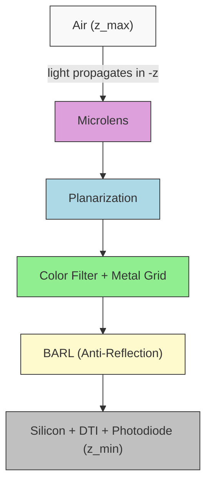

# Pixel Stack Configuration

The pixel structure is the central input to any COMPASS simulation. It is defined in a YAML file under the `pixel:` key and describes a Back-Side Illuminated (BSI) CMOS image sensor pixel as a vertical stack of optical layers.

This page is meant to be read in two passes. First, use the fast path and decision tables to find the few parameters you actually need. Then use the layer reference when you need the exact YAML field name.

<PixelStackBuilder />

## Fast path: edit a pixel in five minutes

Do not start from a blank YAML file. Start from one of the known-good configs in `configs/pixel/`, change one physical idea at a time, and visualize the stack before launching a long solver run.

```bash
# Baseline 1.0 um BSI pixel
python scripts/run_simulation.py pixel=default_bsi_1um solver=torcwa source=wavelength_sweep

# Recent sample structures are listed in docs/guide/sample-pixels.md
python scripts/run_simulation.py pixel=sample_p0p56um_4x4ocl solver=torcwa
```

A practical edit loop looks like this:

1. Pick the closest starting file: `default_bsi_1um.yaml` for a generic Bayer pixel, or a `sample_*.yaml` file for a recent architecture.
2. Change only one family of parameters: pitch, microlens, CFA/grid, BARL, silicon/PD/DTI, or CRA shift.
3. Use the visual parameter map below to check whether the geometry still looks plausible.
4. Run a low-cost single-wavelength simulation.
5. Only after the geometry and one wavelength look sane, run a wavelength sweep or convergence study.

## Mental model

A pixel config answers four questions:

| Question | YAML block | First knob to inspect |
| --- | --- | --- |
| How large is the repeated simulation tile? | `pixel.pitch`, `pixel.unit_cell`, `pixel.bayer_map` | `pitch` and `unit_cell` |
| How does light enter and focus? | `layers.air`, `layers.microlens`, `layers.planarization` | microlens `height`, `radius_x/y`, `shift` |
| Which color and isolation structure does each pixel see? | `layers.color_filter`, `grid`, `bayer_map` | CFA channel `material/thickness/contact_angle`, grid `width`, `corner_radius` |
| Where is light absorbed and collected? | `layers.barl`, `layers.silicon`, `photodiode`, `dti` | silicon `thickness`, PD `size`, DTI `width/depth` |

For most studies, the highest-value parameters are `pitch`, microlens `height`, microlens `radius_x/y`, CRA `shift.cra_deg`, color-filter `thickness`, grid `width`, BARL layer `thickness`, silicon `thickness`, photodiode `size`, and DTI `width/depth`.

## Which parameter should I change?

| Goal | Change these first | Keep an eye on |
| --- | --- | --- |
| Model a smaller or larger pixel | `pitch`, then scale microlens radius, grid width, PD size, and DTI width | Tiny features need finer RCWA/FDTD grids |
| Study corner shading or sensor-edge behavior | `microlens.shift.mode: "auto_cra"` and `shift.cra_deg` | CRA also changes source angle; do not compare to normal incidence blindly |
| Reduce optical crosstalk | Increase `grid.width`, enable/deepen `dti`, adjust PD footprint | More isolation can reduce fill factor or transmission |
| Improve peak QE | Tune microlens height/radius, BARL thicknesses, silicon thickness | A stack optimized for green may hurt blue or red |
| Compare Bayer, Quad Bayer, or 4x4 binning | `unit_cell`, `bayer_map`, `color_filter.pattern`, `microlens.sharing` | `bayer_map` dimensions must match `unit_cell` |
| Test fabrication-like rounded CFA corners | `color_filter.grid.corner_radius` | Radius is clamped by pitch and grid width |
| Make a faster debug run | Use a smaller `unit_cell`, simpler stack, lower solver order/grid | Do not treat debug results as converged physics |

## Coordinate system

COMPASS uses a right-handed coordinate system where light propagates downward through the stack.


```mermaid
graph TB
    A["Air (z_max)"] -->|"light propagates in -z"| B["Microlens"]
    B --> C["Planarization"]
    C --> D["Color Filter + Metal Grid"]
    D --> E["BARL (Anti-Reflection)"]
    E --> F["Silicon + DTI + Photodiode (z_min)"]
    style A fill:#f9f9f9,stroke:#333
    style B fill:#dda0dd,stroke:#333
    style C fill:#add8e6,stroke:#333
    style D fill:#90ee90,stroke:#333
    style E fill:#fffacd,stroke:#333
    style F fill:#c0c0c0,stroke:#333
```

Key conventions:

- All lengths are in **micrometers (um)**
- **x, y**: lateral (in-plane) directions
- **z**: vertical stack direction. Silicon sits at the bottom ($z_\text{min}$), air at the top ($z_\text{max}$)
- Light propagates in **-z** (from air toward silicon), consistent with BSI illumination
- The origin of the x-y plane is at the lower-left corner of the unit cell
- For photodiodes, `position[0]` and `position[1]` are lateral offsets from each pixel center. Most users should leave `position` unchanged and tune `size` first.

## Parameter map (visual reference)

The diagram below labels every dimensional parameter directly on a 2D cross-section of the default 1.0 µm BSI pixel. Switch between **XZ Cross-Section** (vertical stack, layer thicknesses, DTI/photodiode depth) and **XY Top View** (in-plane pitch, microlens footprint, photodiode/DTI/grid widths). Hover any row in the legend to highlight that parameter on the diagram.

<PixelParameterDiagram />

## Top-level pixel parameters

```yaml
pixel:
  pitch: 1.0          # Pixel pitch in um (both x and y)
  unit_cell: [2, 2]   # Number of pixels [rows, cols] in the unit cell
  bayer_map:           # Color channel assignment per pixel
    - ["R", "G"]
    - ["G", "B"]
```

| Parameter    | Type            | Default                       | Description                                        |
|-------------|-----------------|-------------------------------|----------------------------------------------------|
| `pitch`     | float           | `1.0`                         | Pixel pitch in um. Applied to both x and y.        |
| `unit_cell` | [int, int]      | `[2, 2]`                      | Pixels in the periodic unit cell [rows, cols].     |
| `bayer_map` | list[list[str]] | `[["R","G"],["G","B"]]`       | Color channel assignment. Maps to CFA materials.   |

The total simulation domain size is `pitch * unit_cell[1]` in x and `pitch * unit_cell[0]` in y. For a standard 2x2 Bayer pattern with 1.0 um pitch, the domain is 2.0 um x 2.0 um with periodic boundary conditions.

## Layer stack

Layers live under `pixel.layers`. The examples list them in light-entry order for readability, but COMPASS recognizes the canonical layer keys and builds the physical BSI stack consistently: silicon at the bottom, then BARL, color filter, planarization, microlens, and air at the top. Add custom sub-layers inside `barl.layers`; do not invent arbitrary top-level layer names unless the geometry code supports them.

```yaml
pixel:
  layers:
    air:             # Superstrate, light-entry side
    microlens:       # Curved focusing lens
    planarization:   # Flat dielectric spacer
    color_filter:    # Bayer CFA with optional metal grid
    barl:            # Bottom anti-reflection layers
    silicon:         # Photodiode substrate
```

Use this order in your YAML files because it matches the way people think about the optical path. Internally, the solver receives the corresponding bottom-to-top z stack.

### air

Simple dielectric layer above the microlens. This layer provides the medium from which light enters the pixel.

```yaml
air:
  thickness: 1.0     # um
  material: "air"    # Material name from MaterialDB
```

| Parameter   | Type  | Default | Description                          |
|------------|-------|---------|--------------------------------------|
| `thickness` | float | `1.0`  | Air gap above microlens in um.       |
| `material`  | str   | `"air"` | Material name ($n = 1.0$, $k = 0.0$). |

### microlens

Curved focusing lens described by a superellipse profile. The microlens shape in 2D is defined as:

Start with the defaults unless the study is specifically about focusing. The most common safe edits are `height`, `radius_x/y`, and `shift.cra_deg`. If you reduce `pitch`, scale the radius and gap with it; a lens radius larger than roughly `pitch / 2` will overlap neighboring lenses unless you are intentionally using multi-pixel OCL sharing.

$$z(x, y) = h \cdot \left(1 - r(x,y)^2\right)^{1/(2\alpha)}$$

where the normalized radial coordinate $r$ uses the superellipse norm:

$$r(x, y) = \left(\left|\frac{x - x_c}{R_x}\right|^n + \left|\frac{y - y_c}{R_y}\right|^n\right)^{1/n}$$

The parameter $n$ controls squareness ($n = 2$ is a circle/ellipse, $n > 2$ approaches a rectangle) and $\alpha$ controls curvature ($\alpha = 1$ is spherical, $\alpha > 1$ produces a flatter top).

```yaml
microlens:
  enabled: true
  height: 0.6          # Lens sag height in um
  radius_x: 0.48       # Semi-axis in x (um)
  radius_y: 0.48       # Semi-axis in y (um)
  material: "polymer_n1p56"
  profile:
    type: "superellipse"
    n: 2.5              # Squareness parameter
    alpha: 1.0          # Curvature: 1=spherical, >1=flatter
  shift:
    mode: "auto_cra"    # none | manual | auto_cra
    cra_deg: 0.0        # Chief ray angle for auto shift
    shift_x: 0.0        # Manual x-offset (um)
    shift_y: 0.0        # Manual y-offset (um)
  gap: 0.0              # Gap between adjacent lenses (um)
  sharing: 1            # 1 = per-pixel OCL, 2 = 2x2 OCL, 4 = 4x4 OCL
```

| Parameter        | Type  | Default            | Description                                       |
|-----------------|-------|--------------------|---------------------------------------------------|
| `enabled`       | bool  | `true`             | Enable/disable microlens.                         |
| `height`        | float | `0.6`              | Maximum lens height (sag) in um.                  |
| `radius_x`      | float | `0.48`             | Semi-axis in x direction in um.                   |
| `radius_y`      | float | `0.48`             | Semi-axis in y direction in um.                   |
| `material`      | str   | `"polymer_n1p56"`  | Lens material (Cauchy model, $n \approx 1.56$).   |
| `profile.type`  | str   | `"superellipse"`   | Profile model.                                    |
| `profile.n`     | float | `2.5`              | Superellipse squareness. Higher = more square.    |
| `profile.alpha`  | float | `1.0`              | Curvature control. 1.0 = spherical, >1 = flatter. |
| `shift.mode`    | str   | `"auto_cra"`       | `"none"`, `"manual"`, or `"auto_cra"`.            |
| `shift.cra_deg`  | float | `0.0`              | Chief ray angle in degrees for auto shift.        |
| `gap`           | float | `0.0`              | Inter-lens gap in um.                             |
| `sharing`       | int   | `1`                | Multi-pixel OCL grouping (see below).             |

#### Multi-pixel OCL sharing

`sharing: N` places **one** microlens over each $N \times N$ block of pixels (the lens straddles a Quad/Nona/Tetra² color group). When `radius_x`/`radius_y` are not set explicitly, they default to `sharing * pitch / 2` so the lens fills the cluster.

| `sharing` | Use case                                  | Lens diameter (default)   |
|-----------|-------------------------------------------|---------------------------|
| `1`       | Conventional per-pixel OCL                | `pitch`                    |
| `2`       | 2×2 OCL / Quad PD (all-pixel PDAF)        | `2 × pitch`                |
| `3`       | Nonacell shared lens (rare)               | `3 × pitch`                |
| `4`       | 4×4 super-cell OCL                         | `4 × pitch`                |

High-refractive-index microlens materials (`polymer_hri_n1p70`, `polymer_hri_n1p85`) are also registered for modelling recent flagship sub-µm pixels. See the [Sample pixel structures](./sample-pixels.md) guide.

When `shift.mode` is `"auto_cra"`, the microlens center is offset from the pixel center to accommodate off-axis chief ray angles at the image sensor edge. The shift is computed by tracing the chief ray through each layer below the microlens using Snell's law:

$$\Delta x = \sum_i h_i \cdot \frac{\sin\theta_i}{\cos\theta_i}, \quad \sin\theta_i = \frac{n_\text{air} \cdot \sin\theta_\text{CRA}}{n_i}$$

where $h_i$ and $n_i$ are the thickness and refractive index of each layer (planarization, color filter, BARL, silicon to PD center). This accounts for refraction at each interface, improving accuracy over the simple $\tan(\theta_\text{CRA})$ approximation for CRA > 15° (Hwang & Kim, *Sensors* 2023, DOI: [10.3390/s23020702](https://doi.org/10.3390/s23020702)). The `ref_wavelength` parameter (default 0.55 um) controls which wavelength is used for the refractive index lookup.

### planarization

Flat dielectric spacer between microlens and color filter.

```yaml
planarization:
  thickness: 0.3
  material: "sio2"
```

Typically SiO2 or a polymer. This layer acts as the propagation medium between the microlens and the color filter. Adjust thickness to control where the microlens focuses light relative to the photodiode. The effective focal length of the microlens-planarization system determines optical crosstalk.

If you are not calibrating to a real cross-section, change this slowly. A planarization layer that is too thick can make the microlens focus too low; one that is too thin can make the CFA surface unrealistically close to the lens.

### color_filter

Bayer CFA (Color Filter Array) with optional metal grid isolation.

This block controls both color selectivity and lateral optical isolation. For ordinary Bayer simulations, keep `pattern: "bayer_rggb"` and change the per-channel `material` fields only when you have custom material data. For crosstalk studies, the first knobs are grid `enabled`, `width`, `thickness`, and `corner_radius`.

For current BSI stacks, prefer the per-channel form below. Real color filters often rise above the metal grid and the red, green, and blue resists can have different heights. `contact_angle` controls the tapered protrusion above `grid.thickness`: `90` degrees is a vertical sidewall, while lower values make the top footprint smaller. The older `thickness`, `materials`, and `grid.height` fields still work as a legacy flat-slab fallback.

```yaml
color_filter:
  pattern: "bayer_rggb"
  red:
    material: "cf_red"
    thickness: 0.62
    contact_angle: 66.0
  green:
    material: "cf_green"
    thickness: 0.60
    contact_angle: 72.0
  blue:
    material: "cf_blue"
    thickness: 0.65
    contact_angle: 62.0
  grid:
    enabled: true
    width: 0.05          # Grid line width in um
    thickness: 0.47      # Grid thickness in um; usually lower than the CF
    material: "tungsten" # Metal grid material
    corner_radius: 0.0   # Optional: round CF corners by r (um). 0 = sharp.
```

| Parameter            | Type | Default          | Description                            |
|---------------------|------|------------------|----------------------------------------|
| `thickness`         | float | `0.6`           | Legacy flat color filter thickness in um. Used when per-channel thickness is absent. |
| `pattern`           | str  | `"bayer_rggb"`   | CFA pattern name.                      |
| `materials`         | dict | R/G/B mapping    | Legacy color-key to material mapping.  |
| `red/green/blue.material` | str | `cf_*` | Per-channel material name.             |
| `red/green/blue.thickness` | float | `thickness` | Per-channel CF height in um.           |
| `red/green/blue.contact_angle` | float | `90.0` | Sidewall angle in degrees for the protrusion above the grid. |
| `grid.enabled`      | bool | `true`           | Enable metal isolation grid.           |
| `grid.width`        | float | `0.05`          | Grid line width in um.                 |
| `grid.thickness`    | float | `thickness`     | Metal grid height in um.               |
| `grid.height`       | float | `0.6`           | Legacy alias for `grid.thickness`.     |
| `grid.material`     | str  | `"tungsten"`     | Grid material.                         |
| `grid.corner_radius`| float | `0.0`           | Rounded-rectangle corner radius `r` (um), applied identically at all four corners of each CF cell. `0` keeps the sharp-cornered grid; values `> 0` model each CF as a rounded rectangle and the grid as its complement. Auto-clamped to `(pitch - grid.width) / 2`. |
| `n_slices`          | int  | `8` when tapered | Number of z-slices used to staircase a tapered CF surface. |

**Supported Bayer patterns:**

| Pattern                   | Same-color group | Super-pixel | Used by                                          |
|---------------------------|------------------|-------------|--------------------------------------------------|
| `bayer_rggb`              | 1×1              | 2×2         | Standard Bayer                                   |
| `bayer_grbg`              | 1×1              | 2×2         | Standard Bayer (GRBG variant)                    |
| `bayer_gbrg`              | 1×1              | 2×2         | Standard Bayer (GBRG variant)                    |
| `bayer_bggr`              | 1×1              | 2×2         | Standard Bayer (BGGR variant)                    |
| `tetracell` / `quad_bayer` | 2×2              | 4×4         | Quad Bayer (50 MP-class main cameras)            |
| `nonacell`                | 3×3              | 6×6         | 9-cell binning (early 108 MP-class sensors)      |
| `tetra2cell` / `hexadeca` | 4×4              | 8×8         | 16-cell binning (200 MP-class sub-µm pixels)     |

The `bayer_map` at the top level determines which channel each pixel receives. `R`, `G`, and `B` resolve to the `red`, `green`, and `blue` channel blocks; custom material mappings can still use the legacy `materials` dictionary. Custom patterns beyond standard Bayer (e.g., RGBW quad-pixel) can be defined by enlarging the `unit_cell` and `bayer_map`:

```yaml
# 4x4 Quad-Bayer pattern
pixel:
  pitch: 0.7
  unit_cell: [4, 4]
  bayer_map:
    - ["R", "R", "G", "G"]
    - ["R", "R", "G", "G"]
    - ["G", "G", "B", "B"]
    - ["G", "G", "B", "B"]
```

### barl (Bottom Anti-Reflection Layers)

Multi-layer dielectric stack for anti-reflection between the CFA and silicon. The purpose of the BARL is to minimize Fresnel reflection at the high-contrast interface between the color filter ($n \approx 1.55$) and silicon ($n \approx 4.0$).

Treat the BARL as a tunable thin-film recipe, not as a universal truth. The example stack is a reasonable starting point, but real products use vendor-specific material choices and thicknesses. When optimizing, change layer thicknesses in nanometer-scale increments and check the whole visible spectrum rather than a single wavelength.

```yaml
barl:
  layers:
    - thickness: 0.010
      material: "sio2"
    - thickness: 0.025
      material: "hfo2"
    - thickness: 0.015
      material: "sio2"
    - thickness: 0.030
      material: "si3n4"
```

Each entry is a `{thickness, material}` pair. Layers are ordered top-to-bottom. The example above is one *illustrative* stack; the actual material set, layer count, and stacking order are vendor-specific recipes that vary widely (common ingredients include SiO2, Si3N4, HfO2, Al2O3, TiO2, Ta2O5). The general design strategy is to interleave higher- and lower-index dielectrics so that the index transition between filter and silicon becomes graded, with each layer tuned by the quarter-wave condition:

$$t = \frac{\lambda_0}{4 n}$$

where $\lambda_0$ is the target wavelength and $n$ is the layer refractive index.

### silicon

Absorbing substrate containing photodiode regions and DTI (Deep Trench Isolation).

This is where QE becomes collected signal. Silicon `thickness` controls the absorption path, `photodiode.size` controls the collection volume, and `dti` controls how strongly neighboring pixels are isolated. For a first pass, change `photodiode.size` before moving `photodiode.position`.

```yaml
silicon:
  thickness: 3.0
  material: "silicon"
  photodiode:
    position: [0.0, 0.0, 0.5]   # PD center placement [x offset, y offset, z] in um
    size: [0.7, 0.7, 2.0]        # Photodiode extent [dx, dy, dz] in um
  dti:
    enabled: true
    mode: "fdti"                  # "fdti" or "bdti"
    width: 0.1                    # Trench width in um
    depth: 3.0                    # Trench depth in um (from top of silicon)
    material: "sio2"              # Fill material
```

| Parameter              | Type                    | Default          | Description                                  |
|-----------------------|-------------------------|------------------|----------------------------------------------|
| `thickness`           | float                   | `3.0`            | Total silicon thickness in um.               |
| `material`            | str                     | `"silicon"`      | Substrate material.                          |
| `photodiode.position` | [float, float, float]   | `[0, 0, 0.5]`   | PD center placement. x/y are lateral offsets from each pixel center; the z value controls vertical placement in silicon. Leave this at the default unless you are intentionally shifting the collection window. |
| `photodiode.size`     | [float, float, float]   | `[0.7, 0.7, 2.0]` | PD extent (dx, dy, dz) in um.              |
| `dti.enabled`         | bool                    | `true`           | Enable deep trench isolation.                |
| `dti.mode`            | str                     | `"fdti"`         | Trench direction model: `"fdti"` or `"bdti"`. |
| `dti.width`           | float                   | `0.1`            | DTI trench width in um.                     |
| `dti.depth`           | float                   | `3.0`            | DTI depth in um (from top of Si).           |
| `dti.material`        | str                     | `"sio2"`         | DTI fill material.                          |

DTI trenches are placed at pixel boundaries in the silicon layer. They serve as optical barriers that reduce crosstalk by reflecting light back into the intended pixel. Full-depth DTI (`depth == thickness`) provides the strongest isolation in this simplified geometry.

## Safe editing checklist

Before trusting a result, check the geometry against these simple rules:

| Check | Why it matters |
| --- | --- |
| `bayer_map` shape matches `unit_cell` | A `[4, 4]` unit cell needs four rows and four columns in the map |
| Microlens radius is plausible | Per-pixel lenses usually stay just below `pitch / 2`; shared OCL lenses scale with `sharing` |
| Grid, DTI, and corner radius are not smaller than the simulation grid cell | Sub-grid features can disappear or converge slowly |
| BARL thicknesses are in realistic thin-film ranges | Typical values are tens of nanometers, written as `0.010` to `0.050` um |
| Silicon is thick enough for the wavelength range | Red/NIR light needs more silicon than blue light |
| PD size fits inside the pixel | `photodiode.size[0]` and `[1]` should usually be smaller than `pitch` |
| CRA shift is used consistently | If source CRA changes, update `microlens.shift.cra_deg` or intentionally set `shift.mode: "none"` for a no-compensation comparison |

When something looks wrong, simplify the config first: disable the microlens, disable the metal grid, or use a single wavelength. Reintroduce features one at a time.

## Example configurations

### Small pixel (0.8 um)

```yaml
pixel:
  pitch: 0.8
  unit_cell: [2, 2]
  layers:
    air: {thickness: 1.0, material: "air"}
    microlens:
      height: 0.5
      radius_x: 0.38
      radius_y: 0.38
    planarization: {thickness: 0.25, material: "sio2"}
    color_filter:
      red: {material: "cf_red", thickness: 0.52, contact_angle: 66.0}
      green: {material: "cf_green", thickness: 0.50, contact_angle: 72.0}
      blue: {material: "cf_blue", thickness: 0.54, contact_angle: 62.0}
      grid: {width: 0.05, thickness: 0.39}
    barl:
      layers:
        - {thickness: 0.010, material: "sio2"}
        - {thickness: 0.020, material: "hfo2"}
    silicon:
      thickness: 2.5
      photodiode:
        size: [0.55, 0.55, 1.6]
      dti: {depth: 2.5}
  bayer_map:
    - ["R", "G"]
    - ["G", "B"]
```

### Large pixel (1.4 um) with thicker CFA

```yaml
pixel:
  pitch: 1.4
  unit_cell: [2, 2]
  layers:
    air: {thickness: 1.0, material: "air"}
    microlens:
      height: 0.8
      radius_x: 0.65
      radius_y: 0.65
      profile: {n: 3.0, alpha: 1.2}
    planarization: {thickness: 0.4, material: "sio2"}
    color_filter:
      red: {material: "cf_red", thickness: 0.83, contact_angle: 66.0}
      green: {material: "cf_green", thickness: 0.80, contact_angle: 72.0}
      blue: {material: "cf_blue", thickness: 0.86, contact_angle: 62.0}
      grid: {width: 0.06, thickness: 0.62}
    barl:
      layers:
        - {thickness: 0.010, material: "sio2"}
        - {thickness: 0.025, material: "hfo2"}
        - {thickness: 0.015, material: "sio2"}
        - {thickness: 0.030, material: "si3n4"}
    silicon:
      thickness: 3.5
      photodiode:
        size: [1.0, 1.0, 2.5]
      dti: {depth: 3.5}
  bayer_map:
    - ["R", "G"]
    - ["G", "B"]
```

### No microlens (flat top)

Disable the microlens to simulate a bare pixel without focusing optics:

```yaml
pixel:
  pitch: 1.0
  unit_cell: [2, 2]
  layers:
    air: {thickness: 1.0, material: "air"}
    microlens:
      enabled: false
    planarization: {thickness: 0.3, material: "sio2"}
    color_filter:
      red: {material: "cf_red", thickness: 0.62}
      green: {material: "cf_green", thickness: 0.60}
      blue: {material: "cf_blue", thickness: 0.65}
    silicon:
      thickness: 3.0
```

## Loading a pixel config in Python

```python
from pathlib import Path
from omegaconf import OmegaConf
from compass.core.config_schema import CompassConfig

# Load from YAML
raw = OmegaConf.load("configs/pixel/default_bsi_1um.yaml")
config = CompassConfig(**OmegaConf.to_container(raw, resolve=True))

# Inspect
print(f"Pitch: {config.pixel.pitch} um")
print(f"Unit cell: {config.pixel.unit_cell}")
print(f"Bayer map: {config.pixel.bayer_map}")
```

## Next steps

- [Material Database](./material-database.md) -- understand and extend the materials used in each layer
- [Choosing a Solver](./choosing-solver.md) -- select the right solver for your pixel structure
- [Visualization](./visualization.md) -- plot the pixel stack to verify your configuration
