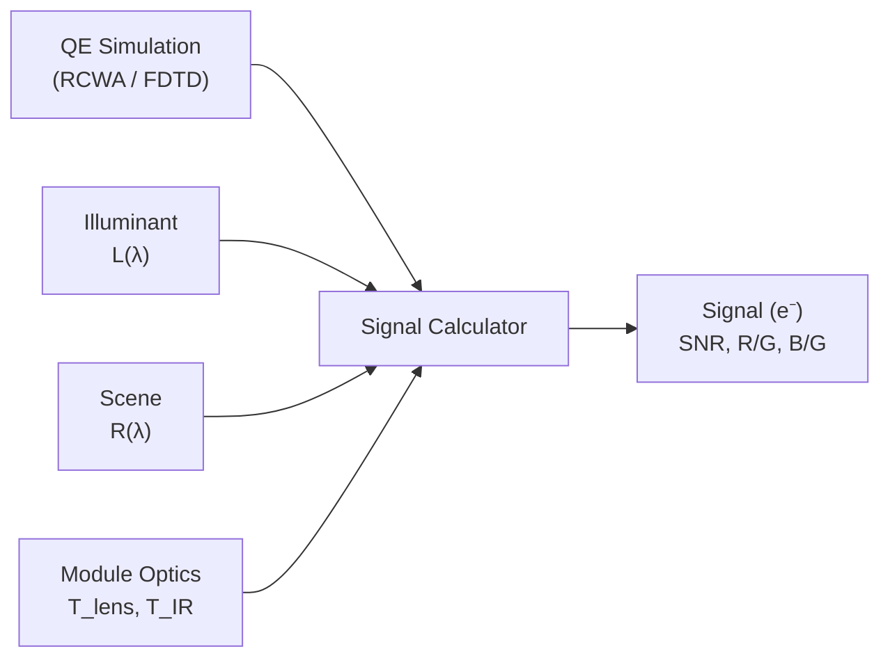

# Signal-Level Simulation

## Overview

After computing the quantum efficiency (QE) spectrum of your pixel design, the next step is to predict the actual signal level under realistic imaging conditions. Signal-level simulation bridges the gap between raw QE curves and practical performance metrics like signal-to-noise ratio, white balance, and color accuracy.

### Why signal simulation matters

- **QE alone is not enough**: Two pixel designs with identical peak QE may perform very differently under real illumination because of differences in spectral shape, color filter bandwidth, and IR leakage.
- **Illuminant dependence**: A pixel that is well-balanced under D65 daylight may show significant color errors under incandescent (A) or fluorescent (F11) lighting.
- **System-level optimization**: Signal simulation lets you evaluate the full camera module (lens + IR filter + sensor) rather than the pixel in isolation.

### Workflow



1. Run a QE simulation to obtain $\text{QE}_i(\lambda)$ for each color channel
2. Define the light source (illuminant) spectral power distribution
3. Specify the scene reflectance
4. Configure camera module optics (lens transmittance, IR filter)
5. Compute the pixel signal in electrons and analyze the results

## Setting Up Illuminants

The `Illuminant` class provides factory methods for common light sources:

```python
from compass.sources.illuminant import Illuminant
import numpy as np

# Define wavelength grid (in micrometers)
wavelengths = np.arange(0.38, 0.781, 0.01)

# Blackbody at 5500K (approximate daylight)
daylight = Illuminant.blackbody(5500, wavelengths)

# CIE D65 (standard average daylight)
d65 = Illuminant.cie_d65(wavelengths)

# CIE Illuminant A (incandescent, 2856K)
cia = Illuminant.cie_a(wavelengths)

# Triband fluorescent (CIE F11)
f11 = Illuminant.cie_f11(wavelengths)

# White LED (blue pump + phosphor, specify CCT)
led = Illuminant.led_white(5000, wavelengths)
```

Each illuminant object stores its spectral power distribution (SPD) normalized so that $L(560\text{ nm}) = 1.0$. You can inspect and plot the SPD:

```python
import matplotlib.pyplot as plt

fig, ax = plt.subplots(figsize=(10, 5))
for name, illum in [("D65", d65), ("A", cia), ("F11", f11), ("LED 5000K", led)]:
    ax.plot(illum.wavelengths * 1000, illum.spd, label=name)

ax.set_xlabel("Wavelength (nm)")
ax.set_ylabel("Relative SPD")
ax.set_title("Standard Illuminant Spectra")
ax.legend()
ax.grid(True, alpha=0.3)
plt.tight_layout()
```

### Custom illuminant from measured data

If you have a measured SPD (e.g., from a spectrometer), create an illuminant from raw arrays:

```python
# Load measured data: columns are wavelength (nm) and relative power
data = np.loadtxt("measured_led.csv", delimiter=",", skiprows=1)
wl_um = data[:, 0] / 1000  # Convert nm to um
spd = data[:, 1]

custom = Illuminant(wavelengths=wl_um, spd=spd, name="Custom LED")
```

## Defining Scene Reflectance

Scene reflectance determines how much light at each wavelength is reflected toward the camera. COMPASS supports constant and spectral reflectance profiles.

### Constant reflectance (grey target)

For a neutral grey card:

```python
# 18% grey card -- the standard exposure reference
scene_reflectance = 0.18

# Or specify per-wavelength constant
scene_reflectance = np.full_like(wavelengths, 0.18)
```

### Spectral reflectance (colored targets)

For colored patches (e.g., Macbeth ColorChecker), use the built-in patch library:

```python
from compass.sources.scene import SceneReflectance

# Load a Macbeth ColorChecker patch
red_patch = SceneReflectance.macbeth("red")
green_patch = SceneReflectance.macbeth("green")
blue_patch = SceneReflectance.macbeth("blue")

# Plot reflectance curves
fig, ax = plt.subplots(figsize=(10, 5))
for name, patch in [("Red", red_patch), ("Green", green_patch), ("Blue", blue_patch)]:
    ax.plot(patch.wavelengths * 1000, patch.reflectance, label=name)

ax.set_xlabel("Wavelength (nm)")
ax.set_ylabel("Reflectance")
ax.set_title("Macbeth ColorChecker Patch Reflectances")
ax.legend()
ax.grid(True, alpha=0.3)
plt.tight_layout()
```

### Custom spectral reflectance

```python
# Define a custom spectral reflectance (e.g., a narrow-band green object)
custom_refl = SceneReflectance(
    wavelengths=wavelengths,
    reflectance=0.5 * np.exp(-0.5 * ((wavelengths - 0.55) / 0.03) ** 2) + 0.05,
    name="Narrow Green"
)
```

## Configuring Module Optics

The camera module introduces lens transmittance and IR filtering:

```python
from compass.sources.optics import ModuleOptics

optics = ModuleOptics(
    lens_transmittance=0.90,       # Total lens T (or provide spectral array)
    ir_cutoff_nm=650,              # IR filter 50% cutoff wavelength
    ir_transition_nm=15,           # Transition region half-width
    f_number=2.0,                  # Lens F-number
    pixel_pitch_um=1.0,            # Pixel pitch
)
```

For spectral lens transmittance (e.g., from Zemax export):

```python
# Spectral lens transmittance from design data
lens_t_data = np.loadtxt("lens_transmittance.csv", delimiter=",", skiprows=1)
optics = ModuleOptics(
    lens_transmittance=lens_t_data[:, 1],  # Spectral T(lambda)
    lens_wavelengths=lens_t_data[:, 0] / 1000,  # Convert nm to um
    ir_cutoff_nm=650,
    f_number=2.0,
    pixel_pitch_um=1.0,
)
```

## Computing Pixel Signal

Combine QE results with illuminant, scene, and optics to compute signal:

```python
from compass.analysis.signal_calculator import SignalCalculator
from compass.analysis.qe_calculator import QECalculator

# Get per-channel QE from simulation results
channel_qe = QECalculator.spectral_response(result.qe_per_pixel, result.wavelengths)

# Create signal calculator
calc = SignalCalculator(
    illuminant=d65,
    scene_reflectance=0.18,
    optics=optics,
    exposure_time_ms=10.0,
)

# Compute signal in electrons for each channel
signals = calc.compute_signal(channel_qe)

print("Signal levels (electrons):")
print(f"  Red:   {signals['R']:.0f} e-")
print(f"  Green: {signals['G']:.0f} e-")
print(f"  Blue:  {signals['B']:.0f} e-")
print(f"  R/G ratio: {signals['R'] / signals['G']:.3f}")
print(f"  B/G ratio: {signals['B'] / signals['G']:.3f}")
```

### Signal-to-noise ratio

Compute SNR including shot noise, dark current, and read noise:

```python
snr = calc.compute_snr(
    channel_qe,
    dark_current_e_per_s=5.0,    # Dark current in e-/s
    read_noise_e=2.5,            # Read noise in e- rms
)

print("SNR (dB):")
for ch, val in snr.items():
    print(f"  {ch}: {val:.1f} dB")
```

## White Balance Analysis

Evaluate white balance characteristics under different illuminants:

```python
# Compute white balance gains for multiple illuminants
illuminants = {
    "D65": Illuminant.cie_d65(wavelengths),
    "A": Illuminant.cie_a(wavelengths),
    "F11": Illuminant.cie_f11(wavelengths),
    "LED 5000K": Illuminant.led_white(5000, wavelengths),
}

print("White balance analysis (18% grey):")
print(f"{'Illuminant':<15} {'R/G':>8} {'B/G':>8} {'Gain_R':>8} {'Gain_B':>8}")
print("-" * 55)

for name, illum in illuminants.items():
    calc_wb = SignalCalculator(
        illuminant=illum,
        scene_reflectance=0.18,
        optics=optics,
        exposure_time_ms=10.0,
    )
    sig = calc_wb.compute_signal(channel_qe)
    rg = sig['R'] / sig['G']
    bg = sig['B'] / sig['G']
    gain_r = 1.0 / rg
    gain_b = 1.0 / bg
    print(f"{name:<15} {rg:>8.3f} {bg:>8.3f} {gain_r:>8.3f} {gain_b:>8.3f}")
```

## Example: Color Accuracy Under Different Illuminants

This example evaluates how well a pixel design reproduces Macbeth ColorChecker colors under various illuminants:

```python
from compass.analysis.signal_calculator import SignalCalculator
from compass.analysis.qe_calculator import QECalculator
from compass.sources.illuminant import Illuminant
from compass.sources.scene import SceneReflectance
import numpy as np

# Load QE results
channel_qe = QECalculator.spectral_response(result.qe_per_pixel, result.wavelengths)
wavelengths = result.wavelengths

# Define illuminants
illuminants = {
    "D65": Illuminant.cie_d65(wavelengths),
    "A": Illuminant.cie_a(wavelengths),
    "LED 5000K": Illuminant.led_white(5000, wavelengths),
}

# Macbeth patches to test
patches = ["red", "green", "blue", "cyan", "magenta", "yellow",
           "dark_skin", "light_skin", "blue_sky", "foliage"]

for illum_name, illum in illuminants.items():
    print(f"\n=== {illum_name} ===")
    calc = SignalCalculator(
        illuminant=illum,
        optics=optics,
        exposure_time_ms=10.0,
    )

    # First compute WB gains from neutral grey
    grey_sig = calc.compute_signal(channel_qe, scene_reflectance=0.18)
    wb_r = grey_sig['G'] / grey_sig['R']
    wb_b = grey_sig['G'] / grey_sig['B']

    print(f"  WB gains: R={wb_r:.3f}, B={wb_b:.3f}")
    print(f"  {'Patch':<15} {'R_wb':>8} {'G':>8} {'B_wb':>8}")
    print(f"  {'-'*45}")

    for patch_name in patches:
        patch = SceneReflectance.macbeth(patch_name)
        sig = calc.compute_signal(channel_qe, scene_reflectance=patch)
        r_wb = sig['R'] * wb_r
        g = sig['G']
        b_wb = sig['B'] * wb_b
        # Normalize to green
        total = r_wb + g + b_wb
        print(f"  {patch_name:<15} {r_wb/total:>8.3f} {g/total:>8.3f} {b_wb/total:>8.3f}")
```

## Configuration via YAML

Signal simulation parameters can also be specified in a YAML config file:

```yaml
signal:
  illuminant: "D65"                  # "D65", "A", "F11", "LED", or "blackbody"
  illuminant_cct: 5000               # CCT for LED or blackbody
  scene_reflectance: 0.18            # Scalar or path to spectral CSV
  optics:
    lens_transmittance: 0.90
    ir_cutoff_nm: 650
    ir_transition_nm: 15
    f_number: 2.0
    pixel_pitch_um: 1.0
  exposure_time_ms: 10.0
  noise:
    dark_current_e_per_s: 5.0
    read_noise_e: 2.5
```

```python
from compass.config import Config

config = Config.load("simulation.yaml")
calc = SignalCalculator.from_config(config.signal, wavelengths)
signals = calc.compute_signal(channel_qe)
```

## Next steps

- [Quantum Efficiency theory](../theory/quantum-efficiency.md) -- Understanding QE computation
- [Signal Chain theory](../theory/signal-chain.md) -- Full radiometric signal chain derivation
- [Cone Illumination](./cone-illumination.md) -- Modeling realistic lens illumination
- [Visualization](./visualization.md) -- Plotting signal and QE results
