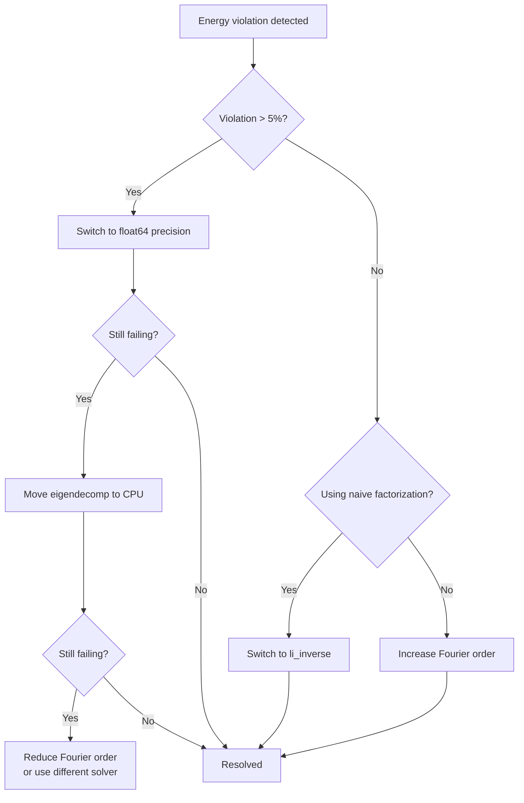

# Troubleshooting

This page covers common errors, their root causes, and step-by-step solutions. Issues are organized from most to least frequent.

## Import errors

### ModuleNotFoundError for solver packages

**Error:**
```
ModuleNotFoundError: No module named 'torcwa'
```

**Cause:** Solver backend packages are optional dependencies and not installed by default.

**Solution:** Install the dependency group for your solver:

```bash
pip install -e ".[rcwa]"     # torcwa, grcwa, meent
pip install -e ".[fdtd]"     # flaport FDTD
pip install -e ".[viz]"      # plotly, pyvista (3D viewer)
pip install -e ".[all]"      # everything
```

Verify which solvers are available:

```python
from compass.solvers.base import SolverFactory
print(SolverFactory.list_solvers())
```

### ImportError for plotly (3D viewer)

**Error:**
```
ImportError: The 'plotly' package is required for 3D visualization.
```

**Solution:**
```bash
pip install -e ".[viz]"
```

For Jupyter notebooks, also install nbformat and the widget extension:

```bash
pip install nbformat
jupyter labextension install @jupyter-widgets/jupyterlab-manager
```

## GPU and CUDA issues

### CUDA not available

**Error:**
```
RuntimeError: No CUDA GPUs are available
```
or `torch.cuda.is_available()` returns `False`.

**Diagnosis:**
```python
import torch
print(f"PyTorch: {torch.__version__}")
print(f"CUDA available: {torch.cuda.is_available()}")
print(f"CUDA version: {torch.version.cuda}")
```

**Solutions:**

1. Reinstall PyTorch with CUDA support:
```bash
pip install torch --index-url https://download.pytorch.org/whl/cu121
```

2. As a workaround, run on CPU:
```yaml
compute:
  backend: "cpu"
```

### CUDA out of memory

**Error:**
```
torch.cuda.OutOfMemoryError: CUDA out of memory
```

**Cause:** RCWA memory scales as $O(M^2)$ where $M = (2N_x+1)(2N_y+1)$ is the total number of Fourier harmonics. The eigenvalue problem requires matrices of size $2M \times 2M$ per layer. At order [15, 15], $M = 961$ and matrix size is $1922 \times 1922$.

| Order     | Modes $M$ | Matrix size       | Approx. GPU memory |
|-----------|-----------|-------------------|--------------------|
| [5, 5]    | 121       | 242 x 242         | ~50 MB             |
| [9, 9]    | 361       | 722 x 722         | ~200 MB            |
| [13, 13]  | 729       | 1458 x 1458       | ~500 MB            |
| [17, 17]  | 1225      | 2450 x 2450       | ~1.2 GB            |
| [21, 21]  | 1849      | 3698 x 3698       | ~3.0 GB            |

**Solutions (try in order):**

1. Reduce Fourier order: `fourier_order: [9, 9]` instead of `[15, 15]`
2. Move eigendecomposition to CPU (keeps other operations on GPU):
```yaml
solver:
  stability:
    eigendecomp_device: "cpu"
```
3. Use CPU for the entire simulation: `compute.backend: "cpu"`

### TF32 precision issues on Ampere+ GPUs

**Symptom:** Results differ between Ampere GPUs (A100, RTX 30xx/40xx) and older GPUs or CPU. Energy conservation violations appear only on newer hardware.

**Cause:** PyTorch enables TF32 (TensorFloat-32) by default on Ampere+ architectures. TF32 reduces the floating-point mantissa from 23 bits (IEEE float32) to 10 bits in matrix multiply operations. This is acceptable for neural network training but causes catastrophic errors in RCWA S-matrix calculations because:

- Eigendecomposition requires high precision to distinguish closely-spaced eigenvalues
- S-matrix products accumulate rounding errors across many layers
- Matrix inversions amplify TF32 truncation errors

**Solution:** COMPASS disables TF32 by default. Verify it is disabled:

```python
import torch
print(torch.backends.cuda.matmul.allow_tf32)  # Must be False
print(torch.backends.cudnn.allow_tf32)         # Must be False
```

If these return True, set explicitly in your config:

```yaml
solver:
  stability:
    allow_tf32: false
```

### MPS (Apple Silicon) issues

**Symptom:** Errors related to complex number operations on M1/M2/M3 Macs.

**Cause:** PyTorch MPS backend has incomplete complex number support in some versions. Eigendecomposition may silently fall back to CPU, and some operations may fail.

**Solution:** Test with CPU first to isolate the issue:

```yaml
compute:
  backend: "cpu"
```

If CPU works, you can try MPS with the caveat that performance may not exceed CPU for RCWA workloads.

## Energy conservation failures

### R + T + A != 1

**Error:**
```
WARNING: Energy conservation violation: max |R+T+A-1| = 0.0523 (tolerance: 0.02)
```

**Cause:** The fundamental physical constraint $R + T + A = 1$ is violated, indicating numerical error in the solver. This is the most important diagnostic signal in RCWA.

**Solutions (ordered by likelihood of fixing the issue):**



**Step 1: Increase precision**
```yaml
solver:
  stability:
    precision_strategy: "float64"
```

**Step 2: Use Li's inverse factorization** (critical for structures with metal grids or DTI)
```yaml
solver:
  stability:
    fourier_factorization: "li_inverse"
```

**Step 3: Move eigendecomposition to CPU**
```yaml
solver:
  stability:
    eigendecomp_device: "cpu"
```

**Step 4: Enable automatic fallback**
```yaml
solver:
  stability:
    energy_check:
      enabled: true
      tolerance: 0.02
      auto_retry_float64: true
```

The `AdaptivePrecisionRunner` implements a 3-level fallback strategy: GPU float32 -> GPU float64 -> CPU float64. If all three fail, the error is raised.

**Step 5: Increase Fourier order** (if truncation is the issue)
```yaml
solver:
  params:
    fourier_order: [15, 15]   # Up from [9, 9]
```

## RCWA numerical stability

### S-matrix vs T-matrix

COMPASS uses the **S-matrix (scattering matrix) algorithm exclusively**. The older T-matrix (transfer matrix) approach is numerically unstable because it involves terms of the form $e^{+|\lambda| k_0 d}$ for evanescent modes, which grow exponentially with layer thickness $d$.

The S-matrix algorithm uses the **Redheffer star product** to combine layer S-matrices, ensuring all intermediate quantities remain bounded. The propagation factors are $e^{-|\lambda| k_0 d}$ (decaying), which never overflow.

If you see overflow errors, verify that:

1. No layer has extreme thickness (> 5 um for a single layer)
2. The solver is using S-matrix recursion (all COMPASS solvers do by default)

### Eigenvalue decomposition instability

**Symptom:** NaN values, condition number warnings, or erratic results at specific wavelengths.

**Root cause:** The RCWA eigenvalue problem requires decomposing a $2M \times 2M$ matrix per layer. This can fail when:

- **Degenerate eigenvalues**: Two or more eigenvalues are nearly identical, making eigenvectors ambiguous
- **Large condition number**: The eigenvector matrix is nearly singular
- **Low precision**: float32 has only 7 significant digits, insufficient for distinguishing closely-spaced eigenvalues

**Solutions:**

1. **Mixed-precision eigendecomposition** (default): The eigenvalue problem is promoted to `complex128` regardless of the simulation precision, then results are cast back:

```python
# This is what PrecisionManager.mixed_precision_eigen does internally
matrix_f64 = matrix.astype(np.complex128)
eigenvalues, eigenvectors = np.linalg.eig(matrix_f64)
```

2. **Eigenvalue broadening**: Adds a small perturbation to break exact degeneracies:

```yaml
solver:
  stability:
    eigenvalue_broadening: 1.0e-10
```

3. **Condition number monitoring**: Warn when the eigenvector matrix condition number exceeds a threshold:

```yaml
solver:
  stability:
    condition_number_warning: 1.0e+12
```

### Li's inverse rule and Fourier factorization

**Problem:** RCWA converges slowly for TM polarization at interfaces with large permittivity contrast (e.g., air/metal, silicon/SiO2 at DTI boundaries).

**Cause:** The naive Laurent rule (direct Fourier transform of $\varepsilon$) produces poor convergence because the Fourier series of the product of two discontinuous functions does not equal the product of their Fourier series (Gibbs phenomenon).

**Solution:** Li's inverse rule uses $[\text{FT}(1/\varepsilon)]^{-1}$ instead of $\text{FT}(\varepsilon)$ at material boundaries, which dramatically improves TM convergence:

```yaml
solver:
  stability:
    fourier_factorization: "li_inverse"   # default for torcwa
```

This is especially important when:

- Tungsten metal grid is enabled in the color filter
- DTI trenches are present in silicon
- Any layer has sharp material boundaries with contrast ratio > 2

### Propagation direction (branch cut) selection

The RCWA eigenvalue problem produces eigenvalues whose square roots can have either sign. Selecting the wrong branch leads to exponentially growing (unphysical) fields. COMPASS's `EigenvalueStabilizer.select_propagation_direction` enforces:

- Propagating modes: $\text{Re}(\sqrt{\lambda}) > 0$ (forward-traveling)
- Evanescent modes: proper decay direction based on the time convention $e^{-i\omega t}$

If you suspect branch selection errors, enable debug logging:

```python
import logging
logging.getLogger("compass.solvers.rcwa.stability").setLevel(logging.DEBUG)
```

## QE anomalies

### QE greater than 1

**Symptom:** QE values exceed 1.0 for some pixels or wavelengths.

**Cause:** Unphysical result indicating numerical error. QE must satisfy $0 \leq \text{QE} \leq 1$.

**Checklist:**
1. Check energy conservation (R + T + A = 1)
2. Increase Fourier order
3. Verify material data (especially silicon $k$ values)
4. Check that photodiode region does not extend outside the silicon layer
5. Try a different solver for cross-validation

### Jagged or spiky QE spectrum

**Symptom:** QE spectrum has sharp spikes or irregular oscillations.

**Possible causes:**

1. **Wavelength step too coarse**: Thin-film interference fringes have period:

$$\Delta\lambda \approx \frac{\lambda^2}{2 n d}$$

For a 3 um silicon layer at 550 nm: $\Delta\lambda \approx \frac{0.55^2}{2 \times 4 \times 3} \approx 12.6$ nm.

**Fix:** Use wavelength step $\leq \Delta\lambda / 3$ (e.g., 4 nm).

2. **Numerical noise**: Random spikes at isolated wavelengths indicate stability issues at those points. Enable `auto_retry_float64`.

3. **Fourier order too low**: Insufficient harmonics cause irregular artifacts. Increase order and re-run.

### Negative QE

**Cause:** Numerical error in the absorption decomposition. The QE per pixel is derived from the total absorption $A = 1 - R - T$ distributed among pixels. If $R + T > 1$ due to numerical error, $A$ becomes negative.

**Fix:** Same as energy conservation fixes above.

## Performance tips

| Bottleneck                | Diagnosis                          | Solution                              |
|--------------------------|-------------------------------------|---------------------------------------|
| Running on CPU            | Check `result.metadata["device"]`  | Set `compute.backend: "cuda"`         |
| High Fourier order        | Order > [13, 13]                   | Reduce order, verify convergence      |
| Float64 everywhere        | `precision_strategy: "float64"`    | Use `"mixed"` instead                 |
| CPU eigendecomposition    | `eigendecomp_device: "cpu"`        | Try `"gpu"` if stability permits      |
| Unpolarized (2 runs/wl)  | `polarization: "unpolarized"`      | Use TE or TM if structure is symmetric |
| Many wavelengths          | Step < 5 nm over wide range        | Use coarser step, interpolate results |
| Large unit cell           | `unit_cell: [4, 4]`               | Use smallest periodic unit            |

### Profiling a simulation

```python
result = solver.run_timed()
print(f"Runtime: {result.metadata['runtime_seconds']:.2f} s")
print(f"Solver: {result.metadata['solver_name']}")
print(f"Device: {result.metadata['device']}")
```

## Pre-simulation diagnostics

Run the built-in stability checker before launching a simulation:

```python
from compass.solvers.rcwa.stability import StabilityDiagnostics

warnings = StabilityDiagnostics.pre_simulation_check(pixel_stack, solver_config)
for w in warnings:
    print(f"WARNING: {w}")
```

This checks for:

- Large matrix size with low precision
- Thick layers that require S-matrix algorithm
- TF32 enabled when it should not be
- Patterned layers with naive factorization

## Post-simulation validation

```python
from compass.solvers.rcwa.stability import StabilityDiagnostics

report = StabilityDiagnostics.post_simulation_check(result)
if report:
    for key, info in report.items():
        print(f"{key}: {info['status']} -- {info['issue']}")
else:
    print("All checks passed.")
```

This validates:

- QE values within [0, 1] (tolerance: +/- 0.01)
- No NaN or Inf in R, T, A arrays
- Energy conservation within 5%

## FAQ

**Q: Which Fourier order should I use?**

Start with `[9, 9]` for quick exploration. Increase to `[13, 13]` or `[15, 15]` for publication-quality results. Always run a convergence sweep before trusting absolute QE values.

**Q: Should I use float32 or float64?**

Use `precision_strategy: "mixed"` (default). This runs the main computation in float32 for speed and promotes eigendecomposition to float64 for stability. Switch to full `"float64"` only if you see energy conservation issues.

**Q: Why does my simulation give different results on different GPUs?**

Most likely TF32. Ampere+ GPUs (A100, RTX 30xx/40xx) enable TF32 by default. Ensure `allow_tf32: false` in your config.

**Q: How do I know if my results are converged?**

Run the same simulation at two different Fourier orders (e.g., [9,9] and [11,11]). If peak QE changes by less than 1%, you are converged.

**Q: Can I run COMPASS without a GPU?**

Yes. Set `compute.backend: "cpu"`. All solvers work on CPU. Performance is slower (5--20x) but results are identical and often more numerically stable.

## Getting help

If none of the above solutions resolve your issue:

1. Run pre- and post-simulation diagnostics (see above)
2. Enable debug logging:
```python
import logging
logging.basicConfig(level=logging.DEBUG)
```
3. Run the test suite to verify your installation:
```bash
PYTHONPATH=. python3.11 -m pytest tests/ -v -k "test_energy"
```
4. File an issue on the COMPASS repository with your YAML config and the full error traceback.

## Next steps

- [Choosing a Solver](./choosing-solver.md) -- understand solver trade-offs
- [Material Database](./material-database.md) -- check material data coverage
- [Visualization](./visualization.md) -- visually inspect structure and results
