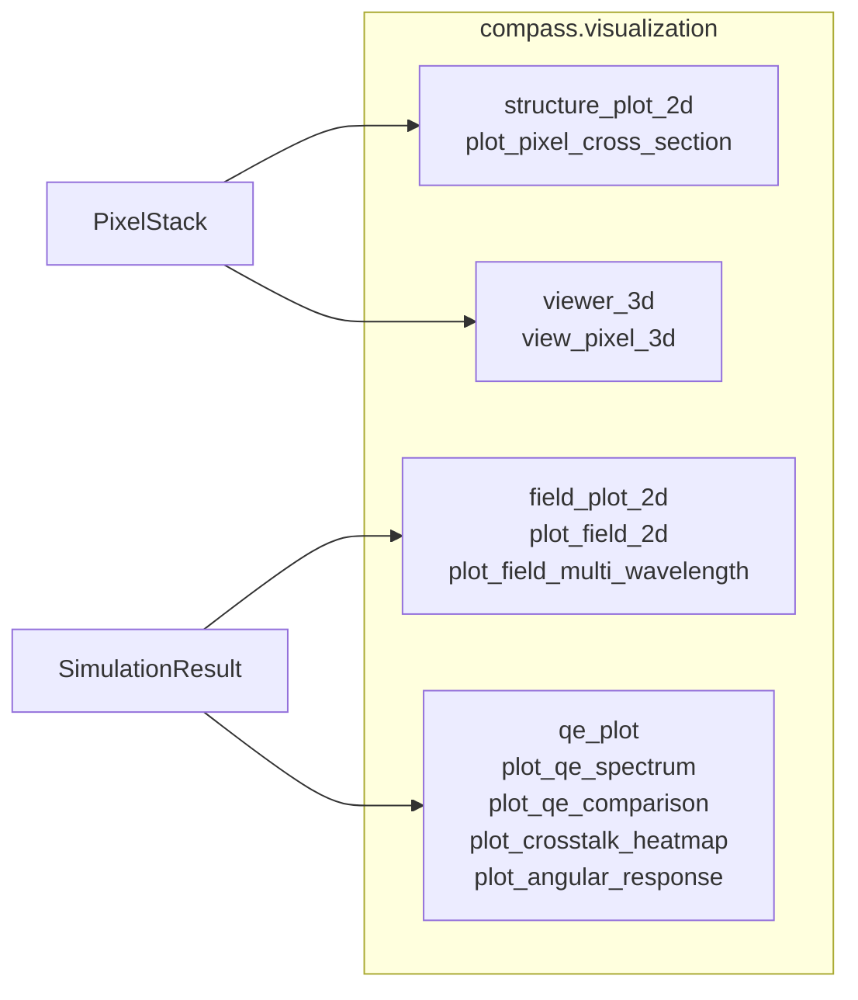

# Visualization

COMPASS provides a comprehensive visualization toolkit for inspecting pixel structures, analyzing electromagnetic field distributions, and presenting simulation results. All 2D plotting functions are built on matplotlib and return `Axes` objects for further customization. The 3D viewer uses plotly for interactive exploration.

## Module overview



All public functions can be imported directly from the `compass.visualization` namespace:

```python
from compass.visualization import (
    plot_pixel_cross_section,
    plot_field_2d,
    plot_field_multi_wavelength,
    plot_qe_spectrum,
    plot_qe_comparison,
    plot_crosstalk_heatmap,
    plot_angular_response,
    view_pixel_3d,
)
```

## 2D structure plots

The `plot_pixel_cross_section` function renders cross-sections of the pixel stack with material color-coding and layer annotations. Always inspect your structure visually before running a solver.

### XZ cross-section (vertical)

Shows all layers from silicon (bottom) to air (top) at a specified y-position.

```python
from compass.visualization import plot_pixel_cross_section

ax = plot_pixel_cross_section(
    pixel_stack,
    plane="xz",
    position=0.5,       # y-coordinate of the slice in um
    wavelength=0.55,     # wavelength for permittivity (used in XY mode)
    figsize=(12, 6),
)
```

The plot includes:

- Color-coded rectangles for each layer using the material color map
- Per-pixel color filter regions showing the Bayer pattern
- Black boundary lines at layer interfaces
- Layer name annotations on the right margin
- Pixel pitch annotation in the upper-left corner

### YZ cross-section

Same as XZ but sliced along the y-z plane at a given x-position:

```python
ax = plot_pixel_cross_section(pixel_stack, plane="yz", position=1.0)
```

### XY cross-section (horizontal)

Shows the permittivity distribution at a given z-height. Useful for inspecting the color filter pattern, metal grid geometry, and DTI layout.

```python
ax = plot_pixel_cross_section(
    pixel_stack,
    plane="xy",
    position=4.5,       # z-coordinate in um
    wavelength=0.55,
)
```

The XY mode computes the real part of the complex permittivity $\text{Re}(\varepsilon)$ on a 256 x 256 grid and renders it with the `viridis` colormap. Pixel boundary lines are overlaid as white dashed lines.

### Function signature

```python
def plot_pixel_cross_section(
    pixel_stack: PixelStack,
    plane: str = "xz",           # "xz", "yz", or "xy"
    position: float = 0.0,       # slice position in um
    wavelength: float = 0.55,    # wavelength in um (for XY eps)
    ax: plt.Axes | None = None,  # pass existing axes, or None to create
    figsize: tuple = (12, 6),    # figure size when ax is None
) -> plt.Axes:
```

### Multi-panel structure comparison

Compose multiple views by passing your own axes:

```python
import matplotlib.pyplot as plt

fig, axes = plt.subplots(1, 3, figsize=(18, 5))

z_positions = [5.5, 4.5, 1.0]
labels = ["Microlens region", "Color Filter region", "Silicon region"]

for ax, z_pos, label in zip(axes, z_positions, labels):
    plot_pixel_cross_section(
        pixel_stack, plane="xy",
        position=z_pos, wavelength=0.55, ax=ax,
    )
    ax.set_title(label)

fig.tight_layout()
plt.savefig("structure_xy_slices.png", dpi=150)
```

## Field distribution plots

After running a simulation that produces field data, visualize electromagnetic field distributions with `plot_field_2d`.

### Single field plot

```python
from compass.visualization import plot_field_2d

ax = plot_field_2d(
    result,                     # SimulationResult from solver.run()
    component="|E|2",          # field component to plot
    plane="xz",                # cross-section plane
    position=0.5,              # slice position in um
    wavelength_key=None,       # auto-selects first available
    overlay_structure=True,    # overlay material boundary contours
    log_scale=False,           # logarithmic color normalization
    cmap="hot",                # matplotlib colormap name
    figsize=(10, 6),
)
```

### Available field components

| Component | Physical meaning                                    | Units          |
|-----------|-----------------------------------------------------|----------------|
| `"Ex"`    | Magnitude of $E_x$ component                       | V/m            |
| `"Ey"`    | Magnitude of $E_y$ component                       | V/m            |
| `"Ez"`    | Magnitude of $E_z$ component                       | V/m            |
| `"|E|2"`  | Electric field intensity $\|E_x\|^2 + \|E_y\|^2 + \|E_z\|^2$ | V$^2$/m$^2$ |
| `"Sz"`    | z-component of Poynting vector (energy flow)         | W/m$^2$        |

The intensity $|E|^2$ is the most commonly plotted quantity because it shows where electromagnetic energy is concentrated within the pixel structure. The Poynting vector $S_z$ indicates the direction and magnitude of energy flow along the vertical axis.

### Structure overlay

When `overlay_structure=True`, material boundaries are drawn as white contour lines on top of the field data. This requires the simulation result to include permittivity data in `result.metadata["eps_3d"]`. If not available, the overlay is silently skipped.

### Log scale for high dynamic range

Silicon absorption creates large field intensity differences between the top and bottom of the pixel. Use `log_scale=True` to reveal field structure in low-intensity regions:

```python
ax = plot_field_2d(
    result,
    component="|E|2",
    plane="xz",
    position=0.5,
    log_scale=True,
    cmap="inferno",
)
```

### Multi-wavelength comparison

Compare field patterns at different wavelengths side by side:

```python
from compass.visualization import plot_field_multi_wavelength

fig = plot_field_multi_wavelength(
    result,
    wavelengths=["0.450", "0.550", "0.650"],
    component="|E|2",
    plane="xz",
    position=0.5,
    ncols=3,
    figsize_per_plot=(5, 4),
    log_scale=True,
    cmap="hot",
)
fig.savefig("field_comparison.png", dpi=150)
```

This creates a grid of subplots, one per wavelength, with consistent color scaling for easy visual comparison.

## QE spectrum plots

### Basic QE spectrum

```python
from compass.visualization import plot_qe_spectrum

ax = plot_qe_spectrum(result, figsize=(8, 5))
```

This plots QE vs wavelength for each Bayer channel (R, G, B). Individual pixel curves are drawn as thin semi-transparent lines (alpha=0.3), and the channel mean is drawn as a thick line. The y-axis is fixed to [0, 1].

The wavelength axis is automatically converted from um (internal) to nm (display) using `compass.core.units.um_to_nm`.

### Multi-solver QE comparison

Overlay QE spectra from different solvers or configurations:

```python
from compass.visualization import plot_qe_comparison

ax_main, ax_diff = plot_qe_comparison(
    results=[result_torcwa, result_grcwa, result_meent],
    labels=["torcwa", "grcwa", "meent"],
    show_difference=True,
    figsize=(10, 7),
)
```

Each solver gets a distinct line style (solid, dashed, dash-dot, dotted) while maintaining R/G/B color coding. When `show_difference=True`, a lower panel shows $\Delta\text{QE} = \text{QE}_i - \text{QE}_\text{ref}$ where the first result is the reference.

### Function signature

```python
def plot_qe_comparison(
    results: Sequence[SimulationResult],
    labels: Sequence[str],
    ax: plt.Axes | None = None,
    figsize: tuple = (10, 6),
    show_difference: bool = False,
) -> plt.Axes | tuple[plt.Axes, plt.Axes]:
```

## Crosstalk heatmaps

Visualize pixel-to-pixel crosstalk as a matrix where entry $(i, j)$ represents the signal in pixel $i$ relative to the intended target pixel $j$.

```python
from compass.visualization import plot_crosstalk_heatmap

# At a specific wavelength index
ax = plot_crosstalk_heatmap(result, wavelength_idx=15, figsize=(7, 6))

# Averaged over all wavelengths
ax = plot_crosstalk_heatmap(result, wavelength_idx=None)
```

The heatmap uses the `YlOrRd` colormap. Diagonal entries represent correctly detected signal (self-coupling), and off-diagonal entries represent crosstalk. Cell values are annotated numerically.

For a 2x2 Bayer unit cell with pixels `R_0_0`, `G_0_1`, `G_1_0`, `B_1_1`, the matrix is 4x4:

```
         R_0_0  G_0_1  G_1_0  B_1_1
R_0_0  [ 0.85   0.05   0.05   0.05 ]
G_0_1  [ 0.05   0.85   0.05   0.05 ]
G_1_0  [ 0.05   0.05   0.85   0.05 ]
B_1_1  [ 0.05   0.05   0.05   0.85 ]
```

## Angular response curves

Plot QE as a function of chief ray angle at a fixed wavelength:

```python
from compass.visualization import plot_angular_response

ax = plot_angular_response(
    results_vs_angle=angle_results,    # list of SimulationResult, one per angle
    angles=[0, 5, 10, 15, 20, 25],    # incidence angles in degrees
    wavelength_idx=15,                  # single wavelength index (or None for avg)
    figsize=(8, 5),
)
```

This is essential for evaluating pixel performance at the sensor edge, where chief ray angles can reach 25--35 degrees. Each channel (R, G, B) is plotted as a separate curve with circular markers.

## 3D pixel viewer

For interactive exploration, use the plotly-based 3D viewer. Requires `pip install compass[viz]`.

```python
from compass.visualization import view_pixel_3d

fig = view_pixel_3d(pixel_stack, wavelength=0.55)
fig.show()
```

### What the 3D viewer renders

| Structure element | Rendering                           | Opacity |
|-------------------|-------------------------------------|---------|
| Air layer         | Semi-transparent box                | 0.05    |
| Microlenses       | Smooth superellipse curved surfaces | 0.50    |
| Planarization     | Semi-transparent box                | 0.30    |
| Color filters     | Per-pixel colored boxes (Bayer)     | 0.70    |
| BARL layers       | Semi-transparent box                | 0.40    |
| Silicon           | Gray box                            | 0.60    |
| Photodiodes       | Highlighted boxes within silicon    | 0.40    |
| DTI trenches      | Thin boxes at pixel boundaries      | 0.50    |

### Export and sharing

```python
# Save as interactive HTML (no server needed)
fig.write_html("pixel_3d_view.html")

# Save as static image (requires kaleido)
fig.write_image("pixel_3d_view.png", scale=2)
```

## Material color map

Structure plots use the following default color scheme, resolved by substring matching against material names:

| Material   | 2D Color       | 3D RGB             |
|-----------|----------------|--------------------|
| silicon   | gray           | (160, 160, 160)    |
| sio2      | lightblue      | (173, 216, 230)    |
| cf_red    | red            | (220, 50, 50)      |
| cf_green  | green          | (50, 180, 50)      |
| cf_blue   | blue           | (50, 80, 220)      |
| tungsten  | yellow         | (220, 200, 50)     |
| polymer   | plum           | (221, 160, 221)    |
| air       | white          | (240, 248, 255)    |
| hfo2      | lightyellow    | (255, 255, 224)    |
| si3n4     | lightsalmon    | (250, 180, 150)    |
| tio2      | wheat          | (245, 222, 179)    |

Colors are defined in `MATERIAL_COLORS` (2D) and `MATERIAL_COLORS_3D` (3D) dictionaries in the respective modules. Unrecognized materials default to light gray.

## Recommended colormaps

| Plot type           | Recommended cmap | Why                                   |
|--------------------|-----------------|---------------------------------------|
| Field intensity     | `hot` or `inferno` | High dynamic range, perceptual     |
| Permittivity (XY)  | `viridis`       | Perceptually uniform, colorblind-safe |
| Crosstalk           | `YlOrRd`        | Sequential, intuitive heat scale      |
| Log-scale fields    | `inferno`       | Good contrast at low intensities      |

## Composing a full summary figure

All plot functions accept an optional `ax` argument, allowing you to compose COMPASS plots into custom figure layouts:

```python
import matplotlib.pyplot as plt

fig = plt.figure(figsize=(16, 10))

# Structure
ax1 = fig.add_subplot(2, 2, 1)
plot_pixel_cross_section(pixel_stack, plane="xz", position=0.5, ax=ax1)

# Field
ax2 = fig.add_subplot(2, 2, 2)
plot_field_2d(result, component="|E|2", plane="xz", position=0.5, ax=ax2)

# QE
ax3 = fig.add_subplot(2, 2, 3)
plot_qe_spectrum(result, ax=ax3)

# Crosstalk
ax4 = fig.add_subplot(2, 2, 4)
plot_crosstalk_heatmap(result, ax=ax4)

fig.suptitle("COMPASS Simulation Summary", fontsize=14)
fig.tight_layout()
fig.savefig("simulation_summary.png", dpi=200)
```

## Saving figures

All visualization functions work with matplotlib's standard save workflow:

```python
ax = plot_qe_spectrum(result)
plt.savefig("output.png", dpi=150, bbox_inches="tight")
plt.savefig("output.pdf", bbox_inches="tight")  # Vector format
plt.savefig("output.svg", bbox_inches="tight")  # SVG for web
```

## Visualization in notebooks

COMPASS visualization works in Jupyter notebooks. For inline display:

```python
%matplotlib inline
from compass.visualization import plot_qe_spectrum
plot_qe_spectrum(result)
```

For interactive zoom/pan in notebooks:

```python
%matplotlib widget
from compass.visualization import plot_qe_spectrum
plot_qe_spectrum(result)
```

## Next steps

- [First Simulation](./first-simulation.md) -- generate results to visualize
- [Choosing a Solver](./choosing-solver.md) -- compare solver outputs visually
- [Troubleshooting](./troubleshooting.md) -- fix blank plots and display issues
