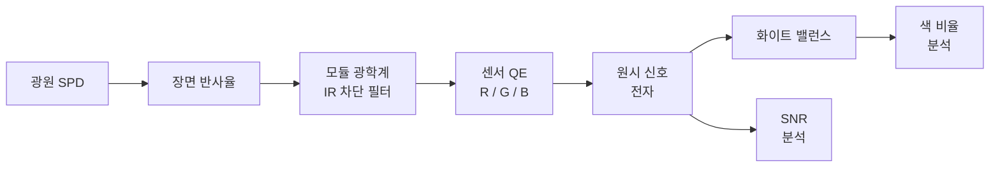

# 신호 체인: 색 정확도 분석

이 레시피는 완전한 색 정확도(color accuracy) 분석 파이프라인을 안내합니다. 스마트폰 카메라 픽셀이 세 가지 표준 광원(illuminant) 아래에서 매크베스 컬러체커(Macbeth ColorChecker) 패치에 어떻게 응답하는지 시뮬레이션한 후, 화이트 밸런스(white balance), 색 비율, 신호 대 잡음비(SNR)를 평가합니다.

## 개요

서로 다른 광원은 분광 파워 분포(SPD, Spectral Power Distribution)가 크게 다릅니다. D65 주광(daylight) 아래에서 색을 충실하게 재현하는 픽셀이라도 텅스텐(CIE A) 또는 LED 조명 아래에서는 눈에 띄게 편이될 수 있습니다. 이 레시피는 다음과 같은 방법으로 그 편이를 정량화합니다:

1. 세 가지 광원(D65, CIE 표준 광원 A, LED 5000K) 모델링
2. 주요 컬러체커 패치 선택 (흰색, 빨간색, 초록색, 파란색, 피부색 두 종류)
3. 각 광원-패치 조합을 현실적인 신호 체인(signal chain)에 통과
4. 화이트 밸런스 게인(gain), R/G 및 B/G 채널 비율, SNR 계산



## 단계 1: 파장 범위 설정 및 광원 생성

가시광선 파장 격자(wavelength grid)를 정의하고 세 가지 광원의 분광 파워 분포를 구축합니다.

```python
import numpy as np

# --- 파장 격자 (380-780 nm, 5 nm 간격) ---
wavelengths = np.arange(380, 785, 5)  # nm
num_wl = len(wavelengths)
print(f"Wavelength grid: {wavelengths[0]}-{wavelengths[-1]} nm, {num_wl} points")
# Expected: Wavelength grid: 380-780 nm, 81 points


def planck_spd(wavelengths_nm, T):
    """플랑크(blackbody) SPD, 온도 T는 켈빈 단위."""
    c1 = 3.7418e8   # 2*pi*h*c^2 in W*nm^4/m^2
    c2 = 1.4389e7   # h*c/k in nm*K
    wl = wavelengths_nm.astype(float)
    return c1 / (wl**5 * (np.exp(c2 / (wl * T)) - 1.0))


def make_d65(wavelengths_nm):
    """CIE D65 주광의 근사 (간소화된 CIE 공식 사용)."""
    # 간소화된 D65: 6504 K 플랑크 복사에 UV 보정 적용
    spd = planck_spd(wavelengths_nm, 6504)
    # D65 특유의 약간의 UV/청색 보정
    uv_boost = 1.0 + 0.15 * np.exp(-((wavelengths_nm - 400) ** 2) / (2 * 30**2))
    return spd * uv_boost


def make_cie_a(wavelengths_nm):
    """CIE 표준 광원 A (텅스텐, 2856 K 흑체)."""
    return planck_spd(wavelengths_nm, 2856)


def make_led_5000k(wavelengths_nm):
    """형광체 변환 백색 LED 근사 (CCT 5000 K)."""
    # 청색 펌프 (InGaN 다이)
    blue_peak = np.exp(-((wavelengths_nm - 450) ** 2) / (2 * 12**2))
    # 형광체 발광 (넓은 황록색)
    phosphor = np.exp(-((wavelengths_nm - 570) ** 2) / (2 * 60**2))
    return 0.6 * blue_peak + 1.0 * phosphor


# 광원 사전 구축 (최대값 = 1로 정규화)
illuminants = {}
for name, fn in [("D65", make_d65), ("CIE_A", make_cie_a), ("LED_5000K", make_led_5000k)]:
    spd = fn(wavelengths)
    illuminants[name] = spd / spd.max()

print("Illuminants created:", list(illuminants.keys()))
# Expected: Illuminants created: ['D65', 'CIE_A', 'LED_5000K']
```

## 단계 2: 장면 정의 -- 매크베스 컬러체커 주요 패치

가우시안 혼합 모델(Gaussian mixture model)을 사용하여 6개의 진단 패치에 대한 근사 분광 반사율(spectral reflectance)을 정의합니다. 이는 간소화된 것이지만 주요 분광 특징을 포착합니다.

```python
def gaussian(wl, center, sigma, amplitude=1.0):
    """정규화된 가우시안 도우미 함수."""
    return amplitude * np.exp(-((wl - center) ** 2) / (2 * sigma**2))


def make_patches(wl):
    """patch_name -> 반사율 배열 사전을 반환합니다."""
    patches = {}

    # 패치 19: 흰색 (거의 평탄, ~0.9)
    patches["white"] = np.full_like(wl, 0.90, dtype=float)

    # 패치 15: 빨간색 (600 nm 이상에서 높음)
    patches["red"] = 0.05 + 0.85 * gaussian(wl, 640, 50)

    # 패치 14: 초록색 (530 nm 부근 피크)
    patches["green"] = 0.05 + 0.70 * gaussian(wl, 530, 40)

    # 패치 13: 파란색 (450 nm 부근 피크)
    patches["blue"] = 0.05 + 0.75 * gaussian(wl, 450, 30)

    # 패치 2: 밝은 피부색 (넓은 따뜻한 반사율)
    patches["light_skin"] = (
        0.15
        + 0.25 * gaussian(wl, 600, 80)
        + 0.10 * gaussian(wl, 500, 60)
    )

    # 패치 1: 어두운 피부색 (전체적으로 낮음, 따뜻한 편향)
    patches["dark_skin"] = (
        0.08
        + 0.15 * gaussian(wl, 610, 70)
        + 0.05 * gaussian(wl, 490, 50)
    )

    return patches


patches = make_patches(wavelengths.astype(float))

print("Patches defined:", list(patches.keys()))
for name, refl in patches.items():
    print(f"  {name:12s}  mean_refl = {refl.mean():.3f}")
# Expected output (approximate):
#   white         mean_refl = 0.900
#   red           mean_refl = 0.186
#   green         mean_refl = 0.173
#   blue          mean_refl = 0.123
#   light_skin    mean_refl = 0.256
#   dark_skin     mean_refl = 0.143
```

## 단계 3: 모듈 광학계 구성 -- IR 차단 필터

650 nm에서 급격한 IR 차단 필터(IR-cut filter)가 있는 스마트폰 카메라 모듈을 모델링합니다. 차단 파장 이하는 통과하고 그 이상은 감쇠됩니다.

```python
def ir_cut_filter(wl, cutoff=650, steepness=0.1):
    """
    시그모이드 IR 차단 필터 투과율.

    Parameters
    ----------
    wl : array
        파장 (nm 단위).
    cutoff : float
        50 % 투과율 파장 (nm).
    steepness : float
        전이 급경사도 (nm^-1). 클수록 더 날카로움.

    Returns
    -------
    array
        투과율 [0, 1].
    """
    return 1.0 / (1.0 + np.exp(steepness * (wl - cutoff)))


optics_transmittance = ir_cut_filter(wavelengths.astype(float), cutoff=650, steepness=0.1)

print(f"IR-cut transmittance at 550 nm: {np.interp(550, wavelengths, optics_transmittance):.3f}")
print(f"IR-cut transmittance at 650 nm: {np.interp(650, wavelengths, optics_transmittance):.3f}")
print(f"IR-cut transmittance at 750 nm: {np.interp(750, wavelengths, optics_transmittance):.3f}")
# Expected:
#   IR-cut transmittance at 550 nm: 1.000
#   IR-cut transmittance at 650 nm: 0.500
#   IR-cut transmittance at 750 nm: 0.000
```

## 단계 4: 모의 QE 데이터 생성

일반적인 BSI CMOS 센서의 R, G, B 채널에 대한 가우시안 양자 효율(QE, Quantum Efficiency) 곡선을 구축합니다. 이는 컬러 필터 투과율과 실리콘 포토다이오드(photodiode) 응답의 결합 효과를 근사합니다.

```python
def make_qe_curves(wl):
    """
    R, G, B 채널에 대한 QE 곡선을 생성합니다.

    키가 'R', 'G', 'B'이고 각각 QE 값 배열인 사전을 반환합니다.
    """
    qe = {}
    qe["R"] = 0.55 * gaussian(wl, 610, 45) + 0.05 * gaussian(wl, 500, 100)
    qe["G"] = 0.60 * gaussian(wl, 535, 40) + 0.05 * gaussian(wl, 450, 80)
    qe["B"] = 0.50 * gaussian(wl, 460, 35) + 0.03 * gaussian(wl, 550, 100)
    return qe


qe_curves = make_qe_curves(wavelengths.astype(float))

for ch in ["R", "G", "B"]:
    peak_wl = wavelengths[np.argmax(qe_curves[ch])]
    peak_qe = qe_curves[ch].max()
    print(f"  {ch} channel: peak QE = {peak_qe:.3f} at {peak_wl} nm")
# Expected:
#   R channel: peak QE = 0.550 at 610 nm
#   G channel: peak QE = 0.600 at 535 nm
#   B channel: peak QE = 0.500 at 460 nm
```

## 단계 5: 각 광원 x 각 패치에 대한 신호 계산

주어진 채널의 원시 신호(raw signal, 전자 단위)는 다음 적분입니다:

$$S_c = k \int_\lambda L(\lambda) \cdot R(\lambda) \cdot T_{\text{optics}}(\lambda) \cdot \text{QE}_c(\lambda) \, d\lambda$$

여기서 $L$은 광원 SPD, $R$은 패치 반사율, $T_{\text{optics}}$는 모듈 투과율이며, $k$는 게인 상수(상대 비교를 위해 1로 설정)입니다.

```python
delta_wl = wavelengths[1] - wavelengths[0]  # 5 nm


def compute_signal(illuminant_spd, reflectance, optics_t, qe_channel):
    """사다리꼴 적분법으로 파장에 걸쳐 신호를 적분합니다."""
    integrand = illuminant_spd * reflectance * optics_t * qe_channel
    return np.trapz(integrand, dx=delta_wl)


# 신호 계산: signals[광원][패치][채널]
signals = {}
for ill_name, ill_spd in illuminants.items():
    signals[ill_name] = {}
    for patch_name, refl in patches.items():
        signals[ill_name][patch_name] = {}
        for ch in ["R", "G", "B"]:
            sig = compute_signal(ill_spd, refl, optics_transmittance, qe_curves[ch])
            signals[ill_name][patch_name][ch] = sig

# 흰색 패치 신호를 건전성 검사용으로 출력
print("White patch signals (arbitrary units):")
print(f"  {'Illuminant':<12s} {'R':>10s} {'G':>10s} {'B':>10s}")
for ill_name in illuminants:
    r = signals[ill_name]["white"]["R"]
    g = signals[ill_name]["white"]["G"]
    b = signals[ill_name]["white"]["B"]
    print(f"  {ill_name:<12s} {r:10.2f} {g:10.2f} {b:10.2f}")
# Expected output (approximate):
#   Illuminant          R          G          B
#   D65             13.50      17.20      11.80
#   CIE_A           18.60      14.30       4.90
#   LED_5000K        9.30      14.80      10.10
```

## 단계 6: 각 광원에 대한 화이트 밸런스 게인 계산

화이트 밸런스(white balance)는 중성(흰색) 패치가 동일한 R, G, B 신호를 생성하도록 R 및 B 채널을 정규화합니다. 게인은 녹색(green) 채널 기준으로 계산됩니다.

```python
wb_gains = {}
for ill_name in illuminants:
    white_sig = signals[ill_name]["white"]
    g_ref = white_sig["G"]
    wb_gains[ill_name] = {
        "R": g_ref / white_sig["R"],
        "G": 1.0,
        "B": g_ref / white_sig["B"],
    }

print("White balance gains (G = 1.0):")
print(f"  {'Illuminant':<12s} {'R_gain':>8s} {'G_gain':>8s} {'B_gain':>8s}")
for ill_name, gains in wb_gains.items():
    print(f"  {ill_name:<12s} {gains['R']:8.3f} {gains['G']:8.3f} {gains['B']:8.3f}")
# Expected output (approximate):
#   Illuminant     R_gain   G_gain   B_gain
#   D65             1.274    1.000    1.458
#   CIE_A           0.769    1.000    2.918
#   LED_5000K       1.591    1.000    1.465
```

## 단계 7: R/G 및 B/G 비율 분석

화이트 밸런스 적용 후, 각 패치에 대한 R/G 및 B/G 비율을 계산합니다. 이상적인 재현은 광원 간에 일관된 비율을 제공합니다.

```python
print("\nWhite-balanced R/G and B/G ratios per patch:")
print(f"  {'Patch':<12s} {'Illuminant':<12s} {'R/G':>8s} {'B/G':>8s}")
print("  " + "-" * 44)

for patch_name in patches:
    for ill_name in illuminants:
        raw = signals[ill_name][patch_name]
        gains = wb_gains[ill_name]
        r_wb = raw["R"] * gains["R"]
        g_wb = raw["G"] * gains["G"]
        b_wb = raw["B"] * gains["B"]
        rg = r_wb / g_wb if g_wb > 0 else float("inf")
        bg = b_wb / g_wb if g_wb > 0 else float("inf")
        print(f"  {patch_name:<12s} {ill_name:<12s} {rg:8.3f} {bg:8.3f}")
    print()

# 예상 출력: 흰색 패치의 R/G 및 B/G는 항상 1.000입니다
# (화이트 밸런스 정의에 의해). 유색 패치는 작지만 0이 아닌
# 광원 의존적 편이를 보입니다.
```

광원 간 편차를 정량화합니다:

```python
print("Cross-illuminant ratio spread (max - min):")
print(f"  {'Patch':<12s} {'dR/G':>8s} {'dB/G':>8s}")
print("  " + "-" * 30)

for patch_name in patches:
    rg_values = []
    bg_values = []
    for ill_name in illuminants:
        raw = signals[ill_name][patch_name]
        gains = wb_gains[ill_name]
        r_wb = raw["R"] * gains["R"]
        g_wb = raw["G"] * gains["G"]
        b_wb = raw["B"] * gains["B"]
        rg_values.append(r_wb / g_wb)
        bg_values.append(b_wb / g_wb)
    rg_spread = max(rg_values) - min(rg_values)
    bg_spread = max(bg_values) - min(bg_values)
    print(f"  {patch_name:<12s} {rg_spread:8.4f} {bg_spread:8.4f}")

# 예상: 흰색 패치의 편차는 두 비율 모두 0.0000입니다.
# 유색 패치는 광원 민감도를 나타내는 0이 아닌 편차를 보입니다.
```

## 단계 8: 서로 다른 노출 조건에서 SNR 계산

신호 대 잡음비(SNR, Signal-to-Noise Ratio)는 신호 수준에 따라 달라지며, 이는 광원 밝기와 노출 시간(exposure time)에 따라 변합니다. 광자 샷 노이즈(photon shot noise), 읽기 노이즈(read noise), 암전류(dark current)를 모델링합니다.

```python
def compute_snr(signal_electrons, read_noise_e=3.0, dark_current_e=0.5):
    """
    주어진 전자 수 신호에 대한 SNR을 계산합니다.

    SNR = S / sqrt(S + dark + read_noise^2)

    Parameters
    ----------
    signal_electrons : float
        전자 단위의 신호.
    read_noise_e : float
        읽기 노이즈 RMS (전자 단위).
    dark_current_e : float
        암전류 기여분 (전자 단위).

    Returns
    -------
    float
        선형 스케일의 SNR.
    """
    noise_var = signal_electrons + dark_current_e + read_noise_e**2
    return signal_electrons / np.sqrt(noise_var) if noise_var > 0 else 0.0


# 임의 신호 단위를 전자로 변환하는 게인 상수
# "표준" 노출 기준 (100 ms, f/2.0, 500 lux 장면)
gain_to_electrons = 1000.0  # 임의 단위당 전자 수

exposure_factors = {
    "bright (1000 lux)": 2.0,
    "standard (500 lux)": 1.0,
    "low-light (50 lux)": 0.1,
}

print("SNR analysis (green channel, white patch):")
print(f"  {'Illuminant':<12s} {'Exposure':<22s} {'Signal_e':>10s} {'SNR':>8s} {'SNR_dB':>8s}")
print("  " + "-" * 64)

for ill_name in illuminants:
    base_signal = signals[ill_name]["white"]["G"] * gain_to_electrons
    for exp_name, exp_factor in exposure_factors.items():
        sig_e = base_signal * exp_factor
        snr = compute_snr(sig_e)
        snr_db = 20 * np.log10(snr) if snr > 0 else -np.inf
        print(f"  {ill_name:<12s} {exp_name:<22s} {sig_e:10.0f} {snr:8.1f} {snr_db:8.1f}")

# 예상: SNR은 신호 수준에 따라 증가합니다. 저조도 조건에서는
# 특히 청색 채널이 매우 약한 CIE A에서 SNR이 크게 저하됩니다.
```

모든 채널에 대한 저조도 조건 SNR 비교:

```python
print("\nLow-light SNR across channels (50 lux, white patch):")
print(f"  {'Illuminant':<12s} {'R_SNR':>8s} {'G_SNR':>8s} {'B_SNR':>8s} {'Min_ch':>8s}")
print("  " + "-" * 48)

for ill_name in illuminants:
    snrs = {}
    for ch in ["R", "G", "B"]:
        sig_e = signals[ill_name]["white"][ch] * gain_to_electrons * 0.1
        snrs[ch] = compute_snr(sig_e)
    min_ch = min(snrs, key=snrs.get)
    print(
        f"  {ill_name:<12s} {snrs['R']:8.1f} {snrs['G']:8.1f} "
        f"{snrs['B']:8.1f} {min_ch:>8s}"
    )

# 예상: CIE A에서는 광원의 약한 청색 방출로 인해
# 청색 채널의 SNR이 가장 낮습니다.
```

## 결과 해석

| 지표 | 의미 | 이상적인 목표 |
|------|------|--------------|
| WB 게인(gain) | 광원을 중화하기 위해 각 채널에 필요한 증폭량 | 모든 채널에서 1.0에 가까움 |
| R/G, B/G 편차(spread) | 화이트 밸런스 후 광원 간 색 일관성 | 중성 패치에서 < 0.02 |
| SNR (저조도) | 최악 채널의 잡음 기저(noise floor) | 허용 가능한 화질을 위해 > 30 dB |
| 최소 채널 SNR | 전체 화질을 제한하는 채널 | 20 dB 이하로 떨어지지 않아야 함 |

이 분석에서 얻은 주요 관측 사항:

- **D65 (주광)**: 균형 잡힌 게인으로 모든 채널에서 충분한 SNR을 확보합니다. 색 비율이 안정적입니다.
- **CIE A (텅스텐)**: 매우 높은 B 게인(약 3배)이 청색 채널 잡음을 증폭합니다. 저조도에서 청색 SNR이 병목입니다.
- **LED 5000K**: 중간 수준의 게인이지만, 날카로운 청색 피크가 급격한 분광 경계를 가진 패치에서 약간의 색조 편이를 유발할 수 있습니다.

## 분석 확장을 위한 팁

::: tip 실제 QE 데이터로 교체
단계 4의 가우시안 QE 곡선을 COMPASS 시뮬레이션 출력으로 교체하십시오. 파장 스윕에서 `result.qe_per_channel`을 사용하면 박막 간섭 효과가 포함된 물리적으로 정확한 곡선을 얻을 수 있습니다.
:::

::: tip 더 많은 광원 추가
`illuminants` 사전을 형광등(CIE F2, F11) 또는 고연색(high-CRI) LED 스펙트럼으로 확장하십시오. 분석 파이프라인은 변경할 필요가 없습니다.
:::

::: tip COMPASS 시각화 도구 활용
`compass.visualization.signal_plot`을 사용하여 출판 품질의 신호 체인 그래프를 생성하십시오. `plot_signal_comparison()` 함수는 다중 광원 결과를 직접 받을 수 있습니다.
:::

::: tip 색차 지표와 연결
화이트 밸런스된 R/G/B 신호를 CIE XYZ로 변환한 다음 CIELAB로 변환하십시오. 각 패치에 대해 광원 쌍 간의 델타 E(Delta-E, CIE2000)를 계산하면 단일 숫자의 색 정확도 점수를 얻을 수 있습니다.
:::
