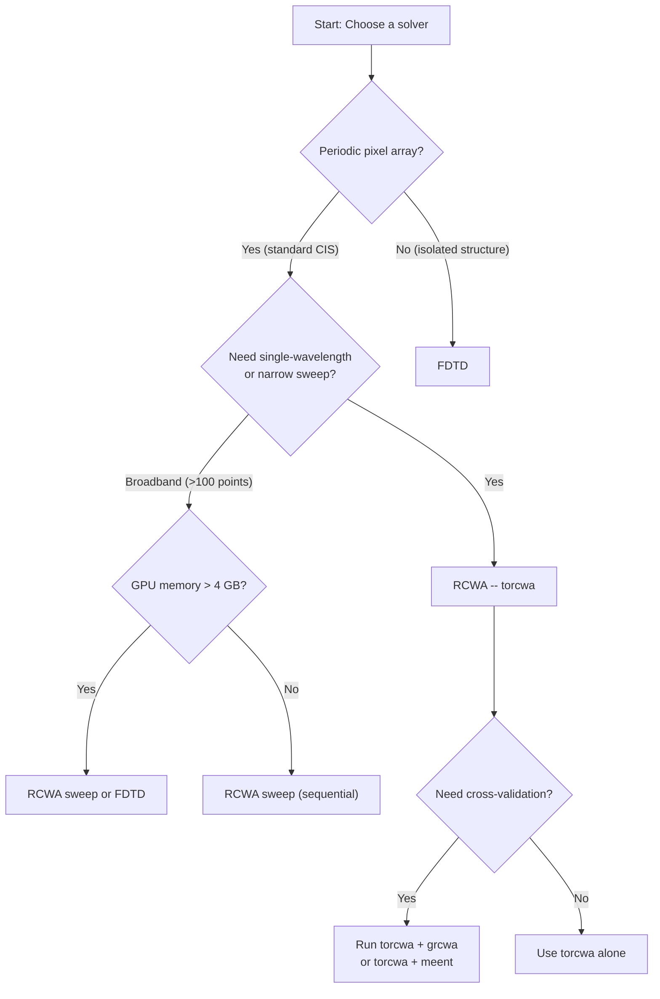

# 솔버 선택(Choosing a Solver)

COMPASS는 통합된 인터페이스를 통해 여러 전자기 솔버(Solver) 백엔드를 지원합니다. 이 가이드에서는 사용 가능한 솔버, 각 솔버의 사용 시점, 설정 방법, 수렴(Convergence) 검증 방법을 다룹니다.

## 사용 가능한 솔버

### RCWA 솔버

RCWA(엄밀 결합파 해석, Rigorous Coupled-Wave Analysis)는 장(Field)과 유전율(Permittivity)을 푸리에 고조파(Fourier Harmonics)로 전개하여 주기적 구조에 대한 맥스웰 방정식(Maxwell's Equations)을 풀는 주파수 영역 방법입니다. 픽셀이 주기적으로 반복되기 때문에 픽셀 배열에 자연스럽게 적합합니다.

| 이름     | 라이브러리 | 백엔드     | GPU     | 상태             |
|----------|---------|------------|---------|-------------|
| `torcwa` | torcwa  | PyTorch    | CUDA    | 주력, 권장        |
| `grcwa`  | grcwa   | NumPy/JAX  | CUDA    | 교차 검증용       |
| `meent`  | meent   | NumPy/JAX/PyTorch | CUDA/CPU | 멀티 백엔드, 검증에 적합 |

### FDTD 솔버

FDTD(유한차분 시간영역법, Finite-Difference Time-Domain)는 공간 격자에서 시간 스테핑을 통해 맥스웰 방정식을 풉니다. 단일 실행으로 광대역 결과를 제공하며 임의의(비주기적) 지오메트리를 처리할 수 있습니다.

| 이름             | 라이브러리 | 백엔드    | GPU           | 상태        |
|-----------------|---------|-----------|---------------|------------|
| `fdtd_flaport`  | fdtd    | PyTorch   | CUDA          | 프로토타이핑 |

## RCWA vs FDTD: 언제 사용할 것인가



### 트레이드오프 요약

| 기준                        | RCWA                         | FDTD                          |
|-----------------------------|------------------------------|-------------------------------|
| **속도 (단일 파장)**         | 빠름 (0.1--2 s)             | 느림 (30--120 s)              |
| **속도 (31점 스위프)**       | ~10 s (순차)                | ~45 s (단일 광대역 실행)        |
| **메모리**                  | 중간 (200--800 MB)          | 높음 (1--4 GB)                |
| **주기적 구조**              | 네이티브 (블로흐 경계조건)     | 주기적 경계조건 필요             |
| **곡면**                    | 계단 근사                    | 계단 근사                      |
| **분산 금속**               | 자연스러움 (파장별)           | 드루드/로렌츠 피팅 필요          |
| **근접장 정확도**            | 원거리장에서 우수              | 모든 곳에서 우수                |
| **수렴 파라미터**            | 푸리에 차수 $N$              | 격자 간격 $\Delta x$           |
| **수치 안정성**              | S-행렬 필요                  | CFL 조건                      |

### RCWA가 우수한 경우

- 표준 베이어 픽셀 QE 스위프(COMPASS의 주요 사용 사례)
- 각도 응답 연구($\theta$, $\phi$ 변경만으로 가능)
- 푸리에 차수 수렴 연구
- 각 점이 독립적인 파라미터 스위프

### FDTD가 유리한 경우

- 비주기적 또는 유한 크기 구조
- 단일 시뮬레이션(Simulation)에서의 광대역 응답
- 구조 내부의 근접장 세부 정보가 중요한 경우
- RCWA에 대한 교차 검증(Cross-Validation)

## 솔버 설정 참조

### torcwa (권장)

```yaml
solver:
  name: "torcwa"
  type: "rcwa"
  params:
    fourier_order: [9, 9]       # Fourier harmonics [Nx, Ny]
    dtype: "complex64"           # complex64 or complex128
  stability:
    precision_strategy: "mixed"  # mixed | float32 | float64
    allow_tf32: false            # MUST be false for RCWA
    eigendecomp_device: "cpu"    # cpu | gpu (cpu is more stable)
    fourier_factorization: "li_inverse"  # li_inverse | naive
    energy_check:
      enabled: true
      tolerance: 0.02
      auto_retry_float64: true
    eigenvalue_broadening: 1.0e-10
    condition_number_warning: 1.0e+12
  convergence:
    auto_converge: false
    order_range: [5, 25]
    qe_tolerance: 0.01
```

**핵심 파라미터: `fourier_order`**

푸리에 차수(Fourier Order) $N$은 각 방향에서 유지되는 고조파의 수를 결정합니다. 전체 고조파 수는 $(2N_x + 1) \times (2N_y + 1)$입니다. `[9, 9]`의 경우 $19 \times 19 = 361$개의 모드가 됩니다. 레이어당 크기 $2 \times 361 = 722$의 고유값 문제가 풀립니다.

| 차수    | 모드  | 행렬 크기     | 일반적 실행시간 | 정확도    |
|--------|-------|-------------|-----------------|-----------|
| [5, 5] | 121   | 242x242     | 0.1 s           | 낮음      |
| [9, 9] | 361   | 722x722     | 0.3 s           | 양호      |
| [13,13]| 729   | 1458x1458   | 1.5 s           | 높음      |
| [17,17]| 1225  | 2450x2450   | 5.0 s           | 매우 높음  |

**핵심 파라미터: `precision_strategy`**

`"mixed"` 전략(기본값)은 주 시뮬레이션을 `complex64`로 실행하되 고유값 분해를 `complex128`로 승격하여 CPU에서 실행합니다. 이는 속도와 안정성의 좋은 균형을 제공합니다.

$$\text{mixed} = \begin{cases} \text{float32 for layer setup, FFT, S-matrix products} \\ \text{float64 for eigendecomp (on CPU)} \end{cases}$$

### grcwa

```yaml
solver:
  name: "grcwa"
  type: "rcwa"
  params:
    fourier_order: [9, 9]
    dtype: "complex128"     # grcwa defaults to float64
  convergence:
    auto_converge: false
    order_range: [5, 25]
    qe_tolerance: 0.01
```

grcwa는 선택적 JAX 가속이 가능한 NumPy 기반 계산을 사용합니다. 기본적으로 `complex128`을 사용하며 속도를 희생하는 대신 torcwa보다 수치적으로 더 안정적인 경향이 있습니다. 교차 검증에 유용합니다.

### meent

```yaml
solver:
  name: "meent"
  type: "rcwa"
  params:
    fourier_order: [9, 9]
    dtype: "complex64"
    backend: "torch"       # numpy | jax | torch
  convergence:
    auto_converge: false
    order_range: [5, 25]
    qe_tolerance: 0.01
```

meent는 `numpy` (backend=0), `jax` (backend=1), `torch` (backend=2)의 세 가지 백엔드를 지원합니다. JAX 백엔드는 XLA 컴파일을 활용하여 성능을 높일 수 있습니다. meent는 내부적으로 **나노미터**를 사용하며, COMPASS 어댑터가 마이크로미터에서의 변환을 처리합니다.

### fdtd_flaport

```yaml
solver:
  name: "fdtd_flaport"
  type: "fdtd"
  params:
    grid_spacing: 0.02     # Grid cell size in um (20 nm)
    runtime: 200           # Simulation time in femtoseconds
    pml_layers: 15         # PML absorber thickness in cells
    dtype: "float64"
```

**핵심 파라미터: `grid_spacing`**

격자는 가장 작은 기하학적 특징과 가장 높은 굴절률 재료 내부의 가장 짧은 파장을 모두 분해해야 합니다. 400 nm에서 실리콘($n \approx 4$)의 경우:

$$\Delta x \leq \frac{\lambda_\text{min}}{n_\text{max} \cdot \text{PPW}} = \frac{0.400}{4.0 \times 10} = 0.010 \text{ um}$$

여기서 PPW(파장당 포인트 수, Points Per Wavelength)는 정확도를 위해 최소 10이어야 합니다. 20 nm 격자가 대부분의 가시광 범위 시뮬레이션에 적합하지만, 10 nm은 메모리를 8배 더 사용하는 대신(3D) 더 나은 정확도를 제공합니다.

## GPU vs CPU 고려사항

### CUDA (NVIDIA GPU)

RCWA는 행렬 연산(FFT, 고유값 분해, S-행렬 곱)에서 GPU 가속의 혜택이 큽니다. 푸리에 차수 [7, 7] 이상에서 일반적으로 5--20배 속도 향상이 있습니다.

```yaml
compute:
  backend: "cuda"
  gpu_id: 0
```

**중요**: Ampere 이상 GPU(RTX 30xx/40xx, A100)에서 TF32를 비활성화하십시오. TF32는 행렬 곱셈 연산에서 부동소수점 가수부를 23비트에서 10비트로 줄여 S-행렬 정확도를 치명적으로 저하시킵니다.

```yaml
solver:
  stability:
    allow_tf32: false  # Always keep this false for RCWA
```

### Apple Silicon (MPS)

PyTorch MPS 백엔드는 기본 텐서 연산에서 작동하지만 RCWA에 제한이 있습니다:

- 일부 PyTorch 버전에서 복소수 지원이 불완전합니다
- 고유값 분해가 자동으로 CPU로 폴백될 수 있습니다
- RCWA 워크로드에서 성능은 일반적으로 CUDA보다 느립니다

```yaml
compute:
  backend: "mps"
```

MPS 오류가 발생하면 먼저 CPU로 테스트하십시오.

### CPU

모든 솔버는 GPU 의존성 없이 CPU에서 작동합니다. CPU 모드는 느리지만 완전히 기능하며 수치적으로 가장 안정적입니다.

```yaml
compute:
  backend: "cpu"
  num_workers: 4
```

## 수렴 테스트

### RCWA: 푸리에 차수 스위프

결과를 신뢰하기 전에 항상 수렴 여부를 검증하십시오. 푸리에 차수를 스위프하고 QE가 안정화되는지 확인합니다.

```python
import numpy as np
from compass.solvers.base import SolverFactory

orders = range(5, 22, 2)
peak_green_qe = []

for N in orders:
    config["solver"]["params"]["fourier_order"] = [N, N]
    solver = SolverFactory.create("torcwa", config["solver"])
    solver.setup_geometry(pixel_stack)
    solver.setup_source({"wavelength": 0.55, "theta": 0.0,
                         "phi": 0.0, "polarization": "unpolarized"})
    result = solver.run()

    green_qe = np.mean([
        qe for name, qe in result.qe_per_pixel.items()
        if name.startswith("G")
    ])
    peak_green_qe.append(float(green_qe))
    print(f"Order {N:2d}: Green QE = {green_qe:.4f}")

# Check convergence: relative change < 1%
for i in range(1, len(peak_green_qe)):
    delta = abs(peak_green_qe[i] - peak_green_qe[i-1])
    print(f"  Order {list(orders)[i]}: delta = {delta:.5f}")
```

### FDTD: 격자 간격 수렴

```python
for spacing in [0.04, 0.02, 0.01]:
    config["solver"]["params"]["grid_spacing"] = spacing
    # ... run and compare QE
```

### 교차 솔버 검증

동일한 픽셀을 두 개의 솔버로 실행하고 QE 스펙트럼을 비교합니다:

```python
from compass.visualization.qe_plot import plot_qe_comparison

ax_main, ax_diff = plot_qe_comparison(
    results=[torcwa_result, grcwa_result],
    labels=["torcwa", "grcwa"],
    show_difference=True,
    figsize=(10, 7),
)
```

동일한 푸리에 차수에서 잘 수렴된 시뮬레이션의 경우 절대 QE 1--2% 이내의 일치가 예상됩니다.

## 성능 벤치마크

2x2 베이어 단위 셀, 1.0 um 피치, 단일 파장, 수직 입사, NVIDIA RTX 4090 기준 일반적 수치:

| 솔버                 | 차수 / 격자   | 실행시간   | GPU 메모리 | 비고                |
|---------------------|-------------|----------|---------|--------------------|
| torcwa (f32)        | [9, 9]     | 0.3 s    | 200 MB  | 기본값, 빠름         |
| torcwa (f64)        | [9, 9]     | 0.6 s    | 400 MB  | 더 높은 정확도       |
| torcwa (f32)        | [15, 15]   | 2.1 s    | 600 MB  | 높은 정확도          |
| grcwa (f64)         | [9, 9]     | 0.5 s    | 250 MB  | 교차 검증           |
| meent/torch (f32)   | [9, 9]     | 0.4 s    | 200 MB  | 유사 성능           |
| fdtd_flaport (20nm) | --         | 45 s     | 2 GB    | 광대역 가능          |
| fdtd_flaport (10nm) | --         | 180 s    | 8 GB    | 높은 정확도          |

31점 파장 스위프(400--700 nm, 10 nm 간격):

- **RCWA (torcwa, 차수 9)**: 31 x 0.3 s = ~10 s 총 소요
- **FDTD (flaport, 20 nm)**: 1 광대역 실행 = ~45 s

RCWA는 좁은 스위프에서 유리합니다. FDTD는 매우 밀집된 파장 샘플링(>100점)에서 경쟁력이 있습니다.

## 빠른 시작 권장사항

| 사용 사례                        | 권장 솔버           | 설정 참고사항                      |
|----------------------------------|--------------------|-----------------------------|
| 표준 QE 시뮬레이션                | `torcwa`           | 차수 [9,9], 혼합 정밀도         |
| 논문 수준 결과                    | `torcwa`           | 차수 [15,15], float64         |
| 교차 검증                        | `torcwa` + `grcwa` | 동일 차수, QE 비교              |
| 금속 격자 / 높은 대비 레이어       | `torcwa` 또는 `meent` | Li 역규칙 인수분해           |
| 광대역 단일 샷                   | `fdtd_flaport`     | 10 nm 격자, 200 fs 실행시간     |
| CPU 전용 환경                    | `meent` (numpy)    | GPU 불필요                     |

## 다음 단계

- [첫 번째 시뮬레이션](./first-simulation.md) -- 첫 솔버 실행
- [픽셀 스택 설정](./pixel-stack-config.md) -- 시뮬레이션할 구조 정의
- [문제 해결](./troubleshooting.md) -- 솔버 수렴 및 안정성 문제
- [시각화](./visualization.md) -- 솔버 결과 플롯 및 비교
