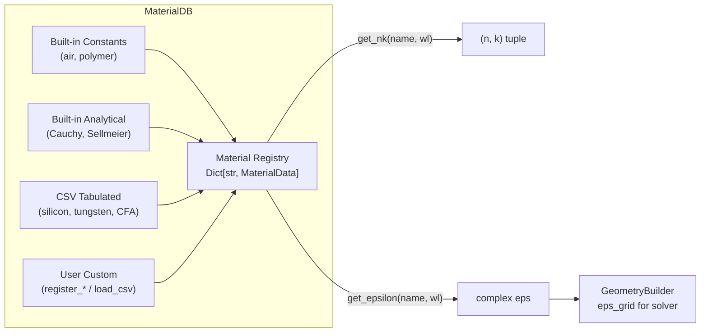
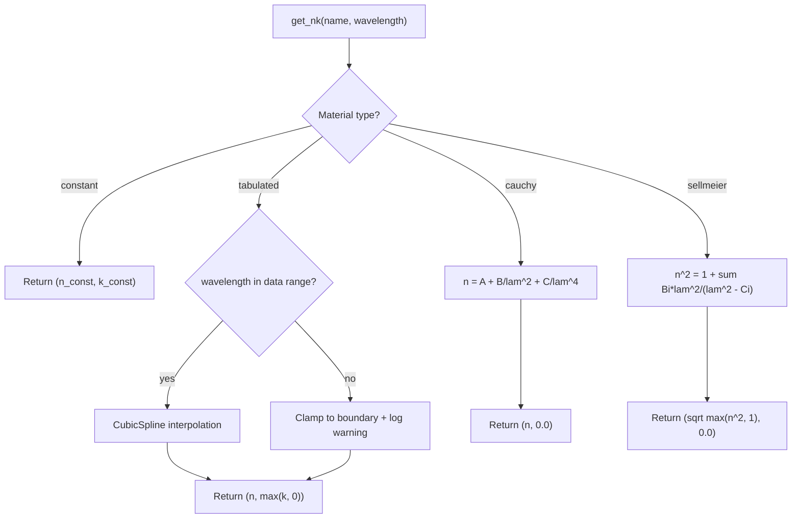

# 재료 데이터베이스(Material Database)

COMPASS는 픽셀 스택(Pixel Stack)의 모든 레이어의 광학 특성을 복소 굴절률 $\tilde{n}(\lambda) = n(\lambda) + i k(\lambda)$로 모델링합니다. 여기서 $n$은 실수 굴절률이고 $k$는 소광 계수(Extinction Coefficient)입니다. `MaterialDB` 클래스는 모든 재료 정의를 관리하고 파장 의존적 보간(Interpolation)을 제공합니다.

<MaterialBrowser />

## 아키텍처 개요



`MaterialDB` 인스턴스를 생성하면 자동으로 다음을 수행합니다:

1. **내장 상수 및 해석적 재료**(공기, 폴리머, 유전체)를 등록합니다
2. `materials/` 디렉토리에서 **표 형식 CSV 데이터**(실리콘, 텅스텐, 컬러 필터)를 로드합니다
3. CSV 파일을 찾을 수 없으면 **근사 내장 데이터**로 폴백합니다

```python
from compass.materials.database import MaterialDB

mat_db = MaterialDB()
print(mat_db.list_materials())
# ['air', 'cf_blue', 'cf_green', 'cf_red', 'hfo2', 'polymer_n1p56',
#  'si3n4', 'silicon', 'sio2', 'tio2', 'tungsten']
```

## 내장 재료

| 재료               | DB 이름          | 타입      | 출처 / 모델                            | 550 nm에서 $n$ |
|--------------------|------------------|-----------|--------------------------------------|---------------|
| 공기               | `air`            | constant  | $n = 1.0$, $k = 0.0$                | 1.000         |
| 마이크로렌즈 폴리머  | `polymer_n1p56`  | cauchy    | $A = 1.56$, $B = 0.004$             | 1.573         |
| 이산화규소          | `sio2`           | sellmeier | 3항 셀마이어(Sellmeier) (Malitson 1965)| 1.460         |
| 질화규소           | `si3n4`          | sellmeier | 2항 셀마이어                           | 2.020         |
| 이산화하프늄        | `hfo2`           | cauchy    | $A = 1.90$, $B = 0.02$              | 1.966         |
| 이산화티타늄        | `tio2`           | cauchy    | $A = 2.27$, $B = 0.05$ (아나타제)     | 2.435         |
| 결정질 실리콘       | `silicon`        | tabulated | Green 2008 (350--1100 nm)            | 4.082         |
| 텅스텐             | `tungsten`       | tabulated | Palik 데이터 (380--780 nm)            | 3.650         |
| 적색 컬러 필터      | `cf_red`         | tabulated | 로렌츠 흡수 모델                       | 1.550         |
| 녹색 컬러 필터      | `cf_green`       | tabulated | 로렌츠 흡수 모델                       | 1.550         |
| 청색 컬러 필터      | `cf_blue`        | tabulated | 로렌츠 흡수 모델                       | 1.550         |

## 재료 데이터 타입

COMPASS는 $n$과 $k$가 파장에 따라 변하는 방식을 지정하는 네 가지 분산 모델(Dispersion Model) 타입을 지원합니다.

### Constant (상수)

파장에 무관한 고정 굴절률입니다. 공기나 이상화된 유전체와 같은 비분산 매질에 적합합니다.

$$n(\lambda) = n_0, \quad k(\lambda) = k_0$$

```python
mat_db.register_constant("my_dielectric", n=1.45, k=0.0)

n, k = mat_db.get_nk("my_dielectric", 0.55)
# n=1.45, k=0.0 at any wavelength
```

### Tabulated (표 형식)

이산 데이터 점으로부터의 파장 의존적 $n(\lambda)$ 및 $k(\lambda)$입니다. COMPASS는 4개 이상의 데이터 점이 있을 때 **큐빅 스플라인 보간(Cubic Spline Interpolation)**을, 더 적은 점에서는 **선형 보간(Linear Interpolation)**을 사용합니다.

```python
# Internally, tabulated materials build scipy interpolators:
from scipy.interpolate import CubicSpline
n_interp = CubicSpline(wavelengths, n_data, extrapolate=True)
k_interp = CubicSpline(wavelengths, k_data, extrapolate=True)
```

주요 동작:

- 데이터 범위 밖의 파장은 가장 가까운 경계값으로 **클램핑(Clamping)**됩니다
- 클램핑이 발생하면 경고가 로그에 기록됩니다
- 소광 계수는 비음수로 클램핑됩니다: $k = \max(k_\text{interp}, 0)$

### Cauchy (코시)

투명 유전체를 위한 해석적 분산 모델입니다. 강한 흡수 밴드가 없는 재료에서 가시광 범위에서 정확합니다.

$$n(\lambda) = A + \frac{B}{\lambda^2} + \frac{C}{\lambda^4}$$

여기서 $\lambda$는 마이크로미터 단위입니다. 코시 모델은 항상 $k = 0$을 반환합니다.

```python
mat_db.register_cauchy("my_polymer", A=1.56, B=0.004, C=0.0)

n, k = mat_db.get_nk("my_polymer", 0.55)
# n = 1.56 + 0.004 / 0.3025 = 1.573, k = 0.0
```

내장 코시 계수:

| 재료            | $A$   | $B$    | $C$   |
|----------------|-------|--------|-------|
| `polymer_n1p56` | 1.56  | 0.004  | 0.0   |
| `hfo2`          | 1.90  | 0.02   | 0.0   |
| `tio2`          | 2.27  | 0.05   | 0.0   |

### Sellmeier (셀마이어)

유리 및 유전체의 고정밀 분산 모델링을 위한 다항 셀마이어 방정식입니다:

$$n^2(\lambda) = 1 + \sum_{i} \frac{B_i \lambda^2}{\lambda^2 - C_i}$$

여기서 $B_i$는 진동자 강도이고 $C_i$는 공명 파장의 제곱(um$^2$)입니다. 이 모델은 $k = 0$을 반환하고 $n^2 \geq 1$로 클램핑합니다.

```python
mat_db.register_sellmeier(
    "fused_silica",
    B=[0.6961663, 0.4079426, 0.8974794],
    C=[0.0684043**2, 0.1162414**2, 9.896161**2],
)
```

내장 셀마이어 계수:

| 재료     | $B_1$   | $B_2$   | $B_3$   | $C_1$ (um$^2$) | $C_2$ (um$^2$) | $C_3$ (um$^2$) |
|----------|---------|---------|---------|-----------------|-----------------|-----------------|
| `sio2`   | 0.6962  | 0.4079  | 0.8975  | 0.00468         | 0.01352         | 97.934          |
| `si3n4`  | 2.8939  | 0.0     | --      | 0.01951         | 1.0             | --              |

## 유전율 변환

솔버는 굴절률이 아닌 복소 유전율(Permittivity) $\varepsilon$을 사용합니다. 변환식은 다음과 같습니다:

$$\varepsilon(\lambda) = \tilde{n}^2 = (n + ik)^2 = (n^2 - k^2) + i\,2nk$$

```python
# Single wavelength
eps = mat_db.get_epsilon("silicon", 0.55)
# eps = (4.082 + 0.028j)^2 ~ 16.66 + 0.229j

# Spectrum over multiple wavelengths
import numpy as np
wavelengths = np.arange(0.40, 0.701, 0.01)
eps_spectrum = mat_db.get_epsilon_spectrum("silicon", wavelengths)
```

## CSV를 통한 사용자 정의 재료 추가

내장 데이터베이스에 없는 재료를 추가하려면 세 개의 열(파장(um), $n$, $k$)이 있는 CSV 파일을 생성합니다. `#`으로 시작하는 줄은 주석으로 처리됩니다.

### CSV 형식

```
# Custom infrared filter material
# wavelength(um), n, k
0.380, 1.60, 0.12
0.400, 1.59, 0.10
0.440, 1.57, 0.05
0.480, 1.55, 0.01
0.520, 1.55, 0.002
0.560, 1.55, 0.002
0.600, 1.56, 0.01
0.650, 1.56, 0.03
0.700, 1.56, 0.05
0.750, 1.57, 0.08
```

### 사용자 정의 CSV 로딩 및 사용

```python
mat_db = MaterialDB()

# Load from file (sorts by wavelength, builds interpolators)
mat_db.load_csv("ir_cut_filter", "materials/ir_cut_filter.csv")

# Verify it loaded
print(mat_db.has_material("ir_cut_filter"))  # True
n, k = mat_db.get_nk("ir_cut_filter", 0.55)
print(f"IR cut filter at 550nm: n={n:.3f}, k={k:.4f}")
```

보간 방법을 오버라이드할 수도 있습니다:

```python
mat_db.load_csv("my_mat", "data.csv", interpolation="linear")
```

### 자동 CSV 검색

COMPASS는 `materials/` 디렉토리(`COMPASS_MATERIALS` 환경 변수로 설정 가능)에서 알려진 파일명을 검색합니다:

| 재료명         | 검색되는 파일명                              |
|---------------|---------------------------------------------|
| `silicon`     | `silicon_green2008.csv`, `silicon_palik.csv` |
| `tungsten`    | `tungsten.csv`                               |
| `cf_red`      | `color_filter_red.csv`                       |
| `cf_green`    | `color_filter_green.csv`                     |
| `cf_blue`     | `color_filter_blue.csv`                      |

CSV를 찾을 수 없으면 근사 내장 폴백 데이터가 사용됩니다.

### YAML 설정에서 사용자 정의 재료 사용

사용자 정의 재료를 등록한 후, 픽셀 설정에서 이름으로 참조합니다:

```yaml
color_filter:
  materials:
    R: "my_custom_red"
    G: "cf_green"
    B: "cf_blue"
```

`GeometryBuilder`를 호출하기 전에 재료가 등록되어 있는지 확인하십시오:

```python
mat_db = MaterialDB()
mat_db.load_csv("my_custom_red", "materials/my_red_filter.csv")

builder = GeometryBuilder(config.pixel, mat_db)
pixel_stack = builder.build()
```

## 보간 흐름



## MaterialDB API 요약

```python
class MaterialDB:
    def __init__(self, db_path: str | None = None): ...
    def register_constant(self, name: str, n: float, k: float = 0.0) -> None: ...
    def register_cauchy(self, name: str, A: float, B: float = 0.0, C: float = 0.0) -> None: ...
    def register_sellmeier(self, name: str, B: list[float], C: list[float]) -> None: ...
    def load_csv(self, name: str, filepath: str, interpolation: str = "cubic_spline") -> None: ...
    def get_nk(self, name: str, wavelength: float) -> tuple[float, float]: ...
    def get_epsilon(self, name: str, wavelength: float) -> complex: ...
    def get_epsilon_spectrum(self, name: str, wavelengths: np.ndarray) -> np.ndarray: ...
    def list_materials(self) -> list[str]: ...
    def has_material(self, name: str) -> bool: ...
```

## 예시: 재료 분산 플롯

```python
import numpy as np
import matplotlib.pyplot as plt
from compass.materials.database import MaterialDB

mat_db = MaterialDB()
wavelengths = np.linspace(0.38, 0.78, 100)
wavelengths_nm = wavelengths * 1000

fig, (ax1, ax2) = plt.subplots(1, 2, figsize=(12, 5))

for name in ["silicon", "sio2", "si3n4", "hfo2"]:
    n_arr = np.array([mat_db.get_nk(name, wl)[0] for wl in wavelengths])
    k_arr = np.array([mat_db.get_nk(name, wl)[1] for wl in wavelengths])
    ax1.plot(wavelengths_nm, n_arr, label=name)
    ax2.plot(wavelengths_nm, k_arr, label=name)

ax1.set_xlabel("Wavelength (nm)")
ax1.set_ylabel("n")
ax1.set_title("Refractive Index")
ax1.legend()
ax1.grid(True, alpha=0.3)

ax2.set_xlabel("Wavelength (nm)")
ax2.set_ylabel("k")
ax2.set_title("Extinction Coefficient")
ax2.legend()
ax2.grid(True, alpha=0.3)
plt.tight_layout()
```

## 다음 단계

- [픽셀 스택 설정](./pixel-stack-config.md) -- 픽셀 레이어 정의에서 재료 참조
- [솔버 선택](./choosing-solver.md) -- 재료 복잡성이 솔버 선택에 미치는 영향
- [문제 해결](./troubleshooting.md) -- 재료 파장 범위 경고 처리
