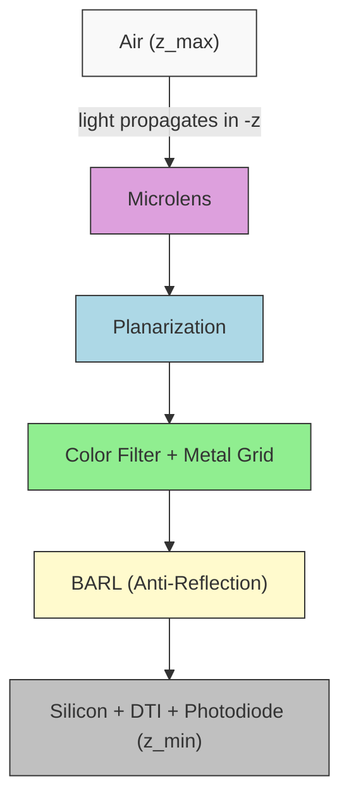

# 픽셀 스택 설정(Pixel Stack Configuration)

픽셀 구조는 모든 COMPASS 시뮬레이션(Simulation)의 핵심 입력입니다. YAML 파일의 `pixel:` 키 아래에 정의되며, BSI(후면 조사, Back-Side Illuminated) CMOS 이미지 센서 픽셀을 광학 레이어의 수직 스택으로 기술합니다. 이 페이지에서는 모든 파라미터의 타입, 기본값, 물리적 의미를 문서화합니다.

<PixelStackBuilder />

## 좌표계

COMPASS는 빛이 스택을 아래로 전파하는 오른손 좌표계를 사용합니다.



주요 규칙:

- 모든 길이 단위는 **마이크로미터(um)**입니다
- **x, y**: 횡방향(면내) 방향
- **z**: 수직 스택 방향. 실리콘이 하단($z_\text{min}$), 공기가 상단($z_\text{max}$)에 위치합니다
- 빛은 **-z** 방향으로 전파됩니다(공기에서 실리콘 방향). BSI 조사 방식에 해당합니다
- x-y 평면의 원점은 단위 셀의 좌측 하단 모서리에 있습니다
- 포토다이오드(Photodiode)의 `position`과 `size`는 각 픽셀 중심에 대한 상대값입니다

## 최상위 픽셀 파라미터

```yaml
pixel:
  pitch: 1.0          # Pixel pitch in um (both x and y)
  unit_cell: [2, 2]   # Number of pixels [rows, cols] in the unit cell
  bayer_map:           # Color channel assignment per pixel
    - ["R", "G"]
    - ["G", "B"]
```

| 파라미터     | 타입            | 기본값                          | 설명                                               |
|-------------|-----------------|-------------------------------|----------------------------------------------------|
| `pitch`     | float           | `1.0`                         | 픽셀 피치(um). x와 y 모두에 적용됩니다.                |
| `unit_cell` | [int, int]      | `[2, 2]`                      | 주기적 단위 셀의 픽셀 수 [행, 열].                    |
| `bayer_map` | list[list[str]] | `[["R","G"],["G","B"]]`       | 색상 채널 할당. CFA 재료에 매핑됩니다.                 |

전체 시뮬레이션 도메인 크기는 x 방향으로 `pitch * unit_cell[1]`, y 방향으로 `pitch * unit_cell[0]`입니다. 1.0 um 피치의 표준 2x2 베이어 패턴(Bayer Pattern)의 경우, 도메인은 주기적 경계 조건을 가진 2.0 um x 2.0 um입니다.

## 레이어 스택

레이어는 `pixel.layers` 아래에 상단에서 하단 순으로 정의됩니다. YAML 딕셔너리의 키 순서가 상단(공기)에서 하단(실리콘)까지의 물리적 적층 순서를 결정합니다.

```yaml
pixel:
  layers:
    air:             # Superstrate (top)
    microlens:       # Curved focusing lens
    planarization:   # Flat dielectric spacer
    color_filter:    # Bayer CFA with optional metal grid
    barl:            # Bottom anti-reflection layers
    silicon:         # Photodiode substrate (bottom)
```

### air

마이크로렌즈(Microlens) 위의 단순 유전체 레이어입니다. 이 레이어는 빛이 픽셀로 들어오는 매질을 제공합니다.

```yaml
air:
  thickness: 1.0     # um
  material: "air"    # Material name from MaterialDB
```

| 파라미터    | 타입  | 기본값  | 설명                                 |
|------------|-------|---------|--------------------------------------|
| `thickness` | float | `1.0`  | 마이크로렌즈 위 공기 간격(um).          |
| `material`  | str   | `"air"` | 재료명 ($n = 1.0$, $k = 0.0$).       |

### microlens

초타원(Superellipse) 프로파일로 기술되는 곡면 집광 렌즈입니다. 마이크로렌즈의 2D 형상은 다음과 같이 정의됩니다:

$$z(x, y) = h \cdot \left(1 - r(x,y)^2\right)^{1/(2\alpha)}$$

여기서 정규화된 반경 좌표 $r$은 초타원 노름을 사용합니다:

$$r(x, y) = \left(\left|\frac{x - x_c}{R_x}\right|^n + \left|\frac{y - y_c}{R_y}\right|^n\right)^{1/n}$$

파라미터 $n$은 사각도를 제어합니다($n = 2$는 원/타원, $n > 2$는 직사각형에 접근). $\alpha$는 곡률을 제어합니다($\alpha = 1$은 구면, $\alpha > 1$은 상단이 더 평평한 형상).

```yaml
microlens:
  enabled: true
  height: 0.6          # Lens sag height in um
  radius_x: 0.48       # Semi-axis in x (um)
  radius_y: 0.48       # Semi-axis in y (um)
  material: "polymer_n1p56"
  profile:
    type: "superellipse"
    n: 2.5              # Squareness parameter
    alpha: 1.0          # Curvature: 1=spherical, >1=flatter
  shift:
    mode: "auto_cra"    # none | manual | auto_cra
    cra_deg: 0.0        # Chief ray angle for auto shift
    shift_x: 0.0        # Manual x-offset (um)
    shift_y: 0.0        # Manual y-offset (um)
  gap: 0.0              # Gap between adjacent lenses (um)
```

| 파라미터         | 타입  | 기본값             | 설명                                              |
|-----------------|-------|--------------------|---------------------------------------------------|
| `enabled`       | bool  | `true`             | 마이크로렌즈 활성화/비활성화.                         |
| `height`        | float | `0.6`              | 최대 렌즈 높이(새그, sag)(um).                       |
| `radius_x`      | float | `0.48`             | x 방향 반축(um).                                    |
| `radius_y`      | float | `0.48`             | y 방향 반축(um).                                    |
| `material`      | str   | `"polymer_n1p56"`  | 렌즈 재료 (코시 모델, $n \approx 1.56$).             |
| `profile.type`  | str   | `"superellipse"`   | 프로파일 모델.                                      |
| `profile.n`     | float | `2.5`              | 초타원 사각도. 높을수록 더 사각형입니다.                |
| `profile.alpha`  | float | `1.0`              | 곡률 제어. 1.0 = 구면, >1 = 더 평평함.               |
| `shift.mode`    | str   | `"auto_cra"`       | `"none"`, `"manual"`, 또는 `"auto_cra"`.            |
| `shift.cra_deg`  | float | `0.0`              | 자동 시프트를 위한 주광선 각도(Chief Ray Angle, CRA)(도). |
| `gap`           | float | `0.0`              | 인접 렌즈 간 간격(um).                               |

`shift.mode`가 `"auto_cra"`일 때, 마이크로렌즈 중심은 이미지 센서 가장자리에서의 비축 주광선 각도를 수용하기 위해 픽셀 중심에서 오프셋됩니다. 시프트는 마이크로렌즈 아래 각 레이어를 통해 스넬 법칙으로 주광선을 추적하여 계산됩니다:

$$\Delta x = \sum_i h_i \cdot \frac{\sin\theta_i}{\cos\theta_i}, \quad \sin\theta_i = \frac{n_\text{air} \cdot \sin\theta_\text{CRA}}{n_i}$$

여기서 $h_i$와 $n_i$는 각 레이어(평탄화층, 컬러 필터, BARL, 실리콘~PD 중심)의 두께와 굴절률입니다. 이 방법은 각 계면에서의 굴절을 고려하므로, CRA > 15°에서 단순 $\tan(\theta_\text{CRA})$ 근사보다 정확도가 향상됩니다 (Hwang & Kim, *Sensors* 2023, DOI: [10.3390/s23020702](https://doi.org/10.3390/s23020702)). `ref_wavelength` 파라미터(기본값 0.55 um)는 굴절률 조회에 사용할 파장을 제어합니다.

### planarization

마이크로렌즈와 컬러 필터(Color Filter) 사이의 평탄한 유전체 스페이서입니다.

```yaml
planarization:
  thickness: 0.3
  material: "sio2"
```

일반적으로 SiO2 또는 폴리머를 사용합니다. 이 레이어는 마이크로렌즈와 컬러 필터 사이의 전파 매질 역할을 합니다. 두께를 조정하여 마이크로렌즈가 포토다이오드에 대해 빛을 집광하는 위치를 제어합니다. 마이크로렌즈-평탄화 시스템의 유효 초점 거리가 광학적 크로스토크(Optical Crosstalk)를 결정합니다.

### color_filter

선택적 금속 격자(Metal Grid) 절연이 포함된 베이어 CFA(Color Filter Array)입니다.

```yaml
color_filter:
  thickness: 0.6
  pattern: "bayer_rggb"
  materials:
    R: "cf_red"
    G: "cf_green"
    B: "cf_blue"
  grid:
    enabled: true
    width: 0.05          # Grid line width in um
    height: 0.6          # Grid height (usually = CFA thickness)
    material: "tungsten"  # Metal grid material
```

| 파라미터         | 타입  | 기본값           | 설명                                   |
|-----------------|------|------------------|----------------------------------------|
| `thickness`     | float | `0.6`           | 컬러 필터 두께(um).                      |
| `pattern`       | str  | `"bayer_rggb"`   | CFA 패턴명.                             |
| `materials`     | dict | R/G/B 매핑       | 색상 키를 재료명에 매핑합니다.             |
| `grid.enabled`  | bool | `true`           | 금속 절연 격자 활성화.                    |
| `grid.width`    | float | `0.05`          | 격자 선 너비(um).                        |
| `grid.height`   | float | `0.6`           | 격자 선 높이(um).                        |
| `grid.material` | str  | `"tungsten"`     | 격자 재료.                               |

**지원되는 베이어 패턴:**

| 패턴            | 레이아웃                                                  |
|----------------|-------------------------------------------------------|
| `bayer_rggb`   | 행 0: R G, 행 1: G B                                   |
| `bayer_grbg`   | 행 0: G R, 행 1: B G                                   |
| `bayer_gbrg`   | 행 0: G B, 행 1: R G                                   |
| `bayer_bggr`   | 행 0: B G, 행 1: G R                                   |

최상위 수준의 `bayer_map`은 각 픽셀이 받는 재료를 결정합니다. `materials`의 키는 `bayer_map`에서 사용된 문자와 일치해야 합니다. 표준 베이어를 넘어선 사용자 정의 패턴(예: RGBW 쿼드 픽셀)은 `unit_cell`과 `bayer_map`을 확장하여 정의할 수 있습니다:

```yaml
# 4x4 Quad-Bayer pattern
pixel:
  pitch: 0.7
  unit_cell: [4, 4]
  bayer_map:
    - ["R", "R", "G", "G"]
    - ["R", "R", "G", "G"]
    - ["G", "G", "B", "B"]
    - ["G", "G", "B", "B"]
```

### barl (하부 반사 방지층, Bottom Anti-Reflection Layers)

CFA와 실리콘 사이의 반사 방지를 위한 다층 유전체 스택입니다. BARL의 목적은 컬러 필터($n \approx 1.55$)와 실리콘($n \approx 4.0$) 사이의 높은 대비 계면에서 프레넬 반사(Fresnel Reflection)를 최소화하는 것입니다.

```yaml
barl:
  layers:
    - thickness: 0.010
      material: "sio2"
    - thickness: 0.025
      material: "hfo2"
    - thickness: 0.015
      material: "sio2"
    - thickness: 0.030
      material: "si3n4"
```

각 항목은 `{thickness, material}` 쌍입니다. 레이어는 상단에서 하단 순으로 정렬됩니다. 일반적인 BARL 스택은 고/저 굴절률 재료(SiO2/HfO2 또는 SiO2/Si3N4)를 교대로 사용하여 점진적 굴절률 전이를 만듭니다. 각 하위 레이어의 최적 두께는 쿼터웨이브 조건(Quarter-Wave Condition)을 따릅니다:

$$t = \frac{\lambda_0}{4 n}$$

여기서 $\lambda_0$는 목표 파장이고 $n$은 레이어의 굴절률입니다.

### silicon

포토다이오드 영역과 DTI(심층 트렌치 절연, Deep Trench Isolation)를 포함하는 흡수 기판입니다.

```yaml
silicon:
  thickness: 3.0
  material: "silicon"
  photodiode:
    position: [0.0, 0.0, 0.5]   # Offset from pixel center [x, y, z] in um
    size: [0.7, 0.7, 2.0]        # Photodiode extent [dx, dy, dz] in um
  dti:
    enabled: true
    width: 0.1                    # Trench width in um
    depth: 3.0                    # Trench depth in um (from top of silicon)
    material: "sio2"              # Fill material
```

| 파라미터               | 타입                    | 기본값           | 설명                                         |
|-----------------------|-------------------------|------------------|----------------------------------------------|
| `thickness`           | float                   | `3.0`            | 전체 실리콘 두께(um).                           |
| `material`            | str                     | `"silicon"`      | 기판 재료.                                     |
| `photodiode.position` | [float, float, float]   | `[0, 0, 0.5]`   | 픽셀 중심으로부터의 PD 오프셋 (x, y, z)(um).    |
| `photodiode.size`     | [float, float, float]   | `[0.7, 0.7, 2.0]` | PD 크기 (dx, dy, dz)(um).                   |
| `dti.enabled`         | bool                    | `true`           | DTI 활성화.                                    |
| `dti.width`           | float                   | `0.1`            | DTI 트렌치 너비(um).                            |
| `dti.depth`           | float                   | `3.0`            | DTI 깊이(um, 실리콘 상단에서).                   |
| `dti.material`        | str                     | `"sio2"`         | DTI 충전 재료.                                  |

DTI 트렌치는 실리콘 레이어의 픽셀 경계에 배치됩니다. 의도된 픽셀로 빛을 다시 반사하여 크로스토크를 줄이는 광학 배리어 역할을 합니다. 풀 뎁스 DTI(`depth == thickness`)가 최상의 절연을 제공합니다.

## 예시 설정

### 소형 픽셀 (0.8 um)

```yaml
pixel:
  pitch: 0.8
  unit_cell: [2, 2]
  layers:
    air: {thickness: 1.0, material: "air"}
    microlens:
      height: 0.5
      radius_x: 0.38
      radius_y: 0.38
    planarization: {thickness: 0.25, material: "sio2"}
    color_filter:
      thickness: 0.5
      grid: {width: 0.05, height: 0.5}
    barl:
      layers:
        - {thickness: 0.010, material: "sio2"}
        - {thickness: 0.020, material: "hfo2"}
    silicon:
      thickness: 2.5
      photodiode:
        size: [0.55, 0.55, 1.6]
      dti: {depth: 2.5}
  bayer_map:
    - ["R", "G"]
    - ["G", "B"]
```

### 대형 픽셀 (1.4 um), 더 두꺼운 CFA

```yaml
pixel:
  pitch: 1.4
  unit_cell: [2, 2]
  layers:
    air: {thickness: 1.0, material: "air"}
    microlens:
      height: 0.8
      radius_x: 0.65
      radius_y: 0.65
      profile: {n: 3.0, alpha: 1.2}
    planarization: {thickness: 0.4, material: "sio2"}
    color_filter:
      thickness: 0.8
      grid: {width: 0.06, height: 0.8}
    barl:
      layers:
        - {thickness: 0.010, material: "sio2"}
        - {thickness: 0.025, material: "hfo2"}
        - {thickness: 0.015, material: "sio2"}
        - {thickness: 0.030, material: "si3n4"}
    silicon:
      thickness: 3.5
      photodiode:
        size: [1.0, 1.0, 2.5]
      dti: {depth: 3.5}
  bayer_map:
    - ["R", "G"]
    - ["G", "B"]
```

### 마이크로렌즈 없음 (평면 상단)

집광 광학계 없이 베어 픽셀을 시뮬레이션하려면 마이크로렌즈를 비활성화합니다:

```yaml
pixel:
  pitch: 1.0
  unit_cell: [2, 2]
  layers:
    air: {thickness: 1.0, material: "air"}
    microlens:
      enabled: false
    planarization: {thickness: 0.3, material: "sio2"}
    color_filter:
      thickness: 0.6
    silicon:
      thickness: 3.0
```

## Python에서 픽셀 설정 로드

```python
from pathlib import Path
from omegaconf import OmegaConf
from compass.core.config_schema import CompassConfig

# Load from YAML
raw = OmegaConf.load("configs/pixel/default_bsi_1um.yaml")
config = CompassConfig(**OmegaConf.to_container(raw, resolve=True))

# Inspect
print(f"Pitch: {config.pixel.pitch} um")
print(f"Unit cell: {config.pixel.unit_cell}")
print(f"Bayer map: {config.pixel.bayer_map}")
```

## 다음 단계

- [재료 데이터베이스](./material-database.md) -- 각 레이어에 사용되는 재료의 이해 및 확장
- [솔버 선택](./choosing-solver.md) -- 픽셀 구조에 적합한 솔버 선택
- [시각화](./visualization.md) -- 설정을 검증하기 위한 픽셀 스택 플롯
