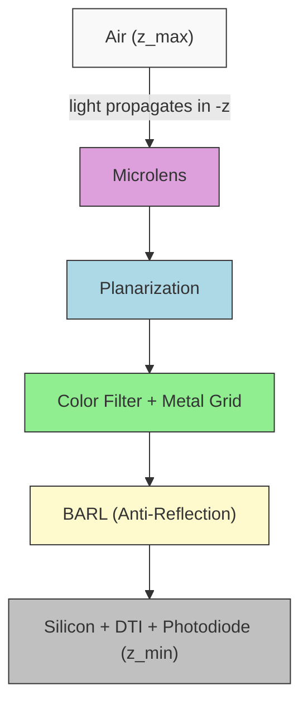

# 픽셀 스택 설정(Pixel Stack Configuration)

픽셀 구조는 모든 COMPASS 시뮬레이션(Simulation)의 핵심 입력입니다. YAML 파일의 `pixel:` 키 아래에 정의되며, BSI(후면 조사, Back-Side Illuminated) CMOS 이미지 센서 픽셀을 광학 레이어의 수직 스택으로 기술합니다.

이 페이지는 두 번에 나누어 읽는 것을 목표로 작성되어 있습니다. 먼저 빠른 시작과 결정 표를 보고 실제로 바꿔야 할 소수의 파라미터를 찾으세요. 그 다음 필요한 경우 레이어별 reference에서 정확한 YAML 필드 이름을 확인하면 됩니다.

<PixelStackBuilder />

## 빠른 시작: 5분 안에 픽셀 수정하기

빈 YAML 파일에서 시작하지 마세요. `configs/pixel/` 아래의 검증된 설정을 복사해서 하나의 물리적 아이디어만 바꾸고, 긴 solver 실행 전에 반드시 구조를 먼저 시각적으로 확인하는 것이 좋습니다.

```bash
# 기본 1.0 um BSI 픽셀
python scripts/run_simulation.py pixel=default_bsi_1um solver=torcwa source=wavelength_sweep

# 최근 구조 예시는 docs/guide/sample-pixels.md에 정리되어 있습니다
python scripts/run_simulation.py pixel=sample_p0p56um_4x4ocl solver=torcwa
```

실전 편집 흐름은 다음과 같습니다:

1. 가장 가까운 시작 파일을 고릅니다. 일반 Bayer 픽셀이면 `default_bsi_1um.yaml`, 최근 구조를 보고 싶으면 `sample_*.yaml` 파일을 사용합니다.
2. 한 번에 하나의 파라미터 묶음만 바꿉니다. 예: pitch, microlens, CFA/grid, BARL, silicon/PD/DTI, CRA shift.
3. 아래 시각적 파라미터 맵으로 지오메트리가 말이 되는지 확인합니다.
4. 낮은 비용의 단일 파장 시뮬레이션을 먼저 실행합니다.
5. 구조와 단일 파장 결과가 정상일 때만 wavelength sweep 또는 convergence study로 넘어갑니다.

## 머릿속 모델

픽셀 설정은 네 가지 질문에 답합니다:

| 질문 | YAML 블록 | 먼저 볼 파라미터 |
| --- | --- | --- |
| 반복되는 시뮬레이션 타일은 얼마나 큰가? | `pixel.pitch`, `pixel.unit_cell`, `pixel.bayer_map` | `pitch`, `unit_cell` |
| 빛은 어떻게 들어오고 집광되는가? | `layers.air`, `layers.microlens`, `layers.planarization` | microlens `height`, `radius_x/y`, `shift` |
| 각 픽셀은 어떤 색과 격리 구조를 보는가? | `layers.color_filter`, `grid`, `bayer_map` | CFA 색별 `material/thickness/contact_angle`, grid `width`, `corner_radius` |
| 빛은 어디에서 흡수되고 수집되는가? | `layers.barl`, `layers.silicon`, `photodiode`, `dti` | silicon `thickness`, PD `size`, DTI `width/depth` |

대부분의 연구에서 가장 중요한 파라미터는 `pitch`, microlens `height`, microlens `radius_x/y`, CRA `shift.cra_deg`, color-filter `thickness`, grid `width`, BARL layer `thickness`, silicon `thickness`, photodiode `size`, DTI `width/depth`입니다.

## 무엇을 바꿔야 할까?

| 목표 | 먼저 바꿀 항목 | 주의할 점 |
| --- | --- | --- |
| 더 작거나 큰 픽셀 모델링 | `pitch`, 이후 microlens radius, grid width, PD size, DTI width를 함께 스케일 | 아주 작은 구조는 더 촘촘한 RCWA/FDTD grid가 필요 |
| 코너 shading 또는 센서 edge 동작 연구 | `microlens.shift.mode: "auto_cra"`와 `shift.cra_deg` | CRA는 source angle도 바꾸므로 normal incidence와 단순 비교하면 안 됨 |
| optical crosstalk 감소 | `grid.width` 증가, `dti` 활성화/깊게 설정, PD footprint 조정 | 격리가 강해지면 fill factor 또는 투과율이 줄 수 있음 |
| peak QE 개선 | microlens height/radius, BARL thickness, silicon thickness 튜닝 | green에 최적화한 stack이 blue/red를 악화시킬 수 있음 |
| Bayer, Quad Bayer, 4x4 binning 비교 | `unit_cell`, `bayer_map`, `color_filter.pattern`, `microlens.sharing` | `bayer_map` 크기는 `unit_cell`과 일치해야 함 |
| 공정에서 보이는 둥근 CFA corner 테스트 | `color_filter.grid.corner_radius` | radius는 pitch와 grid width에 의해 자동 제한됨 |
| 빠른 debug run 만들기 | 더 작은 `unit_cell`, 단순 stack, 낮은 solver order/grid 사용 | debug 결과를 수렴된 물리 결과로 해석하면 안 됨 |

## 좌표계

COMPASS는 빛이 스택을 아래로 전파하는 오른손 좌표계를 사용합니다.


```mermaid
graph TB
    A["Air (z_max)"] -->|"light propagates in -z"| B["Microlens"]
    B --> C["Planarization"]
    C --> D["Color Filter + Metal Grid"]
    D --> E["BARL (Anti-Reflection)"]
    E --> F["Silicon + DTI + Photodiode (z_min)"]
    style A fill:#f9f9f9,stroke:#333
    style B fill:#dda0dd,stroke:#333
    style C fill:#add8e6,stroke:#333
    style D fill:#90ee90,stroke:#333
    style E fill:#fffacd,stroke:#333
    style F fill:#c0c0c0,stroke:#333
```

주요 규칙:

- 모든 길이 단위는 **마이크로미터(um)**입니다
- **x, y**: 횡방향(면내) 방향
- **z**: 수직 스택 방향. 실리콘이 하단($z_\text{min}$), 공기가 상단($z_\text{max}$)에 위치합니다
- 빛은 **-z** 방향으로 전파됩니다(공기에서 실리콘 방향). BSI 조사 방식에 해당합니다
- x-y 평면의 원점은 단위 셀의 좌측 하단 모서리에 있습니다
- 포토다이오드(Photodiode)의 경우 `position[0]`과 `position[1]`은 각 픽셀 중심에 대한 횡방향 오프셋입니다. 대부분의 사용자는 `position`은 그대로 두고 `size`를 먼저 조정하는 것이 안전합니다.

## 파라미터 맵 (시각 참조)

아래 다이어그램은 기본 1.0 µm BSI 픽셀의 2D 단면 위에 모든 치수 파라미터를 직접 라벨링합니다. **XZ 단면**(수직 스택, 레이어 두께, DTI / 포토다이오드 깊이)과 **XY 평면도**(면내 피치, 마이크로렌즈 풋프린트, PD/DTI/격자 폭)를 탭으로 전환할 수 있습니다. 범례의 행에 마우스를 올리면 해당 파라미터가 다이어그램에서 강조됩니다.

<PixelParameterDiagram />

## 최상위 픽셀 파라미터

```yaml
pixel:
  pitch: 1.0          # Pixel pitch in um (both x and y)
  unit_cell: [2, 2]   # Number of pixels [rows, cols] in the unit cell
  bayer_map:           # Color channel assignment per pixel
    - ["R", "G"]
    - ["G", "B"]
```

| 파라미터     | 타입            | 기본값                          | 설명                                               |
|-------------|-----------------|-------------------------------|----------------------------------------------------|
| `pitch`     | float           | `1.0`                         | 픽셀 피치(um). x와 y 모두에 적용됩니다.                |
| `unit_cell` | [int, int]      | `[2, 2]`                      | 주기적 단위 셀의 픽셀 수 [행, 열].                    |
| `bayer_map` | list[list[str]] | `[["R","G"],["G","B"]]`       | 색상 채널 할당. CFA 재료에 매핑됩니다.                 |

전체 시뮬레이션 도메인 크기는 x 방향으로 `pitch * unit_cell[1]`, y 방향으로 `pitch * unit_cell[0]`입니다. 1.0 um 피치의 표준 2x2 베이어 패턴(Bayer Pattern)의 경우, 도메인은 주기적 경계 조건을 가진 2.0 um x 2.0 um입니다.

## 레이어 스택

레이어는 `pixel.layers` 아래에 정의됩니다. 예시는 읽기 쉽도록 빛이 들어오는 순서로 나열하지만, COMPASS는 정해진 canonical layer key를 인식하고 물리적 BSI 스택을 일관되게 구성합니다: 하단의 silicon, 그 위의 BARL, color filter, planarization, microlens, 최상단의 air 순서입니다. 사용자 정의 하위 레이어는 `barl.layers` 안에 추가하세요. geometry 코드가 지원하지 않는 임의의 최상위 layer 이름을 새로 만드는 것은 피하는 것이 좋습니다.

```yaml
pixel:
  layers:
    air:             # Superstrate, 빛 입사측
    microlens:       # Curved focusing lens
    planarization:   # Flat dielectric spacer
    color_filter:    # Bayer CFA with optional metal grid
    barl:            # Bottom anti-reflection layers
    silicon:         # Photodiode substrate
```

YAML 파일에서는 이 순서를 쓰는 것이 광학 경로를 생각하기 쉽습니다. 내부 solver에는 이에 대응되는 bottom-to-top z stack이 전달됩니다.

### air

마이크로렌즈(Microlens) 위의 단순 유전체 레이어입니다. 이 레이어는 빛이 픽셀로 들어오는 매질을 제공합니다.

```yaml
air:
  thickness: 1.0     # um
  material: "air"    # Material name from MaterialDB
```

| 파라미터    | 타입  | 기본값  | 설명                                 |
|------------|-------|---------|--------------------------------------|
| `thickness` | float | `1.0`  | 마이크로렌즈 위 공기 간격(um).          |
| `material`  | str   | `"air"` | 재료명 ($n = 1.0$, $k = 0.0$).       |

### microlens

초타원(Superellipse) 프로파일로 기술되는 곡면 집광 렌즈입니다. 마이크로렌즈의 2D 형상은 다음과 같이 정의됩니다:

집광 자체를 연구하는 경우가 아니라면 기본값에서 시작하세요. 가장 안전하고 흔한 수정 항목은 `height`, `radius_x/y`, `shift.cra_deg`입니다. `pitch`를 줄였다면 radius와 gap도 함께 스케일해야 합니다. 일반적인 픽셀당 렌즈에서 radius가 대략 `pitch / 2`보다 커지면 이웃 렌즈와 겹칠 수 있으며, 이는 multi-pixel OCL sharing을 의도한 경우가 아니라면 피해야 합니다.

$$z(x, y) = h \cdot \left(1 - r(x,y)^2\right)^{1/(2\alpha)}$$

여기서 정규화된 반경 좌표 $r$은 초타원 노름을 사용합니다:

$$r(x, y) = \left(\left|\frac{x - x_c}{R_x}\right|^n + \left|\frac{y - y_c}{R_y}\right|^n\right)^{1/n}$$

파라미터 $n$은 사각도를 제어합니다($n = 2$는 원/타원, $n > 2$는 직사각형에 접근). $\alpha$는 곡률을 제어합니다($\alpha = 1$은 구면, $\alpha > 1$은 상단이 더 평평한 형상).

```yaml
microlens:
  enabled: true
  height: 0.6          # Lens sag height in um
  radius_x: 0.48       # Semi-axis in x (um)
  radius_y: 0.48       # Semi-axis in y (um)
  material: "polymer_n1p56"
  profile:
    type: "superellipse"
    n: 2.5              # Squareness parameter
    alpha: 1.0          # Curvature: 1=spherical, >1=flatter
  shift:
    mode: "auto_cra"    # none | manual | auto_cra
    cra_deg: 0.0        # Chief ray angle for auto shift
    shift_x: 0.0        # Manual x-offset (um)
    shift_y: 0.0        # Manual y-offset (um)
  gap: 0.0              # Gap between adjacent lenses (um)
  sharing: 1            # 1 = 픽셀당 OCL, 2 = 2x2 OCL, 4 = 4x4 OCL
```

| 파라미터         | 타입  | 기본값             | 설명                                              |
|-----------------|-------|--------------------|---------------------------------------------------|
| `enabled`       | bool  | `true`             | 마이크로렌즈 활성화/비활성화.                         |
| `height`        | float | `0.6`              | 최대 렌즈 높이(새그, sag)(um).                       |
| `radius_x`      | float | `0.48`             | x 방향 반축(um).                                    |
| `radius_y`      | float | `0.48`             | y 방향 반축(um).                                    |
| `material`      | str   | `"polymer_n1p56"`  | 렌즈 재료 (코시 모델, $n \approx 1.56$).             |
| `profile.type`  | str   | `"superellipse"`   | 프로파일 모델.                                      |
| `profile.n`     | float | `2.5`              | 초타원 사각도. 높을수록 더 사각형입니다.                |
| `profile.alpha`  | float | `1.0`              | 곡률 제어. 1.0 = 구면, >1 = 더 평평함.               |
| `shift.mode`    | str   | `"auto_cra"`       | `"none"`, `"manual"`, 또는 `"auto_cra"`.            |
| `shift.cra_deg`  | float | `0.0`              | 자동 시프트를 위한 주광선 각도(Chief Ray Angle, CRA)(도). |
| `gap`           | float | `0.0`              | 인접 렌즈 간 간격(um).                               |
| `sharing`       | int   | `1`                | 다중 픽셀 OCL 그룹 (아래 표 참조).                   |

#### 다중 픽셀 OCL 공유

`sharing: N` 설정은 $N \times N$ 픽셀 블록마다 마이크로렌즈를 **하나** 배치합니다 (Quad / Nona / 4×4 슈퍼셀 같은 색 그룹을 가로지름). `radius_x`/`radius_y` 가 명시되지 않으면 클러스터를 가득 채우도록 `sharing * pitch / 2` 로 자동 스케일됩니다.

| `sharing` | 사용 예                                  | 기본 렌즈 직경        |
|-----------|------------------------------------------|-----------------------|
| `1`       | 일반적인 픽셀당 OCL                       | `pitch`                |
| `2`       | 2×2 OCL / Quad PD (전 픽셀 PDAF)          | `2 × pitch`            |
| `3`       | Nonacell 공유 렌즈 (드묾)                  | `3 × pitch`            |
| `4`       | 4×4 슈퍼셀 OCL                            | `4 × pitch`            |

고굴절률 마이크로렌즈 재료 (`polymer_hri_n1p70`, `polymer_hri_n1p85`) 도 `MaterialDB` 에 등록되어 있어 최근 플래그십 sub-µm 픽셀 모델링에 사용할 수 있습니다. 자세한 내용은 [샘플 픽셀 구조](./sample-pixels.md) 가이드 참조.

`shift.mode`가 `"auto_cra"`일 때, 마이크로렌즈 중심은 이미지 센서 가장자리에서의 비축 주광선 각도를 수용하기 위해 픽셀 중심에서 오프셋됩니다. 시프트는 마이크로렌즈 아래 각 레이어를 통해 스넬 법칙으로 주광선을 추적하여 계산됩니다:

$$\Delta x = \sum_i h_i \cdot \frac{\sin\theta_i}{\cos\theta_i}, \quad \sin\theta_i = \frac{n_\text{air} \cdot \sin\theta_\text{CRA}}{n_i}$$

여기서 $h_i$와 $n_i$는 각 레이어(평탄화층, 컬러 필터, BARL, 실리콘~PD 중심)의 두께와 굴절률입니다. 이 방법은 각 계면에서의 굴절을 고려하므로, CRA > 15°에서 단순 $\tan(\theta_\text{CRA})$ 근사보다 정확도가 향상됩니다 (Hwang & Kim, *Sensors* 2023, DOI: [10.3390/s23020702](https://doi.org/10.3390/s23020702)). `ref_wavelength` 파라미터(기본값 0.55 um)는 굴절률 조회에 사용할 파장을 제어합니다.

### planarization

마이크로렌즈와 컬러 필터(Color Filter) 사이의 평탄한 유전체 스페이서입니다.

```yaml
planarization:
  thickness: 0.3
  material: "sio2"
```

일반적으로 SiO2 또는 폴리머를 사용합니다. 이 레이어는 마이크로렌즈와 컬러 필터 사이의 전파 매질 역할을 합니다. 두께를 조정하여 마이크로렌즈가 포토다이오드에 대해 빛을 집광하는 위치를 제어합니다. 마이크로렌즈-평탄화 시스템의 유효 초점 거리가 광학적 크로스토크(Optical Crosstalk)를 결정합니다.

실제 단면에 맞춰 보정하는 것이 아니라면 이 값은 천천히 바꾸는 것이 좋습니다. 너무 두꺼우면 마이크로렌즈 초점이 너무 아래로 내려갈 수 있고, 너무 얇으면 CFA 표면이 렌즈에 비현실적으로 가까워질 수 있습니다.

### color_filter

선택적 금속 격자(Metal Grid) 절연이 포함된 베이어 CFA(Color Filter Array)입니다.

이 블록은 색 선택성과 횡방향 광학 격리를 함께 제어합니다. 일반 Bayer 시뮬레이션에서는 `pattern: "bayer_rggb"`를 유지하고, 자체 재료 데이터가 있을 때만 색별 `material`을 바꾸세요. Crosstalk 연구에서는 grid `enabled`, `width`, `thickness`, `corner_radius`가 첫 번째 조정 대상입니다.

현재 BSI 단면을 맞출 때는 아래처럼 색별 설정을 쓰는 것이 좋습니다. 실제 컬러 필터는 금속 grid보다 높게 솟는 경우가 많고, red/green/blue 레지스트 높이도 서로 다를 수 있습니다. `contact_angle`은 `grid.thickness` 위로 돌출된 부분의 사다리꼴 taper를 제어합니다. `90`도는 수직 sidewall, 더 낮은 값은 위쪽 footprint가 더 작아지는 형상입니다. 기존 `thickness`, `materials`, `grid.height`는 flat slab 하위호환 설정으로 계속 동작합니다.

```yaml
color_filter:
  pattern: "bayer_rggb"
  red:
    material: "cf_red"
    thickness: 0.62
    contact_angle: 66.0
  green:
    material: "cf_green"
    thickness: 0.60
    contact_angle: 72.0
  blue:
    material: "cf_blue"
    thickness: 0.65
    contact_angle: 62.0
  grid:
    enabled: true
    width: 0.05          # Grid line width in um
    thickness: 0.47      # Grid thickness in um; usually lower than the CF
    material: "tungsten"  # Metal grid material
    corner_radius: 0.0   # 선택: CF 모서리 반경 r(um). 0 = 직각.
```

| 파라미터              | 타입  | 기본값           | 설명                                   |
|----------------------|------|------------------|----------------------------------------|
| `thickness`          | float | `0.6`           | legacy flat 컬러 필터 두께(um). 색별 두께가 없을 때 사용. |
| `pattern`            | str  | `"bayer_rggb"`   | CFA 패턴명.                             |
| `materials`          | dict | R/G/B 매핑       | legacy 색상 키-재료명 매핑.               |
| `red/green/blue.material` | str | `cf_*` | 색별 재료명.                              |
| `red/green/blue.thickness` | float | `thickness` | 색별 CF 높이(um).                         |
| `red/green/blue.contact_angle` | float | `90.0` | grid 위 돌출부 sidewall 각도(deg).         |
| `grid.enabled`       | bool | `true`           | 금속 절연 격자 활성화.                    |
| `grid.width`         | float | `0.05`          | 격자 선 너비(um).                        |
| `grid.thickness`     | float | `thickness`     | 금속 grid 높이(um).                      |
| `grid.height`        | float | `0.6`           | `grid.thickness`의 legacy alias.          |
| `grid.material`      | str  | `"tungsten"`     | 격자 재료.                               |
| `grid.corner_radius` | float | `0.0`           | rounded rectangle 모서리 반경 `r`(um). 네 모서리 모두 동일하게 적용. `0`이면 기존 직각 격자 유지, `> 0`이면 각 CF 셀을 rounded rectangle로 모델링하고 그 보집합을 메탈 격자로 채움. `(pitch - grid.width) / 2`로 자동 클램프. |
| `n_slices`           | int  | taper 시 `8`     | taper된 CF 표면을 계단 근사할 z-slice 수. |

**지원되는 베이어 패턴:**

| 패턴                       | 같은 색 그룹 | 슈퍼픽셀 | 사용 예                                          |
|---------------------------|--------------|----------|--------------------------------------------------|
| `bayer_rggb`              | 1×1          | 2×2      | 표준 Bayer                                       |
| `bayer_grbg`              | 1×1          | 2×2      | 표준 Bayer (GRBG 변형)                          |
| `bayer_gbrg`              | 1×1          | 2×2      | 표준 Bayer (GBRG 변형)                          |
| `bayer_bggr`              | 1×1          | 2×2      | 표준 Bayer (BGGR 변형)                          |
| `tetracell` / `quad_bayer` | 2×2          | 4×4      | Quad Bayer (50 MP 급 메인 카메라)               |
| `nonacell`                | 3×3          | 6×6      | 9-cell 비닝 (초기 108 MP 급 센서)              |
| `tetra2cell` / `hexadeca` | 4×4          | 8×8      | 16-cell 비닝 (200 MP 급 sub-µm 픽셀)            |

최상위 수준의 `bayer_map`은 각 픽셀이 받는 채널을 결정합니다. `R`, `G`, `B`는 각각 `red`, `green`, `blue` 채널 블록으로 해석되고, 사용자 정의 재료 매핑은 legacy `materials` 딕셔너리도 계속 사용할 수 있습니다. 표준 베이어를 넘어선 사용자 정의 패턴(예: RGBW 쿼드 픽셀)은 `unit_cell`과 `bayer_map`을 확장하여 정의할 수 있습니다:

```yaml
# 4x4 Quad-Bayer pattern
pixel:
  pitch: 0.7
  unit_cell: [4, 4]
  bayer_map:
    - ["R", "R", "G", "G"]
    - ["R", "R", "G", "G"]
    - ["G", "G", "B", "B"]
    - ["G", "G", "B", "B"]
```

### barl (하부 반사 방지층, Bottom Anti-Reflection Layers)

CFA와 실리콘 사이의 반사 방지를 위한 다층 유전체 스택입니다. BARL의 목적은 컬러 필터($n \approx 1.55$)와 실리콘($n \approx 4.0$) 사이의 높은 대비 계면에서 프레넬 반사(Fresnel Reflection)를 최소화하는 것입니다.

BARL은 보편적인 정답이 아니라 조정 가능한 박막 recipe로 보는 것이 맞습니다. 아래 예시는 좋은 시작점이지만, 실제 제품의 재료 선택과 두께는 벤더별 공정 recipe에 따라 다릅니다. 최적화할 때는 두께를 nm 단위로 조금씩 바꾸고, 단일 파장이 아니라 전체 가시광 스펙트럼을 확인하세요.

```yaml
barl:
  layers:
    - thickness: 0.010
      material: "sio2"
    - thickness: 0.025
      material: "hfo2"
    - thickness: 0.015
      material: "sio2"
    - thickness: 0.030
      material: "si3n4"
```

각 항목은 `{thickness, material}` 쌍입니다. 레이어는 상단에서 하단 순으로 정렬됩니다. 위 예시는 어디까지나 *예시용* 스택이며, 실제 사용 재료·층 수·적층 순서는 벤더마다 크게 다른 공정 레시피입니다(자주 쓰이는 재료: SiO2, Si3N4, HfO2, Al2O3, TiO2, Ta2O5). 공통적인 설계 전략은 고/저 굴절률 유전체를 번갈아 쌓아 필터-실리콘 사이의 굴절률 변화가 점진적으로 일어나도록 만드는 것이고, 각 층의 두께는 쿼터웨이브 조건(Quarter-Wave Condition)으로 튜닝합니다:

$$t = \frac{\lambda_0}{4 n}$$

여기서 $\lambda_0$는 목표 파장이고 $n$은 레이어의 굴절률입니다.

### silicon

포토다이오드 영역과 DTI(심층 트렌치 절연, Deep Trench Isolation)를 포함하는 흡수 기판입니다.

여기서 QE가 수집 신호로 바뀝니다. Silicon `thickness`는 흡수 경로를, `photodiode.size`는 수집 체적을, `dti`는 이웃 픽셀과의 격리 강도를 제어합니다. 첫 수정에서는 `photodiode.position`을 움직이기보다 `photodiode.size`를 먼저 조정하는 것이 안전합니다.

```yaml
silicon:
  thickness: 3.0
  material: "silicon"
  photodiode:
    position: [0.0, 0.0, 0.5]   # PD 중심 배치 [x offset, y offset, z] in um
    size: [0.7, 0.7, 2.0]        # Photodiode extent [dx, dy, dz] in um
  dti:
    enabled: true
    mode: "fdti"                  # "fdti" 또는 "bdti"
    width: 0.1                    # Trench width in um
    depth: 3.0                    # Trench depth in um (from top of silicon)
    material: "sio2"              # Fill material
```

| 파라미터               | 타입                    | 기본값           | 설명                                         |
|-----------------------|-------------------------|------------------|----------------------------------------------|
| `thickness`           | float                   | `3.0`            | 전체 실리콘 두께(um).                           |
| `material`            | str                     | `"silicon"`      | 기판 재료.                                     |
| `photodiode.position` | [float, float, float]   | `[0, 0, 0.5]`   | PD 중심 배치. x/y는 각 픽셀 중심에 대한 횡방향 오프셋이고, z 값은 실리콘 내부의 수직 배치를 제어합니다. 수집 window를 의도적으로 이동시키는 경우가 아니라면 기본값을 유지하세요. |
| `photodiode.size`     | [float, float, float]   | `[0.7, 0.7, 2.0]` | PD 크기 (dx, dy, dz)(um).                   |
| `dti.enabled`         | bool                    | `true`           | DTI 활성화.                                    |
| `dti.mode`            | str                     | `"fdti"`         | 트렌치 방향 모델: `"fdti"` 또는 `"bdti"`.       |
| `dti.width`           | float                   | `0.1`            | DTI 트렌치 너비(um).                            |
| `dti.depth`           | float                   | `3.0`            | DTI 깊이(um, 실리콘 상단에서).                   |
| `dti.material`        | str                     | `"sio2"`         | DTI 충전 재료.                                  |

DTI 트렌치는 실리콘 레이어의 픽셀 경계에 배치됩니다. 의도된 픽셀로 빛을 다시 반사하여 크로스토크를 줄이는 광학 배리어 역할을 합니다. 이 단순화된 geometry에서는 풀 뎁스 DTI(`depth == thickness`)가 가장 강한 격리를 제공합니다.

## 안전한 편집 체크리스트

결과를 신뢰하기 전에 아래 항목을 확인하세요:

| 확인 항목 | 중요한 이유 |
| --- | --- |
| `bayer_map` 크기가 `unit_cell`과 일치하는가 | `[4, 4]` unit cell이면 map도 4행 4열이어야 함 |
| Microlens radius가 물리적으로 그럴듯한가 | 픽셀당 렌즈는 보통 `pitch / 2`보다 약간 작고, shared OCL은 `sharing`에 맞춰 커짐 |
| Grid, DTI, corner radius가 simulation grid cell보다 충분히 큰가 | grid보다 작은 구조는 사라지거나 수렴이 느려질 수 있음 |
| BARL 두께가 현실적인 박막 범위인가 | 일반적으로 수십 nm, YAML에서는 `0.010`~`0.050` um 정도로 표현 |
| Silicon이 파장 범위에 충분히 두꺼운가 | Red/NIR 빛은 blue보다 더 두꺼운 silicon이 필요 |
| PD size가 픽셀 안에 들어가는가 | `photodiode.size[0]`, `[1]`은 보통 `pitch`보다 작아야 함 |
| CRA shift를 source angle과 일관되게 썼는가 | Source CRA를 바꾸면 `microlens.shift.cra_deg`도 바꾸거나, no-compensation 비교를 위해 의도적으로 `shift.mode: "none"`을 사용 |

무언가 이상해 보이면 먼저 설정을 단순화하세요. 마이크로렌즈를 끄거나, metal grid를 끄거나, 단일 파장만 사용해 보세요. 그 다음 기능을 하나씩 다시 추가하는 것이 디버깅에 가장 빠릅니다.

## 예시 설정

### 소형 픽셀 (0.8 um)

```yaml
pixel:
  pitch: 0.8
  unit_cell: [2, 2]
  layers:
    air: {thickness: 1.0, material: "air"}
    microlens:
      height: 0.5
      radius_x: 0.38
      radius_y: 0.38
    planarization: {thickness: 0.25, material: "sio2"}
    color_filter:
      red: {material: "cf_red", thickness: 0.52, contact_angle: 66.0}
      green: {material: "cf_green", thickness: 0.50, contact_angle: 72.0}
      blue: {material: "cf_blue", thickness: 0.54, contact_angle: 62.0}
      grid: {width: 0.05, thickness: 0.39}
    barl:
      layers:
        - {thickness: 0.010, material: "sio2"}
        - {thickness: 0.020, material: "hfo2"}
    silicon:
      thickness: 2.5
      photodiode:
        size: [0.55, 0.55, 1.6]
      dti: {depth: 2.5}
  bayer_map:
    - ["R", "G"]
    - ["G", "B"]
```

### 대형 픽셀 (1.4 um), 더 두꺼운 CFA

```yaml
pixel:
  pitch: 1.4
  unit_cell: [2, 2]
  layers:
    air: {thickness: 1.0, material: "air"}
    microlens:
      height: 0.8
      radius_x: 0.65
      radius_y: 0.65
      profile: {n: 3.0, alpha: 1.2}
    planarization: {thickness: 0.4, material: "sio2"}
    color_filter:
      red: {material: "cf_red", thickness: 0.83, contact_angle: 66.0}
      green: {material: "cf_green", thickness: 0.80, contact_angle: 72.0}
      blue: {material: "cf_blue", thickness: 0.86, contact_angle: 62.0}
      grid: {width: 0.06, thickness: 0.62}
    barl:
      layers:
        - {thickness: 0.010, material: "sio2"}
        - {thickness: 0.025, material: "hfo2"}
        - {thickness: 0.015, material: "sio2"}
        - {thickness: 0.030, material: "si3n4"}
    silicon:
      thickness: 3.5
      photodiode:
        size: [1.0, 1.0, 2.5]
      dti: {depth: 3.5}
  bayer_map:
    - ["R", "G"]
    - ["G", "B"]
```

### 마이크로렌즈 없음 (평면 상단)

집광 광학계 없이 베어 픽셀을 시뮬레이션하려면 마이크로렌즈를 비활성화합니다:

```yaml
pixel:
  pitch: 1.0
  unit_cell: [2, 2]
  layers:
    air: {thickness: 1.0, material: "air"}
    microlens:
      enabled: false
    planarization: {thickness: 0.3, material: "sio2"}
    color_filter:
      red: {material: "cf_red", thickness: 0.62}
      green: {material: "cf_green", thickness: 0.60}
      blue: {material: "cf_blue", thickness: 0.65}
    silicon:
      thickness: 3.0
```

## Python에서 픽셀 설정 로드

```python
from pathlib import Path
from omegaconf import OmegaConf
from compass.core.config_schema import CompassConfig

# Load from YAML
raw = OmegaConf.load("configs/pixel/default_bsi_1um.yaml")
config = CompassConfig(**OmegaConf.to_container(raw, resolve=True))

# Inspect
print(f"Pitch: {config.pixel.pitch} um")
print(f"Unit cell: {config.pixel.unit_cell}")
print(f"Bayer map: {config.pixel.bayer_map}")
```

## 다음 단계

- [재료 데이터베이스](./material-database.md) -- 각 레이어에 사용되는 재료의 이해 및 확장
- [솔버 선택](./choosing-solver.md) -- 픽셀 구조에 적합한 솔버 선택
- [시각화](./visualization.md) -- 설정을 검증하기 위한 픽셀 스택 플롯
