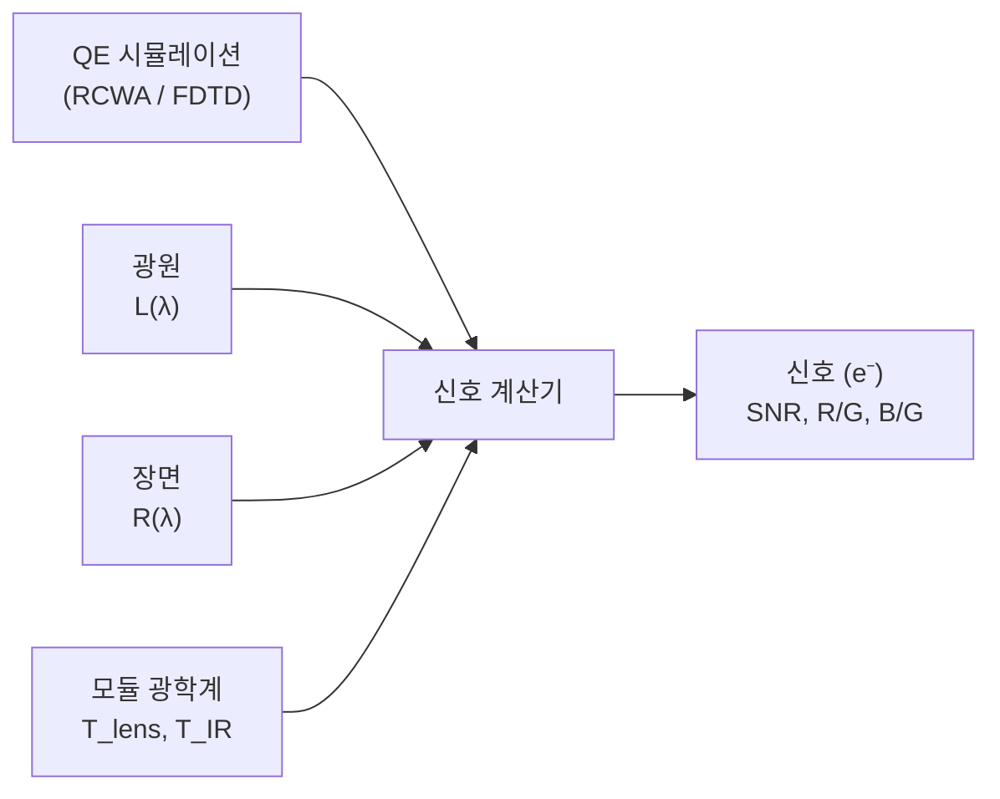

# 신호 수준 시뮬레이션(Signal-Level Simulation)

## 개요

픽셀 설계의 양자 효율(QE) 스펙트럼을 계산한 후, 다음 단계는 실제 이미징 조건에서의 신호 수준을 예측하는 것입니다. 신호 수준 시뮬레이션(Signal-Level Simulation)은 원시 QE 곡선과 신호대잡음비, 화이트 밸런스, 색 정확도 같은 실용적 성능 지표 사이의 간극을 연결합니다.

### 신호 시뮬레이션이 중요한 이유

- **QE만으로는 충분하지 않습니다**: 동일한 피크 QE를 가진 두 픽셀 설계가 스펙트럼 형상, 컬러 필터 대역폭, IR 누설의 차이로 인해 실제 광원 조건에서 매우 다르게 수행될 수 있습니다.
- **광원 의존성**: D65 주광에서 잘 균형 잡힌 픽셀이 백열등(A) 또는 형광등(F11) 조명에서는 상당한 색 오류를 보일 수 있습니다.
- **시스템 수준 최적화**: 신호 시뮬레이션은 픽셀을 단독으로가 아니라 전체 카메라 모듈(렌즈 + IR 필터 + 센서)을 평가할 수 있게 합니다.

### 워크플로우



1. QE 시뮬레이션을 실행하여 각 색상 채널의 $\text{QE}_i(\lambda)$ 획득
2. 광원(Illuminant) 분광 전력 분포 정의
3. 장면 반사율(Scene Reflectance) 지정
4. 카메라 모듈 광학계(렌즈 투과율, IR 필터) 구성
5. 전자 수로 픽셀 신호를 계산하고 결과 분석

## 광원 설정(Setting Up Illuminants)

`Illuminant` 클래스는 일반적인 광원에 대한 팩토리 메서드를 제공합니다:

```python
from compass.sources.illuminant import Illuminant
import numpy as np

# 파장 격자 정의 (마이크로미터 단위)
wavelengths = np.arange(0.38, 0.781, 0.01)

# 5500K 흑체 (근사 주광)
daylight = Illuminant.blackbody(5500, wavelengths)

# CIE D65 (표준 평균 주광)
d65 = Illuminant.cie_d65(wavelengths)

# CIE 광원 A (백열등, 2856K)
cia = Illuminant.cie_a(wavelengths)

# 삼파장 형광등 (CIE F11)
f11 = Illuminant.cie_f11(wavelengths)

# 백색 LED (청색 펌프 + 형광체, CCT 지정)
led = Illuminant.led_white(5000, wavelengths)
```

각 광원 객체는 $L(560\text{ nm}) = 1.0$으로 정규화된 분광 전력 분포(SPD)를 저장합니다. SPD를 조사하고 도시할 수 있습니다:

```python
import matplotlib.pyplot as plt

fig, ax = plt.subplots(figsize=(10, 5))
for name, illum in [("D65", d65), ("A", cia), ("F11", f11), ("LED 5000K", led)]:
    ax.plot(illum.wavelengths * 1000, illum.spd, label=name)

ax.set_xlabel("파장 (nm)")
ax.set_ylabel("상대 SPD")
ax.set_title("표준 광원 스펙트럼")
ax.legend()
ax.grid(True, alpha=0.3)
plt.tight_layout()
```

### 측정 데이터로부터 사용자 정의 광원

측정된 SPD(예: 분광기에서)가 있는 경우, 원시 배열로부터 광원을 생성합니다:

```python
# 측정 데이터 로드: 열은 파장(nm)과 상대 전력
data = np.loadtxt("measured_led.csv", delimiter=",", skiprows=1)
wl_um = data[:, 0] / 1000  # nm을 um으로 변환
spd = data[:, 1]

custom = Illuminant(wavelengths=wl_um, spd=spd, name="Custom LED")
```

## 장면 반사율 정의(Defining Scene Reflectance)

장면 반사율은 각 파장에서 카메라를 향해 반사되는 빛의 양을 결정합니다. COMPASS는 일정 반사율과 분광 반사율 프로파일을 지원합니다.

### 일정 반사율 (회색 타겟)

중립 회색 카드의 경우:

```python
# 18% 회색 카드 -- 표준 노출 기준
scene_reflectance = 0.18

# 또는 파장별 일정 값 지정
scene_reflectance = np.full_like(wavelengths, 0.18)
```

### 분광 반사율 (유채색 타겟)

유채색 패치(예: 맥베스 컬러체커)의 경우, 내장 패치 라이브러리를 사용합니다:

```python
from compass.sources.scene import SceneReflectance

# 맥베스 컬러체커 패치 로드
red_patch = SceneReflectance.macbeth("red")
green_patch = SceneReflectance.macbeth("green")
blue_patch = SceneReflectance.macbeth("blue")

# 반사율 곡선 도시
fig, ax = plt.subplots(figsize=(10, 5))
for name, patch in [("빨간색", red_patch), ("녹색", green_patch), ("파란색", blue_patch)]:
    ax.plot(patch.wavelengths * 1000, patch.reflectance, label=name)

ax.set_xlabel("파장 (nm)")
ax.set_ylabel("반사율")
ax.set_title("맥베스 컬러체커 패치 반사율")
ax.legend()
ax.grid(True, alpha=0.3)
plt.tight_layout()
```

### 사용자 정의 분광 반사율

```python
# 사용자 정의 분광 반사율 (예: 좁은 대역 녹색 물체)
custom_refl = SceneReflectance(
    wavelengths=wavelengths,
    reflectance=0.5 * np.exp(-0.5 * ((wavelengths - 0.55) / 0.03) ** 2) + 0.05,
    name="좁은 대역 녹색"
)
```

## 모듈 광학계 구성(Configuring Module Optics)

카메라 모듈은 렌즈 투과율과 IR 필터링을 도입합니다:

```python
from compass.sources.optics import ModuleOptics

optics = ModuleOptics(
    lens_transmittance=0.90,       # 총 렌즈 T (또는 분광 배열 제공)
    ir_cutoff_nm=650,              # IR 필터 50% 차단 파장
    ir_transition_nm=15,           # 천이 영역 반폭
    f_number=2.0,                  # 렌즈 F-넘버
    pixel_pitch_um=1.0,            # 픽셀 피치
)
```

분광 렌즈 투과율(예: Zemax 내보내기)의 경우:

```python
# 설계 데이터로부터의 분광 렌즈 투과율
lens_t_data = np.loadtxt("lens_transmittance.csv", delimiter=",", skiprows=1)
optics = ModuleOptics(
    lens_transmittance=lens_t_data[:, 1],  # 분광 T(lambda)
    lens_wavelengths=lens_t_data[:, 0] / 1000,  # nm을 um으로 변환
    ir_cutoff_nm=650,
    f_number=2.0,
    pixel_pitch_um=1.0,
)
```

## 픽셀 신호 계산(Computing Pixel Signal)

QE 결과를 광원, 장면, 광학계와 결합하여 신호를 계산합니다:

```python
from compass.analysis.signal_calculator import SignalCalculator
from compass.analysis.qe_calculator import QECalculator

# 시뮬레이션 결과에서 채널별 QE 획득
channel_qe = QECalculator.spectral_response(result.qe_per_pixel, result.wavelengths)

# 신호 계산기 생성
calc = SignalCalculator(
    illuminant=d65,
    scene_reflectance=0.18,
    optics=optics,
    exposure_time_ms=10.0,
)

# 각 채널의 전자 수로 신호 계산
signals = calc.compute_signal(channel_qe)

print("신호 수준 (전자):")
print(f"  Red:   {signals['R']:.0f} e-")
print(f"  Green: {signals['G']:.0f} e-")
print(f"  Blue:  {signals['B']:.0f} e-")
print(f"  R/G 비율: {signals['R'] / signals['G']:.3f}")
print(f"  B/G 비율: {signals['B'] / signals['G']:.3f}")
```

### 신호대잡음비(Signal-to-Noise Ratio)

샷 노이즈, 암전류, 읽기 잡음을 포함한 SNR 계산:

```python
snr = calc.compute_snr(
    channel_qe,
    dark_current_e_per_s=5.0,    # 암전류 (e-/s)
    read_noise_e=2.5,            # 읽기 잡음 (e- rms)
)

print("SNR (dB):")
for ch, val in snr.items():
    print(f"  {ch}: {val:.1f} dB")
```

## 화이트 밸런스 분석(White Balance Analysis)

다양한 광원에서의 화이트 밸런스 특성 평가:

```python
# 여러 광원에 대한 화이트 밸런스 게인 계산
illuminants = {
    "D65": Illuminant.cie_d65(wavelengths),
    "A": Illuminant.cie_a(wavelengths),
    "F11": Illuminant.cie_f11(wavelengths),
    "LED 5000K": Illuminant.led_white(5000, wavelengths),
}

print("화이트 밸런스 분석 (18% 회색):")
print(f"{'광원':<15} {'R/G':>8} {'B/G':>8} {'Gain_R':>8} {'Gain_B':>8}")
print("-" * 55)

for name, illum in illuminants.items():
    calc_wb = SignalCalculator(
        illuminant=illum,
        scene_reflectance=0.18,
        optics=optics,
        exposure_time_ms=10.0,
    )
    sig = calc_wb.compute_signal(channel_qe)
    rg = sig['R'] / sig['G']
    bg = sig['B'] / sig['G']
    gain_r = 1.0 / rg
    gain_b = 1.0 / bg
    print(f"{name:<15} {rg:>8.3f} {bg:>8.3f} {gain_r:>8.3f} {gain_b:>8.3f}")
```

## 예제: 다양한 광원에서의 색 정확도(Color Accuracy Under Different Illuminants)

이 예제는 다양한 광원에서 픽셀 설계가 맥베스 컬러체커 색상을 얼마나 잘 재현하는지 평가합니다:

```python
from compass.analysis.signal_calculator import SignalCalculator
from compass.analysis.qe_calculator import QECalculator
from compass.sources.illuminant import Illuminant
from compass.sources.scene import SceneReflectance
import numpy as np

# QE 결과 로드
channel_qe = QECalculator.spectral_response(result.qe_per_pixel, result.wavelengths)
wavelengths = result.wavelengths

# 광원 정의
illuminants = {
    "D65": Illuminant.cie_d65(wavelengths),
    "A": Illuminant.cie_a(wavelengths),
    "LED 5000K": Illuminant.led_white(5000, wavelengths),
}

# 테스트할 맥베스 패치
patches = ["red", "green", "blue", "cyan", "magenta", "yellow",
           "dark_skin", "light_skin", "blue_sky", "foliage"]

for illum_name, illum in illuminants.items():
    print(f"\n=== {illum_name} ===")
    calc = SignalCalculator(
        illuminant=illum,
        optics=optics,
        exposure_time_ms=10.0,
    )

    # 먼저 중립 회색에서 WB 게인 계산
    grey_sig = calc.compute_signal(channel_qe, scene_reflectance=0.18)
    wb_r = grey_sig['G'] / grey_sig['R']
    wb_b = grey_sig['G'] / grey_sig['B']

    print(f"  WB 게인: R={wb_r:.3f}, B={wb_b:.3f}")
    print(f"  {'패치':<15} {'R_wb':>8} {'G':>8} {'B_wb':>8}")
    print(f"  {'-'*45}")

    for patch_name in patches:
        patch = SceneReflectance.macbeth(patch_name)
        sig = calc.compute_signal(channel_qe, scene_reflectance=patch)
        r_wb = sig['R'] * wb_r
        g = sig['G']
        b_wb = sig['B'] * wb_b
        # 녹색으로 정규화
        total = r_wb + g + b_wb
        print(f"  {patch_name:<15} {r_wb/total:>8.3f} {g/total:>8.3f} {b_wb/total:>8.3f}")
```

## YAML을 통한 설정

신호 시뮬레이션 파라미터는 YAML 설정 파일로도 지정할 수 있습니다:

```yaml
signal:
  illuminant: "D65"                  # "D65", "A", "F11", "LED", 또는 "blackbody"
  illuminant_cct: 5000               # LED 또는 흑체의 CCT
  scene_reflectance: 0.18            # 스칼라 또는 분광 CSV 경로
  optics:
    lens_transmittance: 0.90
    ir_cutoff_nm: 650
    ir_transition_nm: 15
    f_number: 2.0
    pixel_pitch_um: 1.0
  exposure_time_ms: 10.0
  noise:
    dark_current_e_per_s: 5.0
    read_noise_e: 2.5
```

```python
from compass.config import Config

config = Config.load("simulation.yaml")
calc = SignalCalculator.from_config(config.signal, wavelengths)
signals = calc.compute_signal(channel_qe)
```

## 다음 단계

- [양자 효율 이론](../theory/quantum-efficiency.md) -- QE 계산 이해
- [신호 체인 이론](../theory/signal-chain.md) -- 완전한 복사 측정 신호 체인 유도
- [원뿔 조명](./cone-illumination.md) -- 실제 렌즈 조명 모델링
- [시각화](./visualization.md) -- 신호 및 QE 결과 도시
