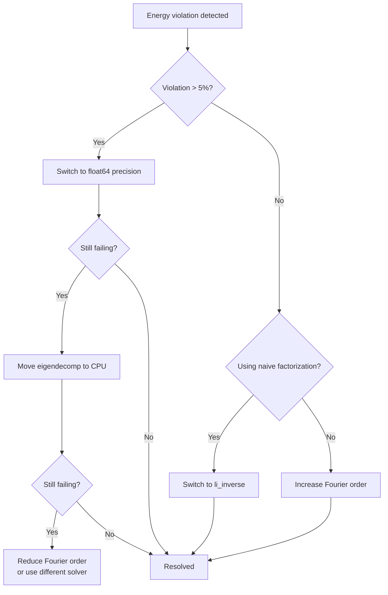

# 문제 해결(Troubleshooting)

이 페이지에서는 일반적인 오류, 근본 원인, 단계별 해결책을 다룹니다. 문제는 가장 빈번한 것부터 순서대로 정리되어 있습니다.

## 임포트 오류

### 솔버 패키지 ModuleNotFoundError

**오류:**
```
ModuleNotFoundError: No module named 'torcwa'
```

**원인:** 솔버(Solver) 백엔드 패키지는 선택적 의존성이며 기본적으로 설치되지 않습니다.

**해결책:** 솔버에 해당하는 의존성 그룹을 설치합니다:

```bash
pip install -e ".[rcwa]"     # torcwa, grcwa, meent
pip install -e ".[fdtd]"     # flaport FDTD
pip install -e ".[viz]"      # plotly, pyvista (3D viewer)
pip install -e ".[all]"      # everything
```

사용 가능한 솔버를 확인합니다:

```python
from compass.solvers.base import SolverFactory
print(SolverFactory.list_solvers())
```

### plotly ImportError (3D 뷰어)

**오류:**
```
ImportError: The 'plotly' package is required for 3D visualization.
```

**해결책:**
```bash
pip install -e ".[viz]"
```

Jupyter 노트북의 경우 nbformat과 위젯 확장도 설치합니다:

```bash
pip install nbformat
jupyter labextension install @jupyter-widgets/jupyterlab-manager
```

## GPU 및 CUDA 문제

### CUDA를 사용할 수 없음

**오류:**
```
RuntimeError: No CUDA GPUs are available
```
또는 `torch.cuda.is_available()`이 `False`를 반환합니다.

**진단:**
```python
import torch
print(f"PyTorch: {torch.__version__}")
print(f"CUDA available: {torch.cuda.is_available()}")
print(f"CUDA version: {torch.version.cuda}")
```

**해결책:**

1. CUDA 지원이 포함된 PyTorch를 재설치합니다:
```bash
pip install torch --index-url https://download.pytorch.org/whl/cu121
```

2. 임시 해결책으로 CPU에서 실행합니다:
```yaml
compute:
  backend: "cpu"
```

### CUDA 메모리 부족

**오류:**
```
torch.cuda.OutOfMemoryError: CUDA out of memory
```

**원인:** RCWA 메모리는 $O(M^2)$로 스케일링됩니다. 여기서 $M = (2N_x+1)(2N_y+1)$은 총 푸리에 고조파(Fourier Harmonics) 수입니다. 고유값 문제(Eigenvalue Problem)는 레이어당 $2M \times 2M$ 크기의 행렬이 필요합니다. 차수 [15, 15]에서 $M = 961$이고 행렬 크기는 $1922 \times 1922$입니다.

| 차수      | 모드 $M$  | 행렬 크기           | 대략적 GPU 메모리 |
|-----------|-----------|-------------------|--------------------|
| [5, 5]    | 121       | 242 x 242         | ~50 MB             |
| [9, 9]    | 361       | 722 x 722         | ~200 MB            |
| [13, 13]  | 729       | 1458 x 1458       | ~500 MB            |
| [17, 17]  | 1225      | 2450 x 2450       | ~1.2 GB            |
| [21, 21]  | 1849      | 3698 x 3698       | ~3.0 GB            |

**해결책 (순서대로 시도):**

1. 푸리에 차수 감소: `[15, 15]` 대신 `fourier_order: [9, 9]`
2. 고유값 분해(Eigendecomposition)를 CPU로 이동 (기타 연산은 GPU 유지):
```yaml
solver:
  stability:
    eigendecomp_device: "cpu"
```
3. 전체 시뮬레이션에 CPU 사용: `compute.backend: "cpu"`

### Ampere 이상 GPU에서의 TF32 정밀도 문제

**증상:** Ampere GPU(A100, RTX 30xx/40xx)와 구형 GPU 또는 CPU 간에 결과가 다릅니다. 최신 하드웨어에서만 에너지 보존(Energy Conservation) 위반이 나타납니다.

**원인:** PyTorch는 Ampere 이상 아키텍처에서 기본적으로 TF32(TensorFloat-32)를 활성화합니다. TF32는 행렬 곱셈 연산에서 부동소수점 가수부를 23비트(IEEE float32)에서 10비트로 줄입니다. 이는 신경망 학습에는 허용되지만 RCWA S-행렬(S-matrix) 계산에서는 치명적 오류를 유발합니다:

- 고유값 분해는 가까이 위치한 고유값을 구별하기 위해 높은 정밀도가 필요합니다
- S-행렬 곱은 여러 레이어에 걸쳐 반올림 오차를 누적합니다
- 행렬 역산은 TF32 절삭 오차를 증폭시킵니다

**해결책:** COMPASS는 기본적으로 TF32를 비활성화합니다. 비활성화되었는지 확인합니다:

```python
import torch
print(torch.backends.cuda.matmul.allow_tf32)  # Must be False
print(torch.backends.cudnn.allow_tf32)         # Must be False
```

True를 반환하면 설정에서 명시적으로 지정합니다:

```yaml
solver:
  stability:
    allow_tf32: false
```

### MPS (Apple Silicon) 문제

**증상:** M1/M2/M3 Mac에서 복소수 연산 관련 오류.

**원인:** PyTorch MPS 백엔드는 일부 버전에서 복소수 지원이 불완전합니다. 고유값 분해가 자동으로 CPU로 폴백될 수 있으며, 일부 연산이 실패할 수 있습니다.

**해결책:** 문제를 격리하기 위해 먼저 CPU로 테스트합니다:

```yaml
compute:
  backend: "cpu"
```

CPU가 작동하면 MPS를 시도할 수 있지만, RCWA 워크로드에서 성능이 CPU를 초과하지 못할 수 있습니다.

## 에너지 보존 실패

### R + T + A != 1

**오류:**
```
WARNING: Energy conservation violation: max |R+T+A-1| = 0.0523 (tolerance: 0.02)
```

**원인:** 기본적인 물리적 제약 조건 $R + T + A = 1$이 위반되어 솔버의 수치 오류를 나타냅니다. 이것은 RCWA에서 가장 중요한 진단 신호입니다.

**해결책 (문제 해결 가능성 순서):**



**1단계: 정밀도 증가**
```yaml
solver:
  stability:
    precision_strategy: "float64"
```

**2단계: Li의 역규칙 인수분해 사용** (금속 격자 또는 DTI가 있는 구조에 매우 중요)
```yaml
solver:
  stability:
    fourier_factorization: "li_inverse"
```

**3단계: 고유값 분해를 CPU로 이동**
```yaml
solver:
  stability:
    eigendecomp_device: "cpu"
```

**4단계: 자동 폴백 활성화**
```yaml
solver:
  stability:
    energy_check:
      enabled: true
      tolerance: 0.02
      auto_retry_float64: true
```

`AdaptivePrecisionRunner`는 3단계 폴백 전략을 구현합니다: GPU float32 -> GPU float64 -> CPU float64. 세 가지 모두 실패하면 오류가 발생합니다.

**5단계: 푸리에 차수 증가** (절삭이 문제인 경우)
```yaml
solver:
  params:
    fourier_order: [15, 15]   # Up from [9, 9]
```

## RCWA 수치 안정성

### S-행렬 vs T-행렬

COMPASS는 **S-행렬(산란 행렬, Scattering Matrix) 알고리즘만을 사용**합니다. 구형 T-행렬(전달 행렬, Transfer Matrix) 접근법은 소멸 모드에 대해 $e^{+|\lambda| k_0 d}$ 형태의 항을 포함하여 레이어 두께 $d$에 따라 기하급수적으로 성장하므로 수치적으로 불안정합니다.

S-행렬 알고리즘은 **레드헤퍼 스타 곱(Redheffer Star Product)**을 사용하여 레이어 S-행렬을 결합하며, 모든 중간 값이 유계를 유지하도록 합니다. 전파 인자는 $e^{-|\lambda| k_0 d}$ (감쇠)이므로 오버플로가 발생하지 않습니다.

오버플로 오류가 보이면 다음을 확인하십시오:

1. 극단적으로 두꺼운 레이어가 없는지 (단일 레이어 > 5 um)
2. 솔버가 S-행렬 재귀를 사용하는지 (모든 COMPASS 솔버는 기본적으로 사용)

### 고유값 분해 불안정성

**증상:** NaN 값, 조건수(Condition Number) 경고, 또는 특정 파장에서의 불규칙한 결과.

**근본 원인:** RCWA 고유값 문제는 레이어당 $2M \times 2M$ 행렬을 분해해야 합니다. 다음 경우에 실패할 수 있습니다:

- **축퇴 고유값(Degenerate Eigenvalues)**: 두 개 이상의 고유값이 거의 동일하여 고유벡터가 모호해짐
- **큰 조건수**: 고유벡터 행렬이 거의 특이(Singular)
- **낮은 정밀도**: float32는 7개의 유효 자릿수만 가지므로 가까이 위치한 고유값을 구별하기에 불충분

**해결책:**

1. **혼합 정밀도 고유값 분해** (기본값): 고유값 문제를 시뮬레이션 정밀도에 관계없이 `complex128`로 승격한 후 결과를 다시 캐스팅합니다:

```python
# This is what PrecisionManager.mixed_precision_eigen does internally
matrix_f64 = matrix.astype(np.complex128)
eigenvalues, eigenvectors = np.linalg.eig(matrix_f64)
```

2. **고유값 확장(Eigenvalue Broadening)**: 정확한 축퇴를 깨기 위해 작은 섭동을 추가합니다:

```yaml
solver:
  stability:
    eigenvalue_broadening: 1.0e-10
```

3. **조건수 모니터링**: 고유벡터 행렬 조건수가 임계값을 초과할 때 경고합니다:

```yaml
solver:
  stability:
    condition_number_warning: 1.0e+12
```

### Li의 역규칙과 푸리에 인수분해(Fourier Factorization)

**문제:** 큰 유전율 대비를 가진 계면(예: 공기/금속, DTI 경계에서의 실리콘/SiO2)에서 TM 편광에 대해 RCWA가 느리게 수렴합니다.

**원인:** 단순 로랑 규칙(Laurent Rule, $\varepsilon$의 직접 푸리에 변환)은 두 불연속 함수의 곱의 푸리에 급수가 각 푸리에 급수의 곱과 같지 않기 때문에(깁스 현상, Gibbs Phenomenon) 수렴이 느립니다.

**해결책:** Li의 역규칙은 재료 경계에서 $\text{FT}(\varepsilon)$ 대신 $[\text{FT}(1/\varepsilon)]^{-1}$을 사용하여 TM 수렴을 극적으로 개선합니다:

```yaml
solver:
  stability:
    fourier_factorization: "li_inverse"   # default for torcwa
```

이는 특히 다음 경우에 중요합니다:

- 컬러 필터에 텅스텐 금속 격자가 활성화된 경우
- 실리콘에 DTI 트렌치가 있는 경우
- 대비 비율이 2를 초과하는 날카로운 재료 경계가 있는 모든 레이어

### 전파 방향(브랜치 컷) 선택

RCWA 고유값 문제는 제곱근이 양쪽 부호를 가질 수 있는 고유값을 생성합니다. 잘못된 브랜치를 선택하면 기하급수적으로 성장하는(비물리적) 장이 됩니다. COMPASS의 `EigenvalueStabilizer.select_propagation_direction`은 다음을 강제합니다:

- 전파 모드: $\text{Re}(\sqrt{\lambda}) > 0$ (전방 전파)
- 소멸 모드: 시간 규약 $e^{-i\omega t}$에 기반한 적절한 감쇠 방향

브랜치 선택 오류가 의심되면 디버그 로깅을 활성화합니다:

```python
import logging
logging.getLogger("compass.solvers.rcwa.stability").setLevel(logging.DEBUG)
```

## QE 이상

### QE가 1보다 큰 경우

**증상:** 일부 픽셀 또는 파장에서 QE 값이 1.0을 초과합니다.

**원인:** 수치 오류를 나타내는 비물리적 결과입니다. QE는 $0 \leq \text{QE} \leq 1$을 만족해야 합니다.

**체크리스트:**
1. 에너지 보존 확인 (R + T + A = 1)
2. 푸리에 차수 증가
3. 재료 데이터 검증 (특히 실리콘 $k$ 값)
4. 포토다이오드 영역이 실리콘 레이어 밖으로 확장되지 않는지 확인
5. 교차 검증을 위해 다른 솔버 시도

### 들쭉날쭉하거나 스파이크가 있는 QE 스펙트럼

**증상:** QE 스펙트럼에 날카로운 스파이크 또는 불규칙한 진동이 있습니다.

**가능한 원인:**

1. **파장 간격이 너무 큰 경우**: 박막 간섭 프린지(Thin-film Interference Fringe)의 주기:

$$\Delta\lambda \approx \frac{\lambda^2}{2 n d}$$

550 nm에서 3 um 실리콘 레이어의 경우: $\Delta\lambda \approx \frac{0.55^2}{2 \times 4 \times 3} \approx 12.6$ nm.

**수정:** 파장 간격을 $\leq \Delta\lambda / 3$ (예: 4 nm)으로 사용합니다.

2. **수치 노이즈**: 격리된 파장에서의 무작위 스파이크는 해당 지점에서의 안정성 문제를 나타냅니다. `auto_retry_float64`를 활성화합니다.

3. **푸리에 차수가 너무 낮은 경우**: 불충분한 고조파가 불규칙한 아티팩트를 유발합니다. 차수를 증가시키고 다시 실행합니다.

### 음의 QE

**원인:** 흡수 분해에서의 수치 오류. 픽셀별 QE는 전체 흡수 $A = 1 - R - T$에서 파생되어 픽셀 간에 분배됩니다. 수치 오류로 인해 $R + T > 1$이면 $A$가 음수가 됩니다.

**수정:** 위의 에너지 보존 수정과 동일합니다.

## 성능 팁

| 병목 지점                  | 진단                                | 해결책                                  |
|--------------------------|-------------------------------------|---------------------------------------|
| CPU에서 실행 중            | `result.metadata["device"]` 확인    | `compute.backend: "cuda"` 설정         |
| 높은 푸리에 차수            | 차수 > [13, 13]                    | 차수 감소, 수렴 확인                     |
| 전체 Float64              | `precision_strategy: "float64"`    | 대신 `"mixed"` 사용                     |
| CPU 고유값 분해            | `eigendecomp_device: "cpu"`        | 안정성이 허용하면 `"gpu"` 시도           |
| 비편광 (2회 실행/파장)      | `polarization: "unpolarized"`      | 구조가 대칭이면 TE 또는 TM 사용          |
| 많은 파장                  | 넓은 범위에서 간격 < 5 nm           | 더 큰 간격 사용, 결과 보간               |
| 큰 단위 셀                 | `unit_cell: [4, 4]`               | 가장 작은 주기 단위 사용                  |

### 시뮬레이션 프로파일링

```python
result = solver.run_timed()
print(f"Runtime: {result.metadata['runtime_seconds']:.2f} s")
print(f"Solver: {result.metadata['solver_name']}")
print(f"Device: {result.metadata['device']}")
```

## 시뮬레이션 전 진단

시뮬레이션 시작 전에 내장 안정성 검사기를 실행합니다:

```python
from compass.solvers.rcwa.stability import StabilityDiagnostics

warnings = StabilityDiagnostics.pre_simulation_check(pixel_stack, solver_config)
for w in warnings:
    print(f"WARNING: {w}")
```

다음을 검사합니다:

- 낮은 정밀도에서의 큰 행렬 크기
- S-행렬 알고리즘이 필요한 두꺼운 레이어
- 비활성화되어야 하는데 TF32가 활성화된 경우
- 단순 인수분해를 사용하는 패턴 레이어

## 시뮬레이션 후 검증

```python
from compass.solvers.rcwa.stability import StabilityDiagnostics

report = StabilityDiagnostics.post_simulation_check(result)
if report:
    for key, info in report.items():
        print(f"{key}: {info['status']} -- {info['issue']}")
else:
    print("All checks passed.")
```

다음을 검증합니다:

- QE 값이 [0, 1] 범위 내 (허용 오차: +/- 0.01)
- R, T, A 배열에 NaN 또는 Inf 없음
- 에너지 보존이 5% 이내

## FAQ

**Q: 어떤 푸리에 차수를 사용해야 합니까?**

빠른 탐색에는 `[9, 9]`로 시작합니다. 논문 수준 결과에는 `[13, 13]` 또는 `[15, 15]`로 증가합니다. 절대 QE 값을 신뢰하기 전에 항상 수렴 스위프를 실행하십시오.

**Q: float32와 float64 중 어느 것을 사용해야 합니까?**

`precision_strategy: "mixed"` (기본값)를 사용합니다. 이는 속도를 위해 주 계산을 float32로 실행하고 안정성을 위해 고유값 분해를 float64로 승격합니다. 에너지 보존 문제가 보이는 경우에만 전체 `"float64"`로 전환합니다.

**Q: 왜 서로 다른 GPU에서 시뮬레이션 결과가 다릅니까?**

대부분 TF32가 원인입니다. Ampere 이상 GPU(A100, RTX 30xx/40xx)는 기본적으로 TF32를 활성화합니다. 설정에서 `allow_tf32: false`를 확인하십시오.

**Q: 결과가 수렴되었는지 어떻게 알 수 있습니까?**

동일한 시뮬레이션을 두 가지 다른 푸리에 차수(예: [9,9]와 [11,11])로 실행합니다. 피크 QE 변화가 1% 미만이면 수렴된 것입니다.

**Q: GPU 없이 COMPASS를 실행할 수 있습니까?**

예. `compute.backend: "cpu"`로 설정합니다. 모든 솔버가 CPU에서 작동합니다. 성능은 느리지만(5--20배) 결과는 동일하며 종종 수치적으로 더 안정적입니다.

## 도움 받기

위의 해결책으로 문제가 해결되지 않는 경우:

1. 시뮬레이션 전후 진단을 실행합니다 (위 참조)
2. 디버그 로깅을 활성화합니다:
```python
import logging
logging.basicConfig(level=logging.DEBUG)
```
3. 테스트 스위트를 실행하여 설치를 확인합니다:
```bash
PYTHONPATH=. python3.11 -m pytest tests/ -v -k "test_energy"
```
4. YAML 설정과 전체 오류 트레이스백을 포함하여 COMPASS 저장소에 이슈를 제출합니다.

## 다음 단계

- [솔버 선택](./choosing-solver.md) -- 솔버 트레이드오프 이해
- [재료 데이터베이스](./material-database.md) -- 재료 데이터 커버리지 확인
- [시각화](./visualization.md) -- 구조 및 결과 시각적 검사
