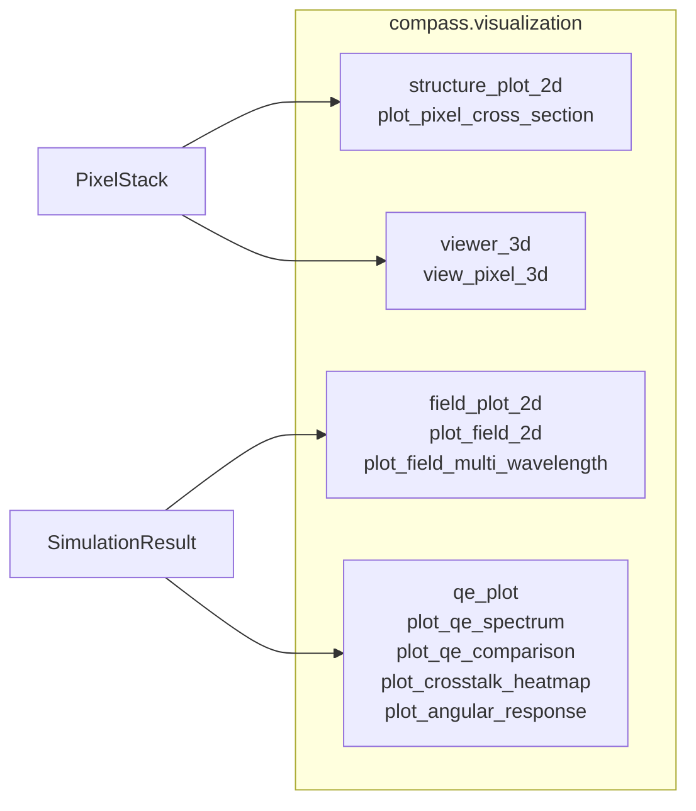

# 시각화(Visualization)

COMPASS는 픽셀 구조 검사, 전자기장(Electromagnetic Field) 분포 분석, 시뮬레이션(Simulation) 결과 표시를 위한 종합 시각화 도구를 제공합니다. 모든 2D 플롯 함수는 matplotlib을 기반으로 하며 추가 사용자 정의를 위해 `Axes` 객체를 반환합니다. 3D 뷰어는 인터랙티브 탐색을 위해 plotly를 사용합니다.

## 모듈 개요



모든 공개 함수는 `compass.visualization` 네임스페이스에서 직접 임포트할 수 있습니다:

```python
from compass.visualization import (
    plot_pixel_cross_section,
    plot_field_2d,
    plot_field_multi_wavelength,
    plot_qe_spectrum,
    plot_qe_comparison,
    plot_crosstalk_heatmap,
    plot_angular_response,
    view_pixel_3d,
)
```

## 2D 구조 플롯

`plot_pixel_cross_section` 함수는 재료 색상 코딩과 레이어 주석이 포함된 픽셀 스택(Pixel Stack)의 단면(Cross-section)을 렌더링합니다. 솔버(Solver)를 실행하기 전에 항상 구조를 시각적으로 검사하십시오.

### XZ 단면 (수직)

지정된 y 위치에서 실리콘(하단)부터 공기(상단)까지의 모든 레이어를 보여줍니다.

```python
from compass.visualization import plot_pixel_cross_section

ax = plot_pixel_cross_section(
    pixel_stack,
    plane="xz",
    position=0.5,       # y-coordinate of the slice in um
    wavelength=0.55,     # wavelength for permittivity (used in XY mode)
    figsize=(12, 6),
)
```

플롯에 포함되는 항목:

- 재료 컬러맵을 사용한 각 레이어의 색상 코딩된 직사각형
- 베이어 패턴을 보여주는 픽셀별 컬러 필터(Color Filter) 영역
- 레이어 인터페이스의 검은색 경계선
- 우측 여백의 레이어 이름 주석
- 좌측 상단의 픽셀 피치(Pitch) 주석

### YZ 단면

XZ와 동일하지만 주어진 x 위치에서 y-z 평면을 따라 슬라이스합니다:

```python
ax = plot_pixel_cross_section(pixel_stack, plane="yz", position=1.0)
```

### XY 단면 (수평)

주어진 z 높이에서의 유전율(Permittivity) 분포를 보여줍니다. 컬러 필터 패턴, 금속 격자(Metal Grid) 지오메트리, DTI 레이아웃을 검사하는 데 유용합니다.

```python
ax = plot_pixel_cross_section(
    pixel_stack,
    plane="xy",
    position=4.5,       # z-coordinate in um
    wavelength=0.55,
)
```

XY 모드는 256 x 256 그리드에서 복소 유전율의 실수부 $\text{Re}(\varepsilon)$를 계산하고 `viridis` 컬러맵으로 렌더링합니다. 픽셀 경계선이 흰색 점선으로 오버레이됩니다.

### 함수 시그니처

```python
def plot_pixel_cross_section(
    pixel_stack: PixelStack,
    plane: str = "xz",           # "xz", "yz", or "xy"
    position: float = 0.0,       # slice position in um
    wavelength: float = 0.55,    # wavelength in um (for XY eps)
    ax: plt.Axes | None = None,  # pass existing axes, or None to create
    figsize: tuple = (12, 6),    # figure size when ax is None
) -> plt.Axes:
```

### 다중 패널 구조 비교

자체 축을 전달하여 여러 뷰를 구성합니다:

```python
import matplotlib.pyplot as plt

fig, axes = plt.subplots(1, 3, figsize=(18, 5))

z_positions = [5.5, 4.5, 1.0]
labels = ["Microlens region", "Color Filter region", "Silicon region"]

for ax, z_pos, label in zip(axes, z_positions, labels):
    plot_pixel_cross_section(
        pixel_stack, plane="xy",
        position=z_pos, wavelength=0.55, ax=ax,
    )
    ax.set_title(label)

fig.tight_layout()
plt.savefig("structure_xy_slices.png", dpi=150)
```

## 장 분포 플롯

장(Field) 데이터를 생성하는 시뮬레이션 실행 후, `plot_field_2d`로 전자기장 분포를 시각화합니다.

### 단일 장 플롯

```python
from compass.visualization import plot_field_2d

ax = plot_field_2d(
    result,                     # SimulationResult from solver.run()
    component="|E|2",          # field component to plot
    plane="xz",                # cross-section plane
    position=0.5,              # slice position in um
    wavelength_key=None,       # auto-selects first available
    overlay_structure=True,    # overlay material boundary contours
    log_scale=False,           # logarithmic color normalization
    cmap="hot",                # matplotlib colormap name
    figsize=(10, 6),
)
```

### 사용 가능한 장 성분

| 성분      | 물리적 의미                                          | 단위            |
|-----------|-----------------------------------------------------|----------------|
| `"Ex"`    | $E_x$ 성분의 크기                                    | V/m            |
| `"Ey"`    | $E_y$ 성분의 크기                                    | V/m            |
| `"Ez"`    | $E_z$ 성분의 크기                                    | V/m            |
| `"|E|2"`  | 전기장 강도 $\|E_x\|^2 + \|E_y\|^2 + \|E_z\|^2$    | V$^2$/m$^2$    |
| `"Sz"`    | 포인팅 벡터(Poynting Vector)의 z 성분 (에너지 흐름)    | W/m$^2$        |

강도 $|E|^2$는 픽셀 구조 내에서 전자기 에너지가 집중되는 위치를 보여주므로 가장 일반적으로 플롯되는 양입니다. 포인팅 벡터 $S_z$는 수직축을 따른 에너지 흐름의 방향과 크기를 나타냅니다.

### 구조 오버레이

`overlay_structure=True`이면 장 데이터 위에 재료 경계가 흰색 등고선으로 그려집니다. 이를 위해서는 시뮬레이션 결과에 `result.metadata["eps_3d"]`에 유전율 데이터가 포함되어야 합니다. 사용할 수 없는 경우 오버레이는 자동으로 건너뜁니다.

### 높은 다이내믹 레인지를 위한 로그 스케일

실리콘 흡수는 픽셀의 상단과 하단 사이에 큰 장 강도 차이를 만듭니다. 저강도 영역의 장 구조를 드러내려면 `log_scale=True`를 사용하십시오:

```python
ax = plot_field_2d(
    result,
    component="|E|2",
    plane="xz",
    position=0.5,
    log_scale=True,
    cmap="inferno",
)
```

### 다중 파장 비교

다른 파장에서의 장 패턴을 나란히 비교합니다:

```python
from compass.visualization import plot_field_multi_wavelength

fig = plot_field_multi_wavelength(
    result,
    wavelengths=["0.450", "0.550", "0.650"],
    component="|E|2",
    plane="xz",
    position=0.5,
    ncols=3,
    figsize_per_plot=(5, 4),
    log_scale=True,
    cmap="hot",
)
fig.savefig("field_comparison.png", dpi=150)
```

이 함수는 파장당 하나의 서브플롯으로 구성된 그리드를 생성하며, 시각적 비교를 쉽게 하기 위해 일관된 색상 스케일링을 사용합니다.

## QE 스펙트럼 플롯

### 기본 QE 스펙트럼

```python
from compass.visualization import plot_qe_spectrum

ax = plot_qe_spectrum(result, figsize=(8, 5))
```

이 함수는 각 베이어 채널(R, G, B)에 대한 QE vs 파장을 플롯합니다. 개별 픽셀 곡선은 얇은 반투명 선(alpha=0.3)으로, 채널 평균은 두꺼운 선으로 그려집니다. y축은 [0, 1]로 고정됩니다.

파장 축은 `compass.core.units.um_to_nm`을 사용하여 um(내부)에서 nm(표시)으로 자동 변환됩니다.

### 다중 솔버 QE 비교

다른 솔버 또는 설정의 QE 스펙트럼을 오버레이합니다:

```python
from compass.visualization import plot_qe_comparison

ax_main, ax_diff = plot_qe_comparison(
    results=[result_torcwa, result_grcwa, result_meent],
    labels=["torcwa", "grcwa", "meent"],
    show_difference=True,
    figsize=(10, 7),
)
```

각 솔버는 R/G/B 색상 코딩을 유지하면서 고유한 선 스타일(실선, 파선, 일점쇄선, 점선)을 갖습니다. `show_difference=True`이면 하단 패널에 $\Delta\text{QE} = \text{QE}_i - \text{QE}_\text{ref}$가 표시되며, 첫 번째 결과가 기준입니다.

### 함수 시그니처

```python
def plot_qe_comparison(
    results: Sequence[SimulationResult],
    labels: Sequence[str],
    ax: plt.Axes | None = None,
    figsize: tuple = (10, 6),
    show_difference: bool = False,
) -> plt.Axes | tuple[plt.Axes, plt.Axes]:
```

<QESpectrumChart />

## 크로스토크 히트맵(Crosstalk Heatmap)

항목 $(i, j)$가 의도된 대상 픽셀 $j$에 대한 픽셀 $i$의 신호를 나타내는 행렬로 픽셀 간 크로스토크를 시각화합니다.

```python
from compass.visualization import plot_crosstalk_heatmap

# At a specific wavelength index
ax = plot_crosstalk_heatmap(result, wavelength_idx=15, figsize=(7, 6))

# Averaged over all wavelengths
ax = plot_crosstalk_heatmap(result, wavelength_idx=None)
```

히트맵은 `YlOrRd` 컬러맵을 사용합니다. 대각선 항목은 올바르게 감지된 신호(자기 결합)를 나타내고, 비대각선 항목은 크로스토크를 나타냅니다. 셀 값은 수치로 주석이 달립니다.

`R_0_0`, `G_0_1`, `G_1_0`, `B_1_1` 픽셀을 가진 2x2 베이어 단위 셀의 경우, 행렬은 4x4입니다:

```
         R_0_0  G_0_1  G_1_0  B_1_1
R_0_0  [ 0.85   0.05   0.05   0.05 ]
G_0_1  [ 0.05   0.85   0.05   0.05 ]
G_1_0  [ 0.05   0.05   0.85   0.05 ]
B_1_1  [ 0.05   0.05   0.05   0.85 ]
```

## 각도 응답 곡선(Angular Response)

고정 파장에서 주광선 각도(Chief Ray Angle, CRA)의 함수로 QE를 플롯합니다:

```python
from compass.visualization import plot_angular_response

ax = plot_angular_response(
    results_vs_angle=angle_results,    # list of SimulationResult, one per angle
    angles=[0, 5, 10, 15, 20, 25],    # incidence angles in degrees
    wavelength_idx=15,                  # single wavelength index (or None for avg)
    figsize=(8, 5),
)
```

이 플롯은 CRA가 25--35도에 달할 수 있는 센서 가장자리에서의 픽셀 성능 평가에 필수적입니다. 각 채널(R, G, B)은 원형 마커가 있는 별도의 곡선으로 플롯됩니다.

## 3D 픽셀 뷰어

인터랙티브 탐색을 위해 plotly 기반 3D 뷰어를 사용합니다. `pip install compass[viz]`가 필요합니다.

```python
from compass.visualization import view_pixel_3d

fig = view_pixel_3d(pixel_stack, wavelength=0.55)
fig.show()
```

### 3D 뷰어 렌더링 대상

| 구조 요소       | 렌더링                              | 불투명도  |
|-------------------|-------------------------------------|---------|
| 공기 레이어       | 반투명 박스                          | 0.05    |
| 마이크로렌즈      | 매끄러운 초타원 곡면                   | 0.50    |
| 평탄화층          | 반투명 박스                          | 0.30    |
| 컬러 필터         | 픽셀별 색상 박스 (베이어)              | 0.70    |
| BARL 레이어       | 반투명 박스                          | 0.40    |
| 실리콘            | 회색 박스                            | 0.60    |
| 포토다이오드       | 실리콘 내 강조 표시된 박스             | 0.40    |
| DTI 트렌치        | 픽셀 경계의 얇은 박스                  | 0.50    |

### 내보내기 및 공유

```python
# Save as interactive HTML (no server needed)
fig.write_html("pixel_3d_view.html")

# Save as static image (requires kaleido)
fig.write_image("pixel_3d_view.png", scale=2)
```

## 재료 컬러맵

구조 플롯은 재료 이름에 대한 부분 문자열 매칭으로 해석되는 다음 기본 색상 체계를 사용합니다:

| 재료      | 2D 색상        | 3D RGB             |
|-----------|----------------|--------------------|
| silicon   | gray           | (160, 160, 160)    |
| sio2      | lightblue      | (173, 216, 230)    |
| cf_red    | red            | (220, 50, 50)      |
| cf_green  | green          | (50, 180, 50)      |
| cf_blue   | blue           | (50, 80, 220)      |
| tungsten  | yellow         | (220, 200, 50)     |
| polymer   | plum           | (221, 160, 221)    |
| air       | white          | (240, 248, 255)    |
| hfo2      | lightyellow    | (255, 255, 224)    |
| si3n4     | lightsalmon    | (250, 180, 150)    |
| tio2      | wheat          | (245, 222, 179)    |

색상은 각 모듈의 `MATERIAL_COLORS` (2D) 및 `MATERIAL_COLORS_3D` (3D) 딕셔너리에 정의되어 있습니다. 인식되지 않는 재료는 밝은 회색으로 기본 설정됩니다.

## 권장 컬러맵

| 플롯 유형          | 권장 cmap       | 이유                                  |
|--------------------|-----------------|---------------------------------------|
| 장 강도            | `hot` 또는 `inferno` | 높은 다이내믹 레인지, 지각적         |
| 유전율 (XY)        | `viridis`       | 지각적으로 균일, 색맹 안전             |
| 크로스토크          | `YlOrRd`        | 순차적, 직관적 열 스케일               |
| 로그 스케일 장      | `inferno`       | 저강도에서 좋은 대비                   |

## 전체 요약 그림 구성

모든 플롯 함수는 선택적 `ax` 인수를 허용하므로, COMPASS 플롯을 사용자 정의 그림 레이아웃으로 구성할 수 있습니다:

```python
import matplotlib.pyplot as plt

fig = plt.figure(figsize=(16, 10))

# Structure
ax1 = fig.add_subplot(2, 2, 1)
plot_pixel_cross_section(pixel_stack, plane="xz", position=0.5, ax=ax1)

# Field
ax2 = fig.add_subplot(2, 2, 2)
plot_field_2d(result, component="|E|2", plane="xz", position=0.5, ax=ax2)

# QE
ax3 = fig.add_subplot(2, 2, 3)
plot_qe_spectrum(result, ax=ax3)

# Crosstalk
ax4 = fig.add_subplot(2, 2, 4)
plot_crosstalk_heatmap(result, ax=ax4)

fig.suptitle("COMPASS Simulation Summary", fontsize=14)
fig.tight_layout()
fig.savefig("simulation_summary.png", dpi=200)
```

## 그림 저장

모든 시각화 함수는 matplotlib의 표준 저장 워크플로우와 함께 작동합니다:

```python
ax = plot_qe_spectrum(result)
plt.savefig("output.png", dpi=150, bbox_inches="tight")
plt.savefig("output.pdf", bbox_inches="tight")  # Vector format
plt.savefig("output.svg", bbox_inches="tight")  # SVG for web
```

## 노트북에서의 시각화

COMPASS 시각화는 Jupyter 노트북에서 작동합니다. 인라인 표시:

```python
%matplotlib inline
from compass.visualization import plot_qe_spectrum
plot_qe_spectrum(result)
```

노트북에서 인터랙티브 확대/이동:

```python
%matplotlib widget
from compass.visualization import plot_qe_spectrum
plot_qe_spectrum(result)
```

## 다음 단계

- [첫 번째 시뮬레이션](./first-simulation.md) -- 시각화할 결과 생성
- [솔버 선택](./choosing-solver.md) -- 솔버 출력을 시각적으로 비교
- [문제 해결](./troubleshooting.md) -- 빈 플롯 및 디스플레이 문제 수정
