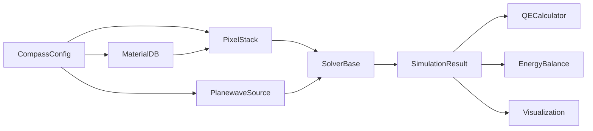

# API 개요

COMPASS는 모듈식 패키지(modular packages)로 구성되어 있습니다. 이 페이지에서는 주요 클래스와 그 관계를 안내합니다.

## 패키지 구조

```
compass/
  core/
    config_schema.py   -- Pydantic 설정 모델 (CompassConfig)
    types.py           -- 데이터 타입 (SimulationResult, LayerSlice, FieldData)
    units.py           -- 단위 변환 유틸리티
  geometry/
    pixel_stack.py     -- PixelStack: 솔버 비의존적 픽셀 표현
    builder.py         -- GeometryBuilder: 메시 생성 유틸리티
  materials/
    database.py        -- MaterialDB: 광학 물성 레지스트리
  solvers/
    base.py            -- SolverBase (ABC), SolverFactory
    rcwa/
      torcwa_solver.py -- torcwa 백엔드 어댑터
      grcwa_solver.py  -- grcwa 백엔드 어댑터
      meent_solver.py  -- meent 백엔드 어댑터
      stability.py     -- 수치 안정성 모듈
    fdtd/
      flaport_solver.py -- fdtd (flaport) 백엔드 어댑터
  sources/
    planewave.py       -- PlanewaveSource
    cone_illumination.py -- ConeIllumination
    ray_file_reader.py -- 외부 광선 파일 가져오기
  analysis/
    qe_calculator.py   -- QECalculator
    energy_balance.py  -- EnergyBalance
    solver_comparison.py -- SolverComparison
  visualization/
    qe_plot.py         -- QE 스펙트럼 및 비교 플롯
    structure_plot_2d.py -- 2D 단면 플롯
    field_plot_2d.py   -- 2D 전계 분포 플롯
    viewer_3d.py       -- 인터랙티브 3D 뷰어
  runners/
    single_run.py      -- SingleRunner
    sweep_runner.py    -- SweepRunner
    comparison_runner.py -- ComparisonRunner
    roi_sweep_runner.py -- ROISweepRunner
  io/
    hdf5_handler.py    -- HDF5 결과 저장소
    export.py          -- 내보내기 유틸리티
    result_schema.py   -- 결과 검증 스키마
  diagnostics/
    stability_diagnostics.py -- 시뮬레이션 전/후 검사
```

## 핵심 워크플로우

일반적인 시뮬레이션 흐름은 다음 클래스들로 구성됩니다:



1. **CompassConfig**가 YAML 설정을 검증합니다.
2. **MaterialDB**가 파장 의존적 광학 물성을 제공합니다.
3. **PixelStack**이 물리적 픽셀 구조를 구성합니다.
4. **SolverBase** (SolverFactory를 통해)가 전자기(EM) 시뮬레이션을 실행합니다.
5. **SimulationResult**가 QE, 전계, R/T/A 데이터를 보유합니다.
6. **분석(Analysis)** 및 **시각화(Visualization)** 모듈이 결과를 처리합니다.

<ModuleArchitectureDiagram />

## 주요 진입점

### 시뮬레이션 실행

| 클래스 | 모듈 | 용도 |
|--------|------|------|
| `SingleRunner.run(config)` | `compass.runners.single_run` | 설정 딕셔너리로 단일 시뮬레이션 실행 |
| `SweepRunner.run(config)` | `compass.runners.sweep_runner` | 파장 스윕 실행 |
| `ComparisonRunner` | `compass.runners.comparison_runner` | 여러 솔버 비교 |

### 지오메트리 구성

| 클래스 | 모듈 | 용도 |
|--------|------|------|
| `PixelStack(config, material_db)` | `compass.geometry.pixel_stack` | 설정으로 픽셀 구축 |
| `PixelStack.get_layer_slices(wl)` | | RCWA 레이어 분해 결과 얻기 |
| `PixelStack.get_permittivity_grid(wl)` | | 3D FDTD 그리드 얻기 |

### 재료

| 클래스 | 모듈 | 용도 |
|--------|------|------|
| `MaterialDB()` | `compass.materials.database` | 재료 레지스트리 생성 |
| `MaterialDB.get_nk(name, wl)` | | 해당 파장에서 (n, k) 조회 |
| `MaterialDB.get_epsilon(name, wl)` | | 복소 유전율 조회 |

### 광원

| 클래스 | 모듈 | 용도 |
|--------|------|------|
| `PlanewaveSource.from_config(cfg)` | `compass.sources.planewave` | 평면파 광원 생성 |
| `ConeIllumination(cra, f_num)` | `compass.sources.cone_illumination` | 콘형 광원 생성 |

### 분석

| 클래스 | 모듈 | 용도 |
|--------|------|------|
| `QECalculator.from_absorption(...)` | `compass.analysis.qe_calculator` | 흡수량으로부터 QE 계산 |
| `EnergyBalance.check(result)` | `compass.analysis.energy_balance` | R+T+A=1 검증 |
| `SolverComparison(results, labels)` | `compass.analysis.solver_comparison` | 솔버 출력 비교 |

### 시각화

| 함수 | 모듈 | 용도 |
|------|------|------|
| `plot_qe_spectrum(result)` | `compass.visualization.qe_plot` | QE 대 파장 플롯 |
| `plot_qe_comparison(results, labels)` | | QE 스펙트럼 비교 |
| `plot_crosstalk_heatmap(result)` | | 크로스토크 매트릭스 |
| `plot_angular_response(results, angles)` | | QE 대 각도 |

## 단위 규약

COMPASS의 모든 길이 단위는 **마이크로미터(um)**입니다:
- 파장: um (예: 550 nm의 경우 0.55)
- 레이어 두께: um
- 픽셀 피치(pixel pitch): um
- 그리드 간격: um

각도는 설정에서 **도(degrees)** 단위를 사용하며, 내부적으로 라디안(radians)으로 변환됩니다.
