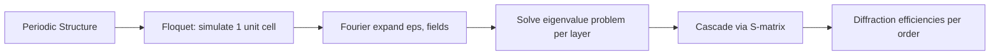

# 회절과 주기 구조

::: tip 선수 지식
[픽셀 해부학](/ko/introduction/pixel-anatomy) → [빛의 기초](/ko/theory/light-basics) → 이 페이지
:::

픽셀 피치가 1 um 이하로 줄어들면, 픽셀 구조의 크기가 빛의 파장과 비슷해집니다. 이 시점에서 빛은 더 이상 직선으로만 진행하지 않고, 가장자리를 돌아 휘거나 개구를 통과하면서 퍼집니다. 이것이 회절(Diffraction)이며, 단순한 광선 추적 대신 파동 광학 시뮬레이션이 필요한 근본적인 이유입니다.

## 이미지 센서에서 회절이 중요한 이유

CMOS 픽셀 피치(Pixel Pitch, 일반적으로 0.7~1.4 um)가 가시광선의 파장(0.38~0.78 um)에 근접하면, 단순한 기하 광학(Ray Optics)이 더 이상 유효하지 않습니다. 빛은 마이크로렌즈(Microlens) 가장자리, 심부 트렌치 격리(Deep Trench Isolation, DTI) 벽, 금속 격자(Metal Grid) 등의 픽셀 구조 주변에서 회절(Diffraction)되며, 간섭 효과가 광학 거동을 지배하게 됩니다. 이것이 바로 RCWA와 FDTD 같은 파동 광학(Wave Optics) 솔버가 필요한 이유입니다.

## 회절의 기초

### 호이겐스 원리

호이겐스 원리(Huygens' Principle)에 따르면, 파면(Wavefront) 위의 모든 점은 2차 구면파(Spherical Wavelet)의 파원으로 작용합니다. 새로운 파면은 이 파원들의 포락선(Envelope)입니다. 파동이 파장과 비슷한 크기의 장애물이나 개구(Aperture)를 만나면, 가장자리에서 발생한 파원들이 그림자 영역으로 퍼지는데, 이것이 회절입니다.

### 단일 슬릿 비유

폭 $a$인 단일 픽셀 개구를 생각해 봅시다. 첫 번째 회절 극소(Diffraction Minimum)의 각도 확산은 다음과 같습니다:

$$\sin\theta = \frac{\lambda}{a}$$

$\lambda = 0.55$ um에서 1 um 픽셀의 경우: $\theta \approx 33°$입니다. 이처럼 넓은 각도 확산은 한 픽셀에 입사한 빛이 인접 픽셀의 포토다이오드에 쉽게 도달할 수 있음을 의미하며, 이것이 광학적 크로스토크(Crosstalk)의 주요 원인입니다.

## 회절 격자

### 주기 구조

반복되는 픽셀 패턴을 가진 CMOS 이미지 센서는 본질적으로 2차원 회절 격자(Diffraction Grating)입니다. 베이어 컬러 필터 배열(Bayer Color Filter Array), DTI 격자, 금속 배선 모두 주기 구조를 형성합니다.

주기 $\Lambda$(픽셀 피치)를 가진 격자에서 입사각 $\theta_i$의 빛은 이산적인 회절 차수(Diffraction Order) $m$으로 회절됩니다:

$$\Lambda(\sin\theta_m - \sin\theta_i) = m\lambda, \quad m = 0, \pm1, \pm2, \ldots$$

각 회절 차수는 입사 전력의 일부를 담당합니다. 차수 간 전력 분포는 각 주기 내의 세부 구조에 따라 달라지며, 이것이 바로 RCWA가 계산하는 내용입니다.

### 2차원 격자 방정식

주기 $\Lambda_x$와 $\Lambda_y$를 가진 2차원 주기 구조의 경우:

$$k_{x,mn} = k_{x,\text{inc}} + m \frac{2\pi}{\Lambda_x}, \quad k_{y,mn} = k_{y,\text{inc}} + n \frac{2\pi}{\Lambda_y}$$

여기서 $k_{x,\text{inc}} = k_0 \sin\theta \cos\phi$이고 $k_{y,\text{inc}} = k_0 \sin\theta \sin\phi$입니다.

## 플로케 정리 (블로흐 정리)

### 핵심 개념

주기 $\Lambda$를 가진 주기 구조에서, 맥스웰 방정식의 해는 다음과 같이 표현할 수 있습니다:

$$\mathbf{E}(x + \Lambda, y, z) = \mathbf{E}(x, y, z) \cdot e^{ik_{x,\text{inc}}\Lambda}$$

즉, $x + \Lambda$ 위치의 전기장은 $x$ 위치의 전기장에 입사각에 의해 결정되는 위상 인자(Phase Factor)를 곱한 것과 같습니다. 이것이 **플로케 정리(Floquet's Theorem)**(고체물리학에서는 블로흐 정리(Bloch's Theorem))입니다.

### 이것이 강력한 이유

플로케 정리에 의해 주기 구조의 **단위 셀(Unit Cell) 하나만** 시뮬레이션하면 됩니다. 나머지 모든 위치의 전기장은 위상 이동으로 결정됩니다. 이것이 RCWA가 픽셀 배열과 같은 주기 구조에 매우 효율적인 이유입니다 -- 하나의 2x2 베이어 단위 셀만 시뮬레이션하면 전체 센서에 적용할 수 있는 결과를 얻습니다.

### 푸리에 전개

한 주기 내에서 전기장을 푸리에 급수(Fourier Series)로 전개합니다:

$$E_x(x, y, z) = \sum_{m,n} a_{mn}(z) \, e^{i(k_{x,m} x + k_{y,n} y)}$$

유지하는 푸리에 항의 수(**푸리에 차수(Fourier Order)** $N$)가 정확도를 결정합니다. 고차 항은 더 미세한 구조적 세부 사항을 포착하지만, 연산량이 $O(N^3)$으로 증가합니다.

## 픽셀 피치 대 파장

비율 $\Lambda / \lambda$에 따라 회절 영역이 결정됩니다:

| 비율 $\Lambda/\lambda$ | 영역 | 거동 | 예시 |
|---|---|---|---|
| $\gg 1$ | 기하 광학 | 기하학적 그림자, 최소한의 회절 | 10 um 픽셀, 가시광선 |
| $\approx 1$--3 | 공진 영역 | 강한 회절, 간섭이 지배적 | 0.7--1.4 um 픽셀 |
| $\ll 1$ | 서브파장 영역 | 유효 매질 거동 | 나노포토닉스 구조 |

최신 BSI 픽셀(0.7~1.4 um 피치)은 공진 영역에 정확히 해당하며, 파동 광학 시뮬레이션이 필수적입니다.

## RCWA와의 연관성

RCWA는 플로케 정리를 직접 활용합니다:

1. **주기 경계 조건(Periodic Boundary Conditions)**: 단위 셀이 플로케 위상 이동을 통해 무한히 반복됩니다.
2. **푸리에 전개**: 유전율과 전기장을 푸리에 고조파(Fourier Harmonics)로 전개합니다.
3. **층별 풀이(Layer-by-Layer)**: 각 z 슬라이스를 균일 격자 층으로 풀이합니다.
4. **S 행렬(S-matrix)**: 산란 행렬(Scattering Matrix) 알고리즘으로 층을 연결합니다.

푸리에 차수 $N$이 정확도와 속도 간의 균형을 제어합니다. 1 um 피치의 2x2 베이어 셀의 경우, 일반적으로 방향당 $N = 5$~$15$를 사용하며, 이는 $(2N+1)^2 = 121$~$961$개의 고조파에 해당합니다.

## 수렴성과 푸리에 차수

### 깁스 현상

급격한 유전율 경계(예: Si/SiO2 계면, DTI 벽)에서 푸리에 급수는 불연속점 근처에서 진동(Ringing) 현상을 보입니다. 이것이 **깁스 현상(Gibbs Phenomenon)**이며, RCWA에서 수렴이 느린 주요 원인입니다.

**리의 인수분해 규칙(Li's Factorization Rules)**(COMPASS의 안정성 모듈에 구현됨)은 불연속 함수의 곱에 대한 푸리에 인수분해를 올바르게 처리하여, TM 편광에 대한 수렴성을 크게 개선합니다.

<FourierOrderDemo />

### 수렴 가이드라인

| 구조 | 최소 차수 | 권장 차수 |
|---|---|---|
| 균일 층만 있는 경우 | $N = 1$ | $N = 3$ |
| 컬러 필터 패턴 | $N = 5$ | $N = 7$--$9$ |
| 금속 격자 (높은 대비) | $N = 9$ | $N = 11$--$15$ |
| 미세 DTI 구조 | $N = 7$ | $N = 11$--$13$ |

항상 수렴 테스트를 수행하십시오: QE 변화가 허용 오차(일반적으로 0.5% 미만) 이하가 될 때까지 $N$을 증가시킵니다.

## 참고 문헌

- **Petit, R.** (ed.), *Electromagnetic Theory of Gratings*, Springer (1980)
- **Li, L.**, "Formulation and comparison of two recursive matrix algorithms for modeling layered diffraction gratings," JOSA A 13(5), 1996
- **Moharam, M.G. et al.**, "Formulation for stable and efficient implementation of RCWA," JOSA A 12(5), 1995
