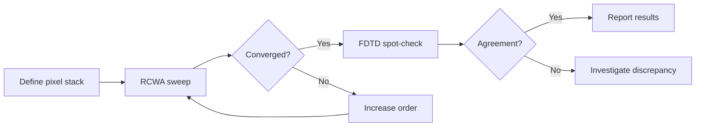

# RCWA vs FDTD

COMPASS는 RCWA와 FDTD 솔버를 모두 지원합니다. 이 페이지에서는 각 솔버의 장단점을 이해하고 시뮬레이션에 적합한 솔버를 선택하는 데 도움을 드립니다.

## 나란히 비교

| 특성 | RCWA | FDTD |
|---------|------|------|
| **영역** | 주파수 영역 (실행당 단일 파장) | 시간 영역 (한 번의 실행으로 광대역) |
| **기하 구조** | 엄밀한 주기성 (무한 배열) | 임의 구조 (주기, 유한, 고립) |
| **이산화** | 푸리에 고조파 (수평), 정확한 층 (수직) | 모든 방향으로 균일한 공간 격자 |
| **박막** | 정확 -- 공간 이산화 불필요 | 격자점으로 각 박막을 분해해야 함 |
| **곡면** | 마이크로렌즈의 계단 근사 | 계단 근사 또는 서브픽셀 평활화 |
| **메모리** | $(2N+1)^2$ 고조파에 비례 | $N_x \times N_y \times N_z$ 격자에 비례 |
| **속도 (단일 파장)** | 매우 빠름 (GPU에서 수 초) | 느림 (정상 상태까지 시간 전진 필요) |
| **속도 (파장 스윕)** | 파장 수에 비례 | 단일 광대역 실행으로 모든 파장 포함 |
| **수치 안정성** | 고차에서 고유값 문제 발생 가능 | CFL 제한이 있으나 일반적으로 견고 |
| **정확도** | 푸리에 차수에 대해 지수적 수렴 | 격자 간격에 대해 2차 수렴 |

## 정확도 영역

### RCWA가 우수한 경우

- 픽셀 피치가 파장의 1~10배인 경우 (이미지 센서의 일반적인 조건).
- 구조가 진정한 주기성을 가진 경우 (2x2 단위 셀이 무한히 반복).
- 특정 파장에서 높은 정확도가 필요한 경우 (예: 최대 QE).
- 반사 방지 코팅 설계에 정확한 박막 처리가 필요한 경우.

### FDTD가 우수한 경우

- 구조에 고립되거나 비주기적인 특징이 있는 경우.
- 파장 루프를 피하고 광대역 데이터가 필요한 경우.
- 시간 영역 효과(펄스 전파, 과도 현상)에 관심이 있는 경우.
- 기하 구조가 복잡하여 균일 층으로 분해되지 않는 경우.

## 이미지 센서를 위한 실무 지침

COMPASS에서 표준 BSI 픽셀 시뮬레이션의 경우:

**RCWA (기본값) 사용 대상**:
- QE 스펙트럼 계산
- 수렴 연구 (푸리에 차수 스윕)
- BARL 최적화
- 컬러 필터 재료 선택
- 매개변수 스윕 (두께, 피치, 각도)

**FDTD 사용 대상**:
- 선택된 파장에서 RCWA 결과 검증
- 실리콘 내 근접장 효과 연구
- 픽셀을 통한 전기장 전파 시각화
- 주기성을 벗어나는 구조

## 상호 검증 워크플로

RCWA로 빠른 반복 작업을 수행하고 FDTD로 검증하는 워크플로를 권장합니다:



COMPASS는 내장 비교 실행기를 제공합니다:

```yaml
# configs/experiment/solver_comparison.yaml
defaults:
  - pixel: default_bsi_1um
  - source: wavelength_sweep

solvers:
  - name: torcwa
    type: rcwa
  - name: fdtd_flaport
    type: fdtd
```

`SolverComparison` 분석 클래스는 임의의 솔버 결과 쌍 간의 QE 차이, 상대 오차, 실행 시간 비율을 계산합니다.

## 성능 벤치마크

1 um 피치의 2x2 베이어 단위 셀, 단일 파장 기준 일반적인 수치:

| 지표 | RCWA (차수 9, GPU) | FDTD (5 nm 격자, GPU) |
|--------|---------------------|-----------------------|
| 실행 시간 | 0.3 s | 45 s |
| 메모리 | 200 MB | 2 GB |
| QE 정확도 | 차수 15 이상에서 0.5% 미만 오차 | 5 nm 격자에서 1% 미만 오차 |

41개 파장 스윕(380-780 nm, 10 nm 간격) 기준:

| 지표 | RCWA | FDTD |
|--------|------|------|
| 실행 시간 | 12 s (41개 순차) | 45 s (단일 광대역 실행) |
| 총 소요 시간 | 12 s | 45 s |

RCWA는 협대역 또는 중간 규모의 스윕에서 유리하며, FDTD는 매우 넓은 대역 연구에서 경쟁력이 있을 수 있습니다.

<SolverComparisonChart />

## 결과 결합

두 솔버가 동일한 구성에 대해 결과를 생성한 경우, `SolverComparison` 클래스를 사용합니다:

```python
from compass.analysis.solver_comparison import SolverComparison

comparison = SolverComparison(
    results=[rcwa_result, fdtd_result],
    labels=["torcwa", "fdtd_flaport"],
)

summary = comparison.summary()
print(f"Max QE difference: {summary['max_qe_diff']}")
print(f"Runtime ratio: {summary['runtimes_seconds']}")
```
