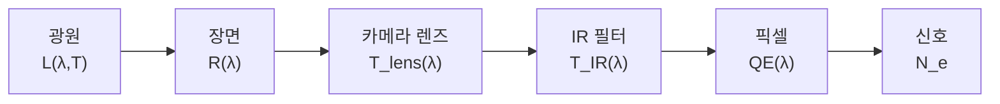

# 복사 측정 신호 체인(Radiometric Signal Chain)

::: tip 선수 지식
[양자 효율](/ko/theory/quantum-efficiency) → 이 페이지
:::

완전한 복사 측정 신호 체인(Radiometric Signal Chain)을 이해하는 것은 이미지 센서 픽셀의 신호 수준과 색 정확도를 예측하는 데 필수적입니다. 이 장에서는 광원에서 전기 신호에 이르기까지 빛의 여정을 추적하며, 각 단계를 분광 모델로 정량화합니다.

## 장면에서 센서 신호까지

빛은 광원에서 센서까지 명확하게 정의된 경로를 따릅니다:



각 단계에서 분광 분포(Spectral Distribution)는 해당 요소의 전달 함수에 의해 변형됩니다. 최종 신호는 파장에 대한 이 모든 요소의 적분입니다. 각 단계를 자세히 살펴보겠습니다.

## 광원과 표준 광원(Illuminants)

### 흑체 복사(Blackbody Radiation)

온도 $T$의 모든 물체는 열 복사를 방출합니다. 완전 흑체의 분광 복사 휘도(Spectral Radiance)는 **플랑크 법칙(Planck's Law)**으로 기술됩니다:

$$L(\lambda, T) = \frac{2hc^2}{\lambda^5} \cdot \frac{1}{\exp\!\left(\dfrac{hc}{\lambda k_B T}\right) - 1}$$

여기서:
- $h = 6.626 \times 10^{-34}$ J s는 플랑크 상수(Planck's Constant)
- $c = 2.998 \times 10^8$ m/s는 광속(Speed of Light)
- $k_B = 1.381 \times 10^{-23}$ J/K는 볼츠만 상수(Boltzmann's Constant)
- $\lambda$는 파장(m)
- $T$는 절대 온도(K)

**빈의 변위 법칙(Wien's Displacement Law)**은 흑체 스펙트럼의 피크 파장을 제공합니다:

$$\lambda_{\max} = \frac{2898}{T} \;\mu\text{m}$$

$T = 5500$ K(대략 주광)에서 $\lambda_{\max} \approx 527$ nm이며, 이는 가시 스펙트럼의 녹색 영역에 해당합니다.

**슈테판-볼츠만 법칙(Stefan-Boltzmann Law)**은 전체 파장에 걸친 총 복사 발산도(Total Radiant Exitance, 단위 면적당 방출 전력)를 제공합니다:

$$M = \sigma T^4$$

여기서 $\sigma = 5.670 \times 10^{-8}$ W m$^{-2}$ K$^{-4}$입니다.

**색온도(Color Temperature)**는 광원의 색조를 해당 온도의 흑체 색도(Chromaticity)와 매칭하여 표현합니다. 촛불은 약 1800 K(따뜻한/주황색)의 색온도를 가지며, 흐린 하늘은 7000-10000 K(차가운/푸른색)에 도달합니다. 색온도는 자연광과 인공광 모두를 특성화하는 데 널리 사용됩니다.

<BlackbodySpectrum />

### 표준 광원(Standard Illuminants)

CIE(국제 조명 위원회, Commission Internationale de l'Eclairage)는 색도 계산을 위한 표준 광원을 정의합니다. 이들은 서로 다른 광원 간의 연색성 비교를 위한 재현 가능한 분광 전력 분포(SPD, Spectral Power Distribution)를 제공합니다.

| 광원 | 설명 | 상관 색온도(CCT, K) | 연색 지수(CRI) | 주요 특성 |
|------------|------------|---------|-----|---------------------|
| CIE A | 백열 텅스텐 | 2856 | 100 | 매끄럽고 따뜻한 스펙트럼; 강한 적색/IR 방출 |
| CIE D65 | 평균 주광 | ~6504 | -- | sRGB 기준; UV 성분 포함 |
| CIE F11 | 삼파장 형광등 | 4000 | 83 | 세 개의 좁은 발광 피크; 메타메리즘 우려 |
| LED 백색 | 청색 펌프 + 형광체 | 3000-6500 | 70-95 | 450 nm 청색 스파이크 + 넓은 형광체 발광 |

::: info CIE D65 기준 광원
CIE D65는 이미징에서 가장 널리 사용되는 기준 광원입니다. 서유럽의 평균 정오 주광을 나타내며 sRGB 색 공간의 표준 백색점(White Point)으로, 카메라 화이트 밸런스 보정의 기본 선택입니다.
:::

**CIE 광원 A(Illuminant A)**는 2856 K에서의 플랑크 법칙으로 해석적으로 정의되어 매끄럽고 연속적입니다. 백열등 조명 조건의 기준으로 사용됩니다.

**CIE D65**는 측정된 주광 분광 분포를 기반으로 하며 대기 흡수에 의한 미세한 스펙트럼 특징을 포함합니다. 완벽한 흑체는 아니지만 상관 색온도(CCT)가 약 6504 K입니다.

**CIE F11**은 약 435 nm, 545 nm, 610 nm에서 세 개의 지배적인 발광 피크를 가진 삼파장 희토류 형광체 형광등을 나타냅니다. 불연속적인 스펙트럼은 좁은 대역 물체에 대해 연색 문제를 일으킬 수 있습니다.

**백색 LED(White LED)** 광원은 청색 GaN/InGaN LED(피크 약 450 nm)와 황색/녹색 형광체(500-700 nm의 넓은 발광)를 결합합니다. 결과 스펙트럼은 특징적인 청색 스파이크 다음에 넓은 형광체 험프가 이어집니다. CCT는 형광체 혼합 비율을 변화시켜 온백색(3000 K)에서 냉백색(6500 K)까지 조절 가능합니다.

## 장면 반사율(Scene Reflectance)

표면의 분광 반사율(Spectral Reflectance) $R(\lambda)$는 각 파장에서 반사되는 입사광의 비율을 나타냅니다:

$$R(\lambda) = \frac{\Phi_{\text{reflected}}(\lambda)}{\Phi_{\text{incident}}(\lambda)}$$

여기서 $0 \leq R(\lambda) \leq 1$입니다.

### 람베르시안(Lambertian) 반사 vs 정반사(Specular Reflection)

- **람베르시안(확산) 반사(Lambertian/Diffuse Reflection)**: 빛이 시야각과 무관하게 모든 방향으로 균일하게 반사됩니다. 반사 복사 휘도는 $L_r = R(\lambda) \cdot E / \pi$이며, 여기서 $E$는 조도(Irradiance)입니다. 대부분의 자연 무광택 표면(종이, 직물, 도색 벽)은 람베르시안 동작을 근사합니다.
- **정반사(Specular Reflection)**: 빛이 반사 법칙에 따라 거울 각도로 반사됩니다. 광택 및 금속 표면이 정반사 동작을 나타냅니다. 이미지 센서의 복사 측정 계산에서는 일반적으로 단순화를 위해 장면을 람베르시안 반사체로 모델링합니다.

### 기준 타겟

**18% 회색 카드(Grey Card)**: 가시 스펙트럼 전체에 걸쳐 평탄한 분광 반사율 $R(\lambda) = 0.18$을 가진 중립 회색 카드입니다. 전형적인 야외 장면의 평균 반사율을 나타내며 노출 측광의 표준 기준입니다.

**맥베스 컬러체커(Macbeth ColorChecker)**: 알려진 분광 반사율을 가진 24개 패치로 구성된 표준화된 색상 타겟입니다:
- 두 행에 6개의 유채색 패치(어두운 피부, 밝은 피부, 파란 하늘, 잎사귀, 파란 꽃, 청록)
- 흰색에서 검은색까지 6개의 무채색 패치
- 카메라 색 보정 및 색 정확도 평가에 사용

| 패치 | 설명 | 피크에서의 근사 $R$ |
|-------|------------|------------------------|
| 흰색 (패치 19) | $R \approx 0.90$ 평탄 | 90% |
| 중립 5 (패치 22) | $R \approx 0.19$ 평탄 | 19% |
| 검은색 (패치 24) | $R \approx 0.03$ 평탄 | 3% |
| 빨간색 (패치 15) | 620 nm 근처 피크 | 30% |
| 녹색 (패치 14) | 540 nm 근처 피크 | 25% |
| 파란색 (패치 13) | 460 nm 근처 피크 | 15% |

## 카메라 모듈 광학계(Camera Module Optics)

### 렌즈 투과율(Lens Transmittance)

카메라 모듈 렌즈는 일반적으로 $N$개의 유리 또는 플라스틱 요소로 구성됩니다. 각 요소는 두 개의 공기-유리 계면과 유리 내부의 흡수를 도입합니다. 총 렌즈 투과율은:

$$T_{\text{lens}}(\lambda) = T_{\text{glass}}^N(\lambda) \times T_{\text{AR}}^{2N}(\lambda)$$

여기서:
- $T_{\text{glass}}(\lambda)$는 단일 요소 유리체 투과율(일반적으로 광학 유리에서 요소당 $> 0.99$)
- $T_{\text{AR}}(\lambda)$는 반사 방지(AR) 코팅의 표면당 투과율(광대역 AR 코팅으로 일반적으로 $> 0.995$)
- $2N$ 인자는 요소당 두 개의 표면을 반영

양호한 AR 코팅을 가진 5매 렌즈의 총 투과율은 대략:

$$T_{\text{lens}} \approx 0.99^5 \times 0.995^{10} \approx 0.90$$

**비네팅(Vignetting)**은 상 주변부에서 추가적인 광 손실을 발생시킵니다. 상대 조도(Relative Illumination)는 대략 다음을 따릅니다:

$$E_{\text{relative}} \approx \cos^4(\theta_{\text{field}})$$

여기서 $\theta_{\text{field}}$는 화각입니다. 35도 화각의 센서 모서리에서 상대 조도는 약 45%로 떨어집니다.

**F-넘버(F-number)** ($F_\#$)는 렌즈가 수집하는 광량을 결정합니다. 람베르시안 장면으로부터의 상면 조도는:

$$E = \frac{\pi L}{4 F_\#^2}$$

F-넘버를 반으로 줄이면(예: F/2.8에서 F/1.4로) 조도가 4배로 증가합니다.

### IR 컷 필터(IR Cut Filter)

실리콘 포토다이오드는 약 1100 nm까지의 근적외선(NIR, Near-Infrared)에 민감합니다. 필터링 없이는 NIR 빛이 다음을 유발합니다:
- 색 왜곡(모든 채널이 NIR에서 유사하게 반응하여 색이 탈채도됨)
- 부정확한 화이트 밸런스
- 감소된 색 분리

IR 컷 필터는 가시광을 투과시키면서 NIR 빛을 차단합니다. 일반적인 필터 특성:

| 파라미터 | 일반적인 값 |
|-----------|--------------|
| 통과 대역 | 400-650 nm ($T > 90\%$) |
| 차단 파장 (50% 지점) | 650 nm |
| 천이 폭 (90%에서 10%) | 30-50 nm |
| 저지 대역 거부율 | 700-1100 nm에서 $T < 1\%$ |

IR 필터 투과율은 시그모이드 함수로 모델링할 수 있습니다:

$$T_{\text{IR}}(\lambda) = \frac{1}{1 + \exp\!\left(\dfrac{\lambda - \lambda_{\text{cut}}}{\Delta}\right)}$$

여기서 $\lambda_{\text{cut}} \approx 650$ nm는 차단 파장이고 $\Delta \approx 10$ nm는 천이 가파름을 제어합니다.

## 신호 적분(Signal Integration)

### 센서에서의 분광 조도(Spectral Irradiance at Sensor)

모든 광학 요소를 통과한 후, 센서면에서의 분광 조도는:

$$E(\lambda) = L(\lambda) \times R_{\text{scene}}(\lambda) \times T_{\text{lens}}(\lambda) \times T_{\text{IR}}(\lambda)$$

각 인자가 스펙트럼을 변형합니다:

1. $L(\lambda)$ -- 광원 스펙트럼(예: D65 주광)
2. $R_{\text{scene}}(\lambda)$ -- 장면 반사율이 파장을 선택적으로 감쇠
3. $T_{\text{lens}}(\lambda)$ -- 렌즈 투과율(가시광 영역에서 비교적 평탄)
4. $T_{\text{IR}}(\lambda)$ -- IR 필터가 650 nm 이후 파장을 급격히 차단

<SignalChainDiagram />

### 픽셀 신호(Pixel Signal)

$i$번째 색상 채널(R, G 또는 B)의 신호는 조도에 픽셀의 양자 효율을 가중한 적분으로 얻어집니다:

$$S_i = \int_{\lambda_1}^{\lambda_2} E(\lambda) \times \text{QE}_i(\lambda) \, d\lambda$$

여기서 $\text{QE}_i(\lambda)$는 컬러 필터 어레이(CFA)와 포토다이오드 감도의 결합 효과를 포함합니다. 적분 범위는 일반적으로 $\lambda_1 = 380$ nm에서 $\lambda_2 = 780$ nm까지입니다.

### 전자 수로 표현한 신호(Signal in Electrons)

노출 시 생성되는 광전자 수는:

$$N_e = \frac{S \cdot t_{\text{exp}} \cdot A_{\text{pixel}}}{4 F_\#^2} \times \frac{\lambda}{hc}$$

여기서:
- $t_{\text{exp}}$는 노출 시간(s)
- $A_{\text{pixel}}$는 픽셀 면적(m$^2$)
- $F_\#$는 렌즈 F-넘버
- $\lambda / hc$ 인자는 에너지를 광자 수로 변환

::: tip
1.0 um 픽셀, F/2.0, D65 광원, 18% 회색 반사율, 10 ms 노출 조건에서 일반적인 녹색 채널 신호는 3000-8000 전자입니다.
:::

## 화이트 밸런스(White Balance)

서로 다른 광원에서 중립(회색) 장면이라도 R, G, B 채널 신호는 크게 달라집니다. 화이트 밸런스는 중립 물체가 동일한 R, G, B 값을 생성하도록 채널 신호를 스케일링하여 이를 보정합니다.

화이트 밸런스 게인(Gain)은 다음과 같이 정의됩니다:

$$g_R = \frac{S_G}{S_R}, \quad g_B = \frac{S_G}{S_B}$$

여기서 $S_R$, $S_G$, $S_B$는 중립 타겟으로부터의 원시 채널 신호입니다.

서로 다른 광원에서의 **R/G** 및 **B/G** 비율은 색 편향을 특성화합니다:

| 광원 | R/G 비율 | B/G 비율 | 화이트 밸런스 특성 |
|-----------|-----------|-----------|----------------------|
| CIE A (2856 K) | 1.8-2.2 | 0.3-0.5 | 강한 적색 과잉 |
| D65 (~6504 K) | 0.9-1.1 | 0.8-1.0 | 거의 중립 |
| F11 (4000 K) | 1.3-1.5 | 0.5-0.7 | 중간 적색 과잉 |
| LED (5000 K) | 1.0-1.3 | 0.6-0.8 | 약간의 적색 과잉 |

::: info 회색 세계 가정(Grey World Assumption)
**회색 세계 가정**은 전체 장면의 평균 반사율이 중립 회색(무채색)이라고 가정하여 장면 광원을 추정합니다. 화이트 밸런스 게인은 영상 전체의 평균 R, G, B 채널 값으로부터 계산됩니다. 이는 전형적인 야외 장면에서 잘 작동하지만 단일 색상이 지배하는 장면에서는 실패합니다.
:::

## 신호대잡음비(Signal-to-Noise Ratio)

신호대잡음비(SNR, Signal-to-Noise Ratio)는 이미지 품질을 결정합니다. CMOS 이미지 센서 픽셀의 주요 잡음 원인:

| 잡음 원인 | 기호 | 발생 원인 | 스케일링 |
|-------------|--------|--------|---------|
| 샷 노이즈(Shot Noise) | $\sqrt{N_{\text{signal}}}$ | 광자 도착의 포아송 통계 | $\propto \sqrt{\text{signal}}$ |
| 암전류 샷 노이즈(Dark Current Shot Noise) | $\sqrt{N_{\text{dark}}}$ | 열적으로 생성된 캐리어 | $\propto \sqrt{t_{\text{exp}} \cdot T}$ |
| 읽기 잡음(Read Noise) | $N_{\text{read}}$ | 증폭기 및 ADC 전자 회로 | 고정 |

총 SNR은:

$$\text{SNR} = \frac{N_{\text{signal}}}{\sqrt{N_{\text{signal}} + N_{\text{dark}} + N_{\text{read}}^2}}$$

높은 신호 수준에서는 샷 노이즈가 지배하여 $\text{SNR} \approx \sqrt{N_{\text{signal}}}$입니다. 낮은 신호 수준에서는 읽기 잡음이 지배하여 $\text{SNR} \approx N_{\text{signal}} / N_{\text{read}}$입니다.

| 조건 | 일반적인 $N_{\text{signal}}$ | SNR | 이미지 품질 |
|-----------|--------------------------|-----|---------------|
| 밝은 주광 | 10,000+ e$^-$ | > 100 (40 dB) | 우수 |
| 실내 조명 | 1,000-5,000 e$^-$ | 30-70 (30-37 dB) | 양호 |
| 저조도 | 100-500 e$^-$ | 10-20 (20-26 dB) | 노이즈 있음 |
| 극저조도 | < 50 e$^-$ | < 5 (14 dB) | 매우 노이즈 있음 |

## COMPASS와의 연결

COMPASS는 전파 전자기 시뮬레이션(RCWA 또는 FDTD)을 통해 각 픽셀의 양자 효율 $\text{QE}_i(\lambda)$를 계산합니다. QE 결과는 위에서 설명한 신호 체인 계산에 직접 사용됩니다.

### 시뮬레이션 결과와 `SignalCalculator` 사용

`SignalCalculator` 클래스는 QE 시뮬레이션 출력을 광원, 장면, 광학계 모델과 결합하여 신호 수준을 계산합니다:

```python
from compass.analysis.signal_calculator import SignalCalculator
from compass.analysis.qe_calculator import QECalculator
from compass.sources.illuminant import Illuminant
import numpy as np

# 시뮬레이션에서 QE 결과 로드
channel_qe = QECalculator.spectral_response(result.qe_per_pixel, result.wavelengths)

# 신호 계산기 설정
calc = SignalCalculator(
    illuminant=Illuminant.cie_d65(result.wavelengths),
    scene_reflectance=0.18,        # 18% 회색
    lens_transmittance=0.90,
    ir_cutoff_nm=650,
    f_number=2.0,
    pixel_pitch_um=1.0,
    exposure_time_ms=10.0,
)

# 각 채널의 신호 계산
signals = calc.compute_signal(channel_qe)
print(f"Red:   {signals['R']:.0f} electrons")
print(f"Green: {signals['G']:.0f} electrons")
print(f"Blue:  {signals['B']:.0f} electrons")
print(f"R/G:   {signals['R']/signals['G']:.3f}")
print(f"B/G:   {signals['B']/signals['G']:.3f}")
```

### 예제 워크플로우

일반적인 종단 간 워크플로우:

1. **픽셀 스택 정의** -- 픽셀 형상, 재료, 컬러 필터 구성
2. **QE 시뮬레이션 실행** -- RCWA 또는 FDTD를 실행하여 각 채널의 $\text{QE}_i(\lambda)$ 획득
3. **광원과 장면 선택** -- 기준선으로 D65 주광과 18% 회색 선택
4. **신호 수준 계산** -- `SignalCalculator`를 사용하여 QE를 전자 수로 변환
5. **색 성능 평가** -- R/G 및 B/G 비율 확인, SNR 계산
6. **조건 변경** -- 광원, 반사율, 노출 설정을 스윕하여 강건성 평가

::: tip
대부분의 이미징 응용에서는 D65 광원과 18% 회색 반사율로 시작하여 기준 신호 수준을 설정한 후, 광원과 장면을 변경하여 색 성능을 평가하십시오.
:::
