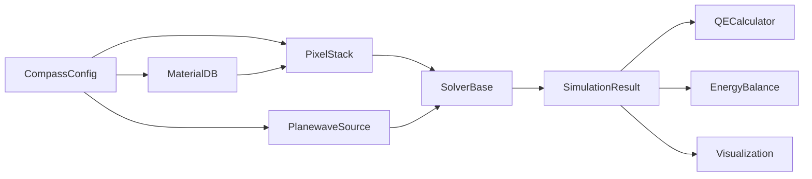

# API Overview

COMPASS is organized into modular packages. This page provides a map of the key classes and their relationships.

## Package structure

```
compass/
  core/
    config_schema.py   -- Pydantic config models (CompassConfig)
    types.py           -- Data types (SimulationResult, LayerSlice, FieldData)
    units.py           -- Unit conversion helpers
  geometry/
    pixel_stack.py     -- PixelStack: solver-agnostic pixel representation
    builder.py         -- GeometryBuilder: mesh generation utilities
  materials/
    database.py        -- MaterialDB: optical property registry
  solvers/
    base.py            -- SolverBase (ABC), SolverFactory
    rcwa/
      torcwa_solver.py -- torcwa backend adapter
      grcwa_solver.py  -- grcwa backend adapter
      meent_solver.py  -- meent backend adapter
      stability.py     -- Numerical stability modules
    fdtd/
      flaport_solver.py -- fdtd (flaport) backend adapter
  sources/
    planewave.py       -- PlanewaveSource
    cone_illumination.py -- ConeIllumination
    ray_file_reader.py -- External ray file import
  analysis/
    qe_calculator.py   -- QECalculator
    energy_balance.py  -- EnergyBalance
    solver_comparison.py -- SolverComparison
  visualization/
    qe_plot.py         -- QE spectrum and comparison plots
    structure_plot_2d.py -- 2D cross-section plots
    field_plot_2d.py   -- 2D field distribution plots
    viewer_3d.py       -- Interactive 3D viewer
  runners/
    single_run.py      -- SingleRunner
    sweep_runner.py    -- SweepRunner
    comparison_runner.py -- ComparisonRunner
    roi_sweep_runner.py -- ROISweepRunner
  io/
    hdf5_handler.py    -- HDF5 result storage
    export.py          -- Export utilities
    result_schema.py   -- Result validation schemas
  diagnostics/
    stability_diagnostics.py -- Pre/post simulation checks
```

## Core workflow

The typical simulation flow involves these classes:



1. **CompassConfig** validates the YAML configuration.
2. **MaterialDB** provides wavelength-dependent optical properties.
3. **PixelStack** constructs the physical pixel structure.
4. **SolverBase** (via SolverFactory) runs the EM simulation.
5. **SimulationResult** holds QE, fields, R/T/A data.
6. **Analysis** and **Visualization** modules process the results.

<ModuleArchitectureDiagram />

## Key entry points

### Running simulations

| Class | Module | Purpose |
|-------|--------|---------|
| `SingleRunner.run(config)` | `compass.runners.single_run` | Run one simulation from a config dict |
| `SweepRunner.run(config)` | `compass.runners.sweep_runner` | Run wavelength sweep |
| `ComparisonRunner` | `compass.runners.comparison_runner` | Compare multiple solvers |

### Building geometry

| Class | Module | Purpose |
|-------|--------|---------|
| `PixelStack(config, material_db)` | `compass.geometry.pixel_stack` | Build pixel from config |
| `PixelStack.get_layer_slices(wl)` | | Get RCWA layer decomposition |
| `PixelStack.get_permittivity_grid(wl)` | | Get 3D FDTD grid |

### Materials

| Class | Module | Purpose |
|-------|--------|---------|
| `MaterialDB()` | `compass.materials.database` | Create material registry |
| `MaterialDB.get_nk(name, wl)` | | Query (n, k) at wavelength |
| `MaterialDB.get_epsilon(name, wl)` | | Query complex permittivity |

### Sources

| Class | Module | Purpose |
|-------|--------|---------|
| `PlanewaveSource.from_config(cfg)` | `compass.sources.planewave` | Create planewave source |
| `ConeIllumination(cra, f_num)` | `compass.sources.cone_illumination` | Create cone source |

### Analysis

| Class | Module | Purpose |
|-------|--------|---------|
| `QECalculator.from_absorption(...)` | `compass.analysis.qe_calculator` | Compute QE from absorption |
| `EnergyBalance.check(result)` | `compass.analysis.energy_balance` | Validate R+T+A=1 |
| `SolverComparison(results, labels)` | `compass.analysis.solver_comparison` | Compare solver outputs |

### Visualization

| Function | Module | Purpose |
|----------|--------|---------|
| `plot_qe_spectrum(result)` | `compass.visualization.qe_plot` | Plot QE vs wavelength |
| `plot_qe_comparison(results, labels)` | | Compare QE spectra |
| `plot_crosstalk_heatmap(result)` | | Crosstalk matrix |
| `plot_angular_response(results, angles)` | | QE vs angle |

## Units convention

All lengths in COMPASS are in **micrometers (um)**:
- Wavelengths: um (e.g., 0.55 for 550 nm)
- Layer thicknesses: um
- Pixel pitch: um
- Grid spacing: um

Angles are in **degrees** in configuration and converted internally to radians.
