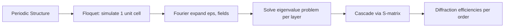

# Diffraction and Periodic Structures

## Why Diffraction Matters for Image Sensors

When a CMOS pixel pitch (typically 0.7--1.4 um) approaches the wavelength of visible light (0.38--0.78 um), simple ray optics breaks down. Light diffracts around the pixel structures -- microlens edges, deep trench isolation (DTI) walls, metal grids -- and interference effects dominate the optical behavior. This is precisely why we need wave-optics solvers like RCWA and FDTD.

## Diffraction Basics

### Huygens' Principle

Every point on a wavefront acts as a source of secondary spherical wavelets. The new wavefront is the envelope of these wavelets. When a wave encounters an obstacle or aperture comparable to its wavelength, the wavelets from the edges spread into the shadow region -- this is diffraction.

### Single Slit Analogy

Think of a single pixel aperture of width $a$. The angular spread of the first diffraction minimum is:

$$\sin\theta = \frac{\lambda}{a}$$

For a 1 um pixel at $\lambda = 0.55$ um: $\theta \approx 33°$. This wide angular spread means light entering one pixel can easily reach a neighboring pixel's photodiode -- a major source of optical crosstalk.

## Diffraction Gratings

### Periodic Structures

A CMOS image sensor with its repeating pixel pattern is essentially a 2D diffraction grating. The Bayer color filter array, DTI grid, and metal wiring all form periodic structures.

For a grating with period $\Lambda$ (the pixel pitch), incident light at angle $\theta_i$ is diffracted into discrete orders $m$:

$$\Lambda(\sin\theta_m - \sin\theta_i) = m\lambda, \quad m = 0, \pm1, \pm2, \ldots$$

Each diffraction order carries a fraction of the incident power. The distribution among orders depends on the detailed structure within each period -- which is exactly what RCWA computes.

### Grating Equation in 2D

For a 2D periodic structure with periods $\Lambda_x$ and $\Lambda_y$:

$$k_{x,mn} = k_{x,\text{inc}} + m \frac{2\pi}{\Lambda_x}, \quad k_{y,mn} = k_{y,\text{inc}} + n \frac{2\pi}{\Lambda_y}$$

where $k_{x,\text{inc}} = k_0 \sin\theta \cos\phi$ and $k_{y,\text{inc}} = k_0 \sin\theta \sin\phi$.

## Floquet's Theorem (Bloch's Theorem)

### The Key Insight

For a periodic structure with period $\Lambda$, any solution to Maxwell's equations can be written as:

$$\mathbf{E}(x + \Lambda, y, z) = \mathbf{E}(x, y, z) \cdot e^{ik_{x,\text{inc}}\Lambda}$$

In words: the field at $x + \Lambda$ is the same as at $x$, multiplied by a phase factor determined by the incident angle. This is **Floquet's theorem** (or Bloch's theorem in solid-state physics).

### Why This is Powerful

Floquet's theorem means we only need to simulate **one unit cell** of the periodic structure. The fields everywhere else are determined by phase shifts. This is why RCWA is so efficient for periodic structures like pixel arrays -- we simulate a single 2x2 Bayer unit cell, and the result applies to the entire sensor.

### Fourier Expansion

Inside one period, we expand the fields in a Fourier series:

$$E_x(x, y, z) = \sum_{m,n} a_{mn}(z) \, e^{i(k_{x,m} x + k_{y,n} y)}$$

The number of Fourier terms retained (the **Fourier order** $N$) determines the accuracy. Higher orders capture finer structural details but increase computation as $O(N^3)$.

## Pixel Pitch vs Wavelength

The ratio $\Lambda / \lambda$ determines the diffraction regime:

| Ratio $\Lambda/\lambda$ | Regime | Behavior | Example |
|---|---|---|---|
| $\gg 1$ | Ray optics | Geometric shadows, minimal diffraction | 10 um pixel, visible light |
| $\approx 1$--3 | Resonance | Strong diffraction, interference dominates | 0.7--1.4 um pixels |
| $\ll 1$ | Sub-wavelength | Effective medium behavior | Nanophotonic structures |

Modern BSI pixels (0.7--1.4 um pitch) fall squarely in the resonance regime, where wave-optics simulation is essential.

## Connection to RCWA

RCWA leverages Floquet's theorem directly:

1. **Periodic boundary conditions**: The unit cell is repeated infinitely via Floquet phase shifts
2. **Fourier expansion**: Permittivity and fields are expanded in Fourier harmonics
3. **Layer-by-layer**: Each z-slice is solved as a uniform grating layer
4. **S-matrix**: Layers are cascaded using the scattering matrix algorithm

The Fourier order $N$ controls the trade-off between accuracy and speed. For a 2x2 Bayer cell at 1 um pitch, typical values are $N = 5$--$15$ per direction, giving $(2N+1)^2 = 121$--$961$ harmonics.

## Convergence and Fourier Order

### Gibbs Phenomenon

Sharp permittivity boundaries (e.g., Si / SiO2 interface, DTI walls) cause the Fourier series to exhibit ringing near discontinuities. This is the **Gibbs phenomenon** and is a key source of slow convergence in RCWA.

**Li's factorization rules** (implemented in COMPASS's stability module) address this by correctly handling the Fourier factorization of products of discontinuous functions, dramatically improving convergence for TM polarization.

<FourierOrderDemo />

### Convergence Guidelines

| Structure | Minimum Order | Recommended |
|---|---|---|
| Uniform layers only | $N = 1$ | $N = 3$ |
| Color filter pattern | $N = 5$ | $N = 7$--$9$ |
| Metal grid (high contrast) | $N = 9$ | $N = 11$--$15$ |
| Fine DTI features | $N = 7$ | $N = 11$--$13$ |

Always run a convergence test: increase $N$ until the QE change is below your tolerance (typically < 0.5%).

## Further Reading

- **Petit, R.** (ed.), *Electromagnetic Theory of Gratings*, Springer (1980)
- **Li, L.**, "Formulation and comparison of two recursive matrix algorithms for modeling layered diffraction gratings," JOSA A 13(5), 1996
- **Moharam, M.G. et al.**, "Formulation for stable and efficient implementation of RCWA," JOSA A 12(5), 1995
