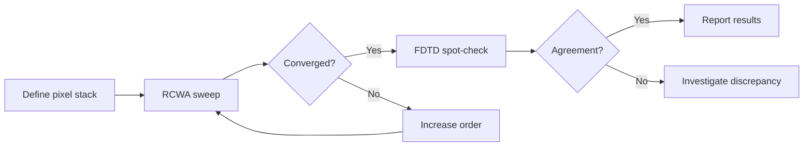

# RCWA vs FDTD

COMPASS supports both RCWA and FDTD solvers. This page helps you understand the trade-offs and choose the right solver for your simulation.

## Side-by-side comparison

| Feature | RCWA | FDTD |
|---------|------|------|
| **Domain** | Frequency (one wavelength per run) | Time (broadband in one run) |
| **Geometry** | Strictly periodic (infinite array) | Arbitrary (periodic, finite, isolated) |
| **Discretization** | Fourier harmonics (lateral), exact layers (vertical) | Uniform spatial grid in all directions |
| **Thin films** | Exact -- no spatial discretization needed | Must resolve each film with grid points |
| **Curved surfaces** | Staircase approximation of microlenses | Staircase or sub-pixel smoothing |
| **Memory** | Scales with $(2N+1)^2$ harmonics | Scales with $N_x \times N_y \times N_z$ grid |
| **Speed (single wavelength)** | Very fast (seconds on GPU) | Slower (must time-step to steady state) |
| **Speed (wavelength sweep)** | Proportional to number of wavelengths | One broadband run covers all wavelengths |
| **Numerical stability** | Eigenvalue issues at high orders | CFL-limited but generally robust |
| **Accuracy** | Exponential convergence in Fourier order | Second-order in grid spacing |

## Accuracy regimes

### RCWA excels when

- The pixel pitch is 1-10 wavelengths (typical for image sensors).
- The structure is genuinely periodic (2x2 unit cell repeats infinitely).
- You need high accuracy at specific wavelengths (e.g., for peak QE).
- Anti-reflection coating design requires exact thin-film treatment.

### FDTD excels when

- The structure has isolated or aperiodic features.
- You need broadband data and want to avoid looping over wavelengths.
- Time-domain effects (pulse propagation, transient behavior) are of interest.
- The geometry is complex and does not decompose into uniform layers.

## Practical guidance for image sensors

For a standard BSI pixel simulation in COMPASS:

**Use RCWA (default)** for:
- QE spectrum computation
- Convergence studies (Fourier order sweep)
- BARL optimization
- Color filter material selection
- Parameter sweeps (thickness, pitch, angle)

**Use FDTD** for:
- Validating RCWA results at selected wavelengths
- Studying near-field effects in silicon
- Visualizing field propagation through the pixel
- Structures that break periodicity

## Cross-validation workflow

A recommended workflow is to use RCWA for fast iteration and FDTD for validation:



COMPASS provides a built-in comparison runner:

```yaml
# configs/experiment/solver_comparison.yaml
defaults:
  - pixel: default_bsi_1um
  - source: wavelength_sweep

solvers:
  - name: torcwa
    type: rcwa
  - name: fdtd_flaport
    type: fdtd
```

And the `SolverComparison` analysis class computes QE differences, relative errors, and runtime ratios between any pair of solver results.

## Performance benchmarks

Typical numbers for a 2x2 Bayer unit cell at 1 um pitch, single wavelength:

| Metric | RCWA (order 9, GPU) | FDTD (5 nm grid, GPU) |
|--------|---------------------|-----------------------|
| Runtime | 0.3 s | 45 s |
| Memory | 200 MB | 2 GB |
| QE accuracy | < 0.5% error at order 15+ | < 1% error at 5 nm grid |

For a 41-wavelength sweep (380-780 nm, 10 nm step):

| Metric | RCWA | FDTD |
|--------|------|------|
| Runtime | 12 s (41 sequential) | 45 s (one broadband run) |
| Total wall time | 12 s | 45 s |

RCWA wins for narrow-band or moderate sweeps; FDTD can be competitive for very wide-band studies.

<SolverComparisonChart />

## Combining results

When both solvers produce results for the same configuration, use the `SolverComparison` class:

```python
from compass.analysis.solver_comparison import SolverComparison

comparison = SolverComparison(
    results=[rcwa_result, fdtd_result],
    labels=["torcwa", "fdtd_flaport"],
)

summary = comparison.summary()
print(f"Max QE difference: {summary['max_qe_diff']}")
print(f"Runtime ratio: {summary['runtimes_seconds']}")
```
