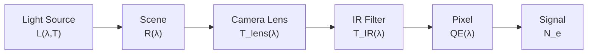

# Radiometric Signal Chain

Understanding the full radiometric signal chain is essential for predicting the signal level and color accuracy of an image sensor pixel. This chapter traces the journey of light from source to electrical signal, quantifying each stage with spectral models.

## From Scene to Sensor Signal

Light follows a well-defined path from source to sensor:



At each stage, the spectral distribution is modified by the transfer function of that element. The final signal is the integral of all these factors over wavelength. Let us examine each stage in detail.

## Light Sources and Illuminants

### Blackbody Radiation

Any object at temperature $T$ emits thermal radiation. The spectral radiance of a perfect blackbody is described by **Planck's law**:

$$L(\lambda, T) = \frac{2hc^2}{\lambda^5} \cdot \frac{1}{\exp\!\left(\dfrac{hc}{\lambda k_B T}\right) - 1}$$

where:
- $h = 6.626 \times 10^{-34}$ J s is Planck's constant
- $c = 2.998 \times 10^8$ m/s is the speed of light
- $k_B = 1.381 \times 10^{-23}$ J/K is Boltzmann's constant
- $\lambda$ is wavelength (m)
- $T$ is absolute temperature (K)

**Wien's displacement law** gives the peak wavelength of the blackbody spectrum:

$$\lambda_{\max} = \frac{2898}{T} \;\mu\text{m}$$

At $T = 5500$ K (roughly daylight), $\lambda_{\max} \approx 527$ nm, which falls in the green portion of the visible spectrum.

The **Stefan-Boltzmann law** gives the total radiant exitance (power emitted per unit area integrated over all wavelengths):

$$M = \sigma T^4$$

where $\sigma = 5.670 \times 10^{-8}$ W m$^{-2}$ K$^{-4}$.

**Color temperature** describes the hue of a light source by matching it to the chromaticity of a blackbody at that temperature. A candle flame has a color temperature around 1800 K (warm/orange), while overcast sky reaches 7000-10000 K (cool/bluish). Color temperature is widely used to characterize both natural and artificial light sources.

<BlackbodySpectrum />

### Standard Illuminants

The CIE (Commission Internationale de l'Eclairage) defines standard illuminants for colorimetric calculations. These provide reproducible spectral power distributions (SPDs) for comparing color rendering across different light sources.

| Illuminant | Description | CCT (K) | CRI | Key characteristics |
|------------|------------|---------|-----|---------------------|
| CIE A | Incandescent tungsten | 2856 | 100 | Smooth, warm spectrum; strong red/IR emission |
| CIE D65 | Average daylight | ~6504 | -- | Reference for sRGB; includes UV component |
| CIE F11 | Triband fluorescent | 4000 | 83 | Three narrow emission peaks; metameric concerns |
| LED white | Blue pump + phosphor | 3000-6500 | 70-95 | Blue spike at 450 nm + broad phosphor emission |

::: info CIE D65 as the Reference
CIE D65 is the most commonly used reference illuminant in imaging. It represents average noon daylight in Western Europe and is the standard white point for the sRGB color space, making it the default choice for camera white balance calibration.
:::

**CIE Illuminant A** is defined analytically from Planck's law at 2856 K, making it smooth and continuous. It serves as the reference for incandescent lighting conditions.

**CIE D65** is based on measured daylight spectral distributions and includes fine spectral features from atmospheric absorption. It is not a perfect blackbody but has a correlated color temperature (CCT) of approximately 6504 K.

**CIE F11** represents a triband rare-earth phosphor fluorescent lamp with three dominant emission peaks at approximately 435 nm, 545 nm, and 610 nm. Its discontinuous spectrum can cause color rendering issues for narrow-band objects.

**White LED** sources combine a blue GaN/InGaN LED (peak around 450 nm) with a yellow/green phosphor (broad emission 500-700 nm). The resulting spectrum has a characteristic blue spike followed by a broad phosphor hump. The CCT is tunable from warm white (3000 K) to cool white (6500 K) by varying the phosphor blend.

## Scene Reflectance

The spectral reflectance $R(\lambda)$ of a surface describes the fraction of incident light that is reflected at each wavelength:

$$R(\lambda) = \frac{\Phi_{\text{reflected}}(\lambda)}{\Phi_{\text{incident}}(\lambda)}$$

where $0 \leq R(\lambda) \leq 1$.

### Lambertian vs Specular Reflection

- **Lambertian (diffuse) reflection**: Light is reflected uniformly in all directions, independent of the viewing angle. The reflected radiance is $L_r = R(\lambda) \cdot E / \pi$ where $E$ is the irradiance. Most natural matte surfaces (paper, fabric, painted walls) approximate Lambertian behavior.
- **Specular reflection**: Light is reflected at the mirror angle according to the law of reflection. Glossy and metallic surfaces exhibit specular behavior. In radiometric calculations for image sensors, we typically model scenes as Lambertian reflectors for simplicity.

### Reference Targets

**18% grey card**: A neutral grey card with a flat spectral reflectance $R(\lambda) = 0.18$ across the visible spectrum. It represents the average reflectance of a typical outdoor scene and is the standard reference for exposure metering.

**Macbeth ColorChecker**: A standardized color target consisting of 24 patches with known spectral reflectances. It includes:
- 6 chromatic patches in two rows (dark skin, light skin, blue sky, foliage, blue flower, bluish green)
- 6 neutral patches from white to black
- Used for camera color calibration and color accuracy evaluation

| Patch | Description | Approximate $R$ at peak |
|-------|------------|------------------------|
| White (patch 19) | $R \approx 0.90$ flat | 90% |
| Neutral 5 (patch 22) | $R \approx 0.19$ flat | 19% |
| Black (patch 24) | $R \approx 0.03$ flat | 3% |
| Red (patch 15) | Peak near 620 nm | 30% |
| Green (patch 14) | Peak near 540 nm | 25% |
| Blue (patch 13) | Peak near 460 nm | 15% |

## Camera Module Optics

### Lens Transmittance

A camera module lens typically consists of $N$ glass or plastic elements. Each element introduces two air-glass interfaces and absorption within the glass body. The total lens transmittance is:

$$T_{\text{lens}}(\lambda) = T_{\text{glass}}^N(\lambda) \times T_{\text{AR}}^{2N}(\lambda)$$

where:
- $T_{\text{glass}}(\lambda)$ is the single-element glass body transmittance (typically $> 0.99$ per element for optical glasses)
- $T_{\text{AR}}(\lambda)$ is the anti-reflection (AR) coating transmittance per surface (typically $> 0.995$ with broadband AR coating)
- The factor $2N$ reflects two surfaces per element

For a 5-element lens with good AR coatings, the total transmittance is approximately:

$$T_{\text{lens}} \approx 0.99^5 \times 0.995^{10} \approx 0.90$$

**Vignetting** causes additional light loss at the edges of the image field. The relative illumination follows approximately:

$$E_{\text{relative}} \approx \cos^4(\theta_{\text{field}})$$

where $\theta_{\text{field}}$ is the field angle. At the corner of a sensor with 35-degree field angle, relative illumination drops to about 45%.

**F-number** ($F_\#$) determines the amount of light collected by the lens. The image-plane irradiance from a Lambertian scene is:

$$E = \frac{\pi L}{4 F_\#^2}$$

Halving the F-number (e.g., F/2.8 to F/1.4) quadruples the irradiance.

### IR Cut Filter

Silicon photodiodes are sensitive to near-infrared (NIR) light up to approximately 1100 nm. Without filtering, NIR light causes:
- Color distortion (all channels respond similarly in the NIR, desaturating colors)
- Incorrect white balance
- Reduced color separation

An IR cut filter blocks NIR light while transmitting visible wavelengths. The typical filter characteristics are:

| Parameter | Typical value |
|-----------|--------------|
| Passband | 400-650 nm ($T > 90\%$) |
| Cutoff wavelength (50% point) | 650 nm |
| Transition width (90% to 10%) | 30-50 nm |
| Stopband rejection | $T < 1\%$ for 700-1100 nm |

The IR filter transmittance can be modeled as a sigmoid function:

$$T_{\text{IR}}(\lambda) = \frac{1}{1 + \exp\!\left(\dfrac{\lambda - \lambda_{\text{cut}}}{\Delta}\right)}$$

where $\lambda_{\text{cut}} \approx 650$ nm is the cutoff wavelength and $\Delta \approx 10$ nm controls the transition steepness.

## Signal Integration

### Spectral Irradiance at the Sensor

After passing through all optical elements, the spectral irradiance at the sensor plane is:

$$E(\lambda) = L(\lambda) \times R_{\text{scene}}(\lambda) \times T_{\text{lens}}(\lambda) \times T_{\text{IR}}(\lambda)$$

Each factor modifies the spectrum:

1. $L(\lambda)$ -- the source spectrum (e.g., D65 daylight)
2. $R_{\text{scene}}(\lambda)$ -- scene reflectance selectively attenuates wavelengths
3. $T_{\text{lens}}(\lambda)$ -- lens transmittance (relatively flat in the visible)
4. $T_{\text{IR}}(\lambda)$ -- IR filter sharply cuts wavelengths beyond 650 nm

<SignalChainDiagram />

### Pixel Signal

The signal for the $i$-th color channel (R, G, or B) is obtained by integrating the irradiance weighted by the pixel's quantum efficiency:

$$S_i = \int_{\lambda_1}^{\lambda_2} E(\lambda) \times \text{QE}_i(\lambda) \, d\lambda$$

where $\text{QE}_i(\lambda)$ includes the combined effect of the color filter array (CFA) and the photodiode sensitivity. The integration limits typically span $\lambda_1 = 380$ nm to $\lambda_2 = 780$ nm.

### Signal in Electrons

The number of photoelectrons generated in an exposure is:

$$N_e = \frac{S \cdot t_{\text{exp}} \cdot A_{\text{pixel}}}{4 F_\#^2} \times \frac{\lambda}{hc}$$

where:
- $t_{\text{exp}}$ is the exposure time (s)
- $A_{\text{pixel}}$ is the pixel area (m$^2$)
- $F_\#$ is the lens F-number
- The factor $\lambda / hc$ converts energy to photon count

::: tip
For a 1.0 um pixel at F/2.0 under D65 illumination with 18% grey reflectance and 10 ms exposure, a typical green channel signal is 3000-8000 electrons.
:::

## White Balance

Under different illuminants, the R, G, and B channel signals vary significantly even for a neutral (grey) scene. White balance corrects for this by scaling the channel signals so that a neutral object produces equal R, G, and B values.

The white balance gains are defined as:

$$g_R = \frac{S_G}{S_R}, \quad g_B = \frac{S_G}{S_B}$$

where $S_R$, $S_G$, $S_B$ are the raw channel signals from a neutral target.

The **R/G** and **B/G** ratios under different illuminants characterize the color bias:

| Illuminant | R/G ratio | B/G ratio | White balance character |
|-----------|-----------|-----------|----------------------|
| CIE A (2856 K) | 1.8-2.2 | 0.3-0.5 | Strong red excess |
| D65 (~6504 K) | 0.9-1.1 | 0.8-1.0 | Near-neutral |
| F11 (4000 K) | 1.3-1.5 | 0.5-0.7 | Moderate red excess |
| LED (5000 K) | 1.0-1.3 | 0.6-0.8 | Slight red excess |

::: info Grey World Assumption
The **grey world assumption** estimates the scene illuminant by assuming that the average reflectance of the entire scene is neutral grey (achromatic). The white balance gains are then computed from the average R, G, B channel values across the image. This works well for typical outdoor scenes but fails for scenes dominated by a single color.
:::

## Signal-to-Noise Ratio

The signal-to-noise ratio (SNR) determines the image quality. For a CMOS image sensor pixel, the main noise sources are:

| Noise source | Symbol | Origin | Scaling |
|-------------|--------|--------|---------|
| Shot noise | $\sqrt{N_{\text{signal}}}$ | Poisson statistics of photon arrival | $\propto \sqrt{\text{signal}}$ |
| Dark current shot noise | $\sqrt{N_{\text{dark}}}$ | Thermally generated carriers | $\propto \sqrt{t_{\text{exp}} \cdot T}$ |
| Read noise | $N_{\text{read}}$ | Amplifier and ADC electronics | Fixed |

The total SNR is:

$$\text{SNR} = \frac{N_{\text{signal}}}{\sqrt{N_{\text{signal}} + N_{\text{dark}} + N_{\text{read}}^2}}$$

At high signal levels, shot noise dominates and $\text{SNR} \approx \sqrt{N_{\text{signal}}}$. At low signal levels, read noise dominates and $\text{SNR} \approx N_{\text{signal}} / N_{\text{read}}$.

| Condition | Typical $N_{\text{signal}}$ | SNR | Image quality |
|-----------|--------------------------|-----|---------------|
| Bright daylight | 10,000+ e$^-$ | > 100 (40 dB) | Excellent |
| Indoor lighting | 1,000-5,000 e$^-$ | 30-70 (30-37 dB) | Good |
| Low light | 100-500 e$^-$ | 10-20 (20-26 dB) | Noisy |
| Near dark | < 50 e$^-$ | < 5 (14 dB) | Very noisy |

## Connection to COMPASS

COMPASS computes the quantum efficiency $\text{QE}_i(\lambda)$ for each pixel through full-wave electromagnetic simulation (RCWA or FDTD). The QE results feed directly into the signal chain calculation described above.

### Using `SignalCalculator` with simulation results

The `SignalCalculator` class combines QE simulation output with illuminant, scene, and optics models to compute signal levels:

```python
from compass.analysis.signal_calculator import SignalCalculator
from compass.analysis.qe_calculator import QECalculator
from compass.sources.illuminant import Illuminant
import numpy as np

# Load QE results from simulation
channel_qe = QECalculator.spectral_response(result.qe_per_pixel, result.wavelengths)

# Set up signal calculator
calc = SignalCalculator(
    illuminant=Illuminant.cie_d65(result.wavelengths),
    scene_reflectance=0.18,        # 18% grey
    lens_transmittance=0.90,
    ir_cutoff_nm=650,
    f_number=2.0,
    pixel_pitch_um=1.0,
    exposure_time_ms=10.0,
)

# Compute signal for each channel
signals = calc.compute_signal(channel_qe)
print(f"Red:   {signals['R']:.0f} electrons")
print(f"Green: {signals['G']:.0f} electrons")
print(f"Blue:  {signals['B']:.0f} electrons")
print(f"R/G:   {signals['R']/signals['G']:.3f}")
print(f"B/G:   {signals['B']/signals['G']:.3f}")
```

### Example workflow

A typical end-to-end workflow:

1. **Define pixel stack** -- Configure the pixel geometry, materials, and color filters
2. **Run QE simulation** -- Execute RCWA or FDTD to obtain $\text{QE}_i(\lambda)$ for each channel
3. **Choose illuminant and scene** -- Select D65 daylight and 18% grey as baseline
4. **Compute signal levels** -- Use `SignalCalculator` to convert QE to electron counts
5. **Evaluate color performance** -- Check R/G and B/G ratios, compute SNR
6. **Vary conditions** -- Sweep illuminants, reflectances, and exposure settings to evaluate robustness

::: tip
For most imaging applications, start with D65 illuminant and 18% grey reflectance to establish baseline signal levels, then vary illuminant and scene to evaluate color performance.
:::
